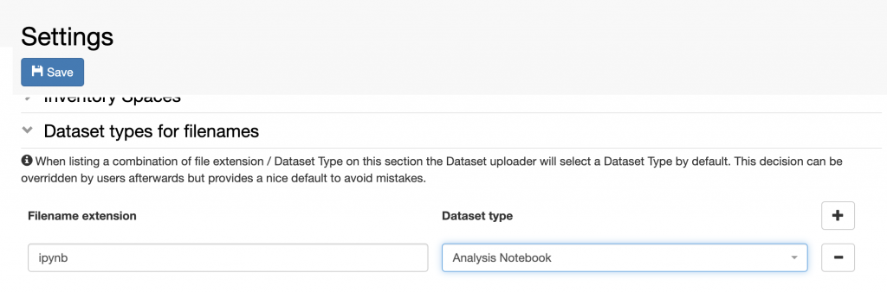

# Associate File Types to Dataset Types

  
It is possible to associate given file types to given *Dataset* *types*.
In this way when a file of this type is uploaded, the *Dataset* *type*
is automatically selected. This option can be found in **Settings**.

For example, a Jupyter notebook, which has extension **.ipynb** can
always be associated with the *Dataset* *type* **Analysis Notebook**.

 

1.  Go to **Settings**
2.  Click **Edit**
3.  Scroll down to the **Dataset types for filenames** section
4.  Enter the file extension (e.g. ipynb) in the **Filename extension**
    field
5.  Select the D**ataset type** with which you always want to associate
    this file type (e.g. Analysis Notebook)
6.  **Save**

 

Updated on November 30, 2022
