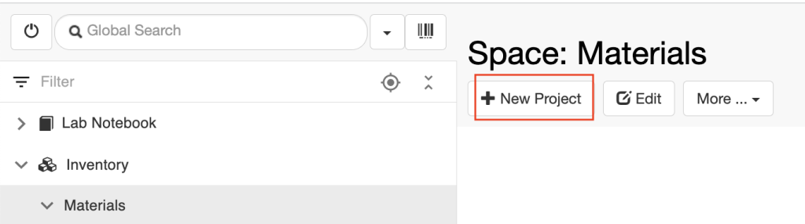
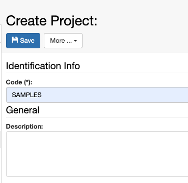
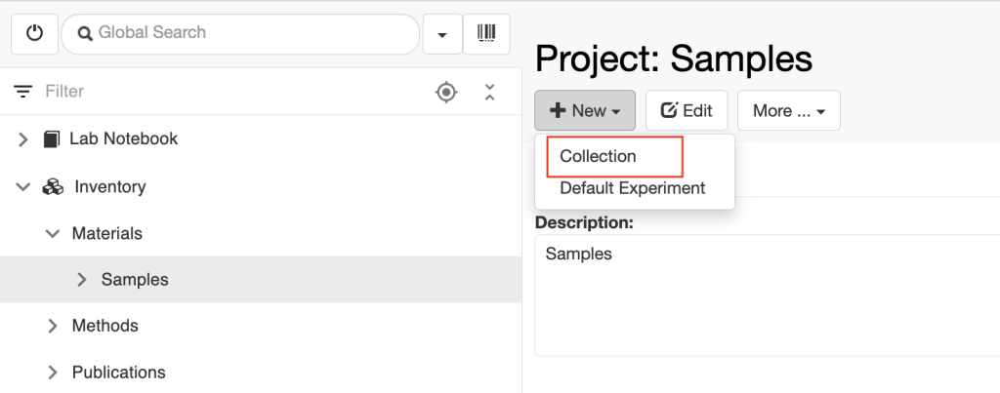
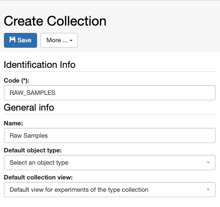
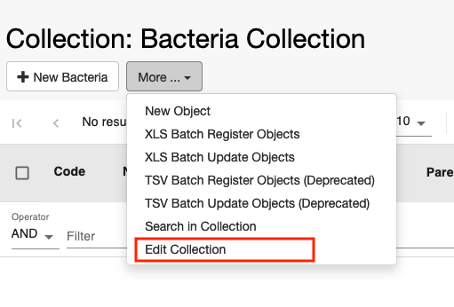
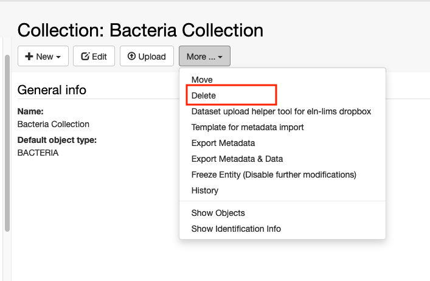
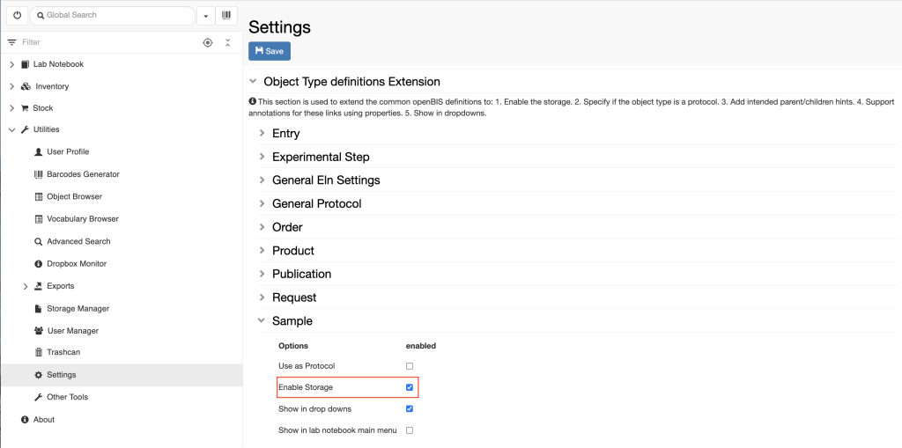
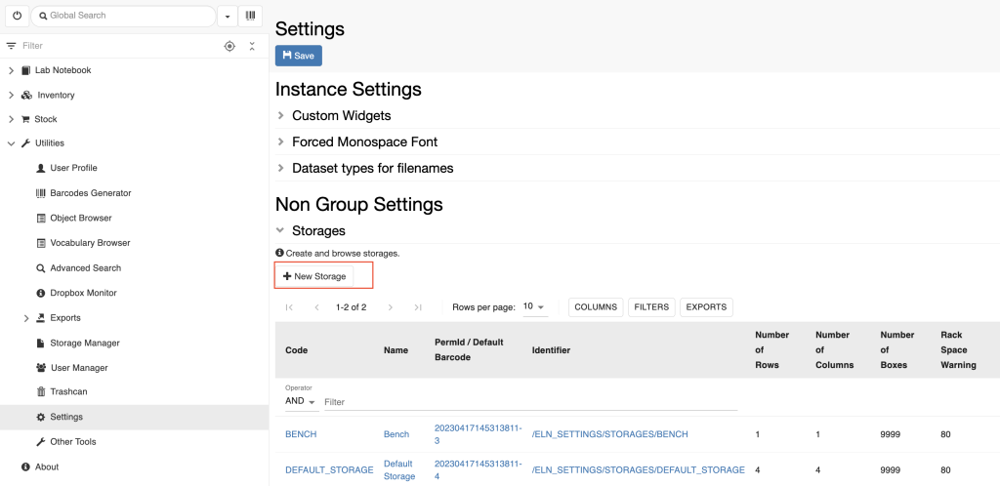

Customise Inventory Of Materials And Samples
====
 
Create Collections of Materials
----

 

*Collections* are folders used to organise
*Objects* in the **Materials** Inventory. Such *Objects* can be
different types of samples and materials (e.g. chemicals, antibodies,
batteries, environmental samples). 

 

*Collections* need to be created inside
another folder, called *Project*, in the **Materials** inventory.

 

For example, if we want to create a collection of raw samples, we need
to adopt the following steps:

1.  Create an *Object* *type* called Sample. This can only be done by an
    *Instance admin*, from the admin interface, as explained here: [New
    Entity Type
    Registration](https://openbis.ch/index.php/docs/admin-documentation/new-entity-type-registration/)
2.  Create a first folder called Samples inside the
    **Materials** folder *(Project)*
3.  Create a second folder called Raw
    Samples** ***(Collection)*

 

 

To create the *Project* folder:

> 1.  Click on the
>     **Materials** folder
>
> 2.  Click the **+ New Project** button
>     in the form. 
>

>
> 3.  Provide a description, if wanted.
>     This is not mandatory.
>
> 4.  Enter the **Code**. This will be the
>     name of the folder, in this case      style="color: #333399;">SAMPLES. Codes only take
>     alphanumeric characters and no spaces. 

 

 

 

To register the *Collection* folder,
inside the *Project* folder:

> 1.  Click on the *Project* folder, in
>     this case **Samples**. 
> 2.  Click the **+ New** button in the
>     main form and choose **Collection** from the dropdown.

> 3.  Replace the automatically generated
>     **Code** with something pertinent to the collection (e.g      style="color: #3366ff;">RAW\_SAMPLES)
> 4.  Fill in the **Name** field (e.g.
>     Raw Samples). Note that by
>     default, the navigation menu on the left shows the name. If the
>     name is not provided, the code is shown.
> 5.  Select the **Default object type**
>     from the list of available types. This is the *Object* for which
>     the *Collection* is used. In this case, **Sample**.
> 6.  Select the **Default collection view** (see **[Customise
>     Collection
>     View](https://openbis.ch/index.php/docs/user-documentation-20-10-3/lab-notebook/customise-collection-view/))**

 

 

 

Updated on April 26, 2023
 
Delete Collections
----

 

To delete an existing Collection:

 

1.  Select **Edit Collection** under the **More..** dropdown menu

 

 

2\. Select **Delete** under the **More..** drop down menu

 

Updated on February 6, 2023
 
Enable Storage Widget on Sample Forms
----

  
When a new *Object type* is created by an *Instance admin (*see [New
Entity Type
Registration)](https://openbis.ch/index.php/docs/admin-documentation-openbis-19-06-4/new-entity-type-registration/)*,*
the storage widget is disabled by default.

  
If we want to track storage positions for this particular *Object type*
as described in [Allocate storage positions to
samples](https://openbis.ch/index.php/docs/user-documentation/managing-storage-of-samples/allocate-storage-to-samples/),
the **Storage** should be enabled in the **Settings**, under
**Utilities**. This can be done by a *group admin*.

For this, follow the steps below:  
  

1.  Go to **Settings**, under **Utilities**
2.  Click the **Edit** button
3.  Scroll to the last section of the Settings: **Object Type
    definitions Extension**
4.  Open the *Object type* for which you want to enable the storage,
    e.g. **Sample**
5.  Select **Enable Storage **
6.  Save

 

 

.. image:: img/Settings-storage-1024x452.png

Updated on April 26, 2023
 
Configure Lab Storage
----

  
Fridges and freezers can be configured in
the **Settings**, under **Utilities**.

 

1.  Go to **Settings**
2.  Click **Edit**
3.  Scroll down to the **Storages** section
4.  Click the **+ New Storage** button
    above the storage table, as shown below.
5.  Fill in the **Storage Form** as explained below

  
**How to fill in Storage Form:**

#.  **Code**. It is advisable to provide
    a meaningful code for the storage, rather than using the default,
    because this information is needed when registering storage
    positions in Batch mode. For example  MINUS80\_ROOM\_A1
#.  **Name**. The name is what is shown
    in most parts of the ELN. E.g. 
    Minus 80°C in Room A1
#.  **Number of rows**. This is the
    number of shelves.
#.  **Number of columns**. This is the
    number of racks per shelf.
#.  **Allowed number of boxes in a
    rack**. This is the maximum number per rack. Enter a very high
    number if this is not important.
#.  **Rack space warning**. Enter space
    as percentage. E.g. 80, means
    that the system will give a warning when 80% of a rack is
    occupied.
#.  **Box space warning**. Enter space
    as percentage. E.g. 80, means
    that the system will give a warning when 80% of a box is
    occupied.
#.  **Validation level**. This is the
    minimum level of information required about the storage:
    #.  **Rack validation**. The
        position in the shelf and rack needs to be specified.
    #.  **Box validation**. In addition
        to **a**, a box name needs to be specified.
    #.  **Box position validation**. In
        addition to **a** and **b**, the position in the box needs to
        be specified.

Updated on April 26, 2023
 
Add metadata to Storage Positions
----

 

 

Storage positions by default have the following metadata:

1.  Storage code
2.  Storage rack row
3.  Storage rack column
4.  Box name
5.  Box size
6.  Box position
7.  User id

 

It is possible to add additional information. This can be done by an
*Instance Admin* by editing the *Object* Type **STORAGE\_POSITION** in
the admin interface (see [New Entity Type
Registration](https://openbis.ch/index.php/docs/admin-documentation/new-entity-type-registration/)).

Updated on February 6, 2023
