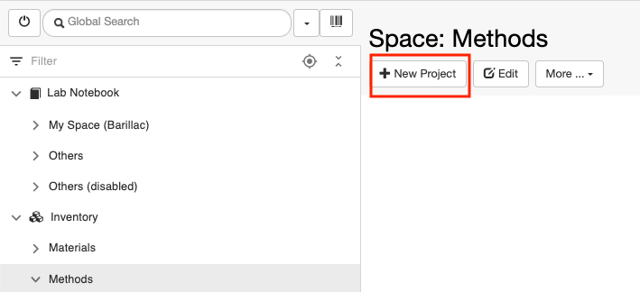
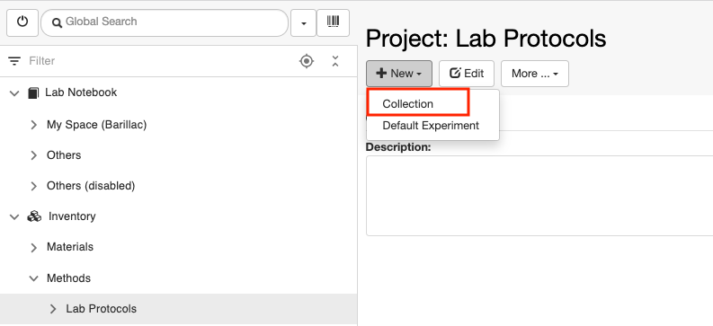
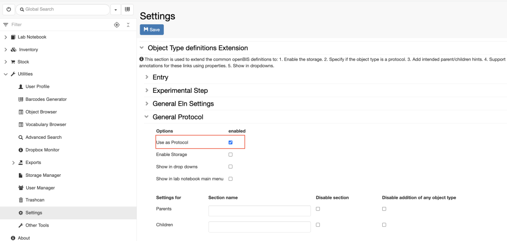

Customise Inventory Of Protocols
====
 
Create Collections of Protocols
----

  
*Collections* are folders used to organise *Objects* in the **Methods**
Inventory. In this case, *Objects* are protocols.

 

*Collections* need to be created inside
another folder, called *Project*, in the **Methods** *Space* in the
inventory.

 

For example, if we want to create a
collection of lab protocols for microscopy and Mass spec, we need to
adopt the following steps:

1.  Register a first *Project* folder called LAB\_PROTOCOLS in the **Methods** *Space*.

1.  In the **Lab** **Protocols** folder, register two additional
    Collections called Microscopy
    Protocols and MS
    Protocols

 

  
The steps for the registration of the folders are the same as explained
in [Create Collections of
Materials](https://openbis.ch/index.php/docs/admin-documentation-openbis-19-06-4/customise-inventory-of-materials-and-samples/create-collections-of-materials/)  
  

 

Updated on April 26, 2023
 
Enable Protocols in Settings
----

  
If a new *Object type* for a protocol is created by an *Instance admin*
in the admin interface, it is advisable to set the *Object type* to
**Protocol** in the **Settings**, under **Utilities**.

  
For this, follow the steps below:  
  

1.  Go to **Settings**
2.  Click **Edit**
3.  Scroll to the last section of the **Settings**: **Object Type
    definitions Extension**
4.  Open the *Object type* corresponding to your protocol, e.g.
    **General Protocol**
5.  Select **Use as Protocol**
6.  **Save**

  
This is done to be able to create local copies of protocols from the
*Inventory* inside an *Experiment* when writing *Experimental steps,* as
described in [How to use protocols in Experimental
Steps](https://openbis.ch/index.php/docs/user-documentation/lab-notebook/how-to-use-protocols-in-experimental-steps/)

Updated on April 26, 2023
