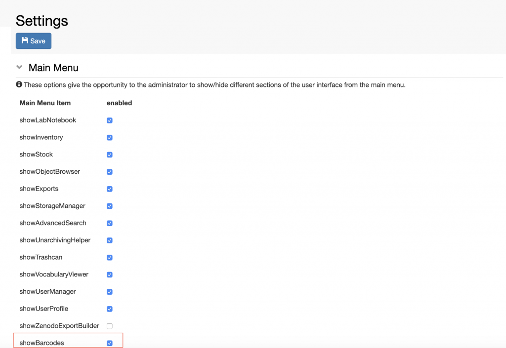
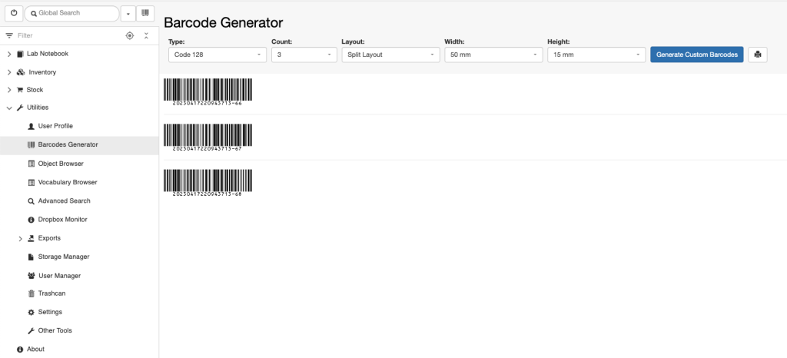
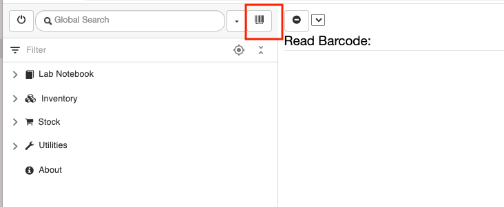

Enable Barcodes
===============

In order to be able to add custom barcodes to *Objects*, an *Instance
Admin* needs to add the $BARCODE property to the object type for which
barcodes are needed.

 

The barcode functionality is disabled by default in the ELN UI. This can
be enabled by a *lab manager* or a *group admin* with admin right to
edit the **Settings**, as shown below.

 

 

 

After enabling the option, please refresh your browser. The **Barcodes
Generator** will be shown in the main menu under **Utilities** and a
barcode icon will be added above the menu.

 

 

 

Information on how to use the Barcode functionality in openBIS can be
found
here: [Barcodes](https://openbis.ch/index.php/docs/user-documentation-20-10-3/inventory-of-materials-and-methods/barcodes/)

Updated on April 26, 2023
