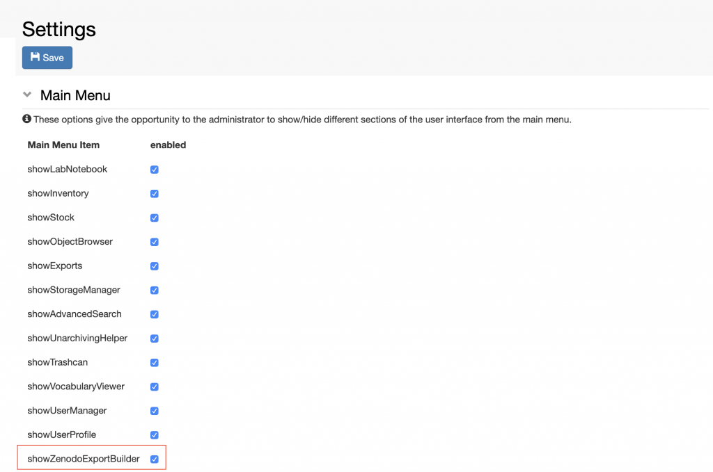

Enable Transfer to Data Repositories
====================================

  
Currently openBIS offers an integration with the **Zenodo** data
repository ([https://zenodo.org/). ](https://zenodo.org/)

This enables data direct data transfer from openBIS to Zenodo.

This feature needs to be configured by a *system admin* as explained
here: [openBIS DSS configuration
file](https://unlimited.ethz.ch/display/openBISDoc2010/Installation+and+Administrators+Guide+of+the+openBIS+Data+Store+Server#InstallationandAdministratorsGuideoftheopenBISDataStoreServer-Configurationfile). 

If this is done, the Zenodo Export needs to be made visible in the ELN
UI by a lab manager, who has should have admin rights for the
**Settings**. This can be done by a *group admin*, in case of a
multi-group instance set up.

  
Procedure:  
  

1.  Edit the **Settings** under **Utilities.**
2.  Select **showZenodoExportBuilder** in the **Main Menu** section.
3.  **Save.**

 

The **Export to Zenodo** functionality becomes available under the
**Utilities** menu (a refresh of the browser page may be necessary to
see the change):

 

Updated on April 26, 2023
