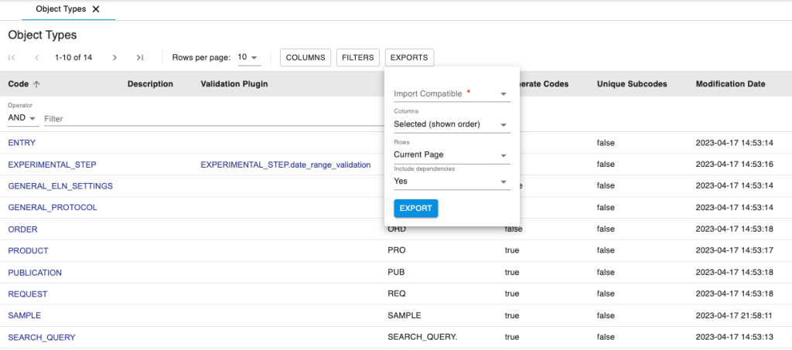
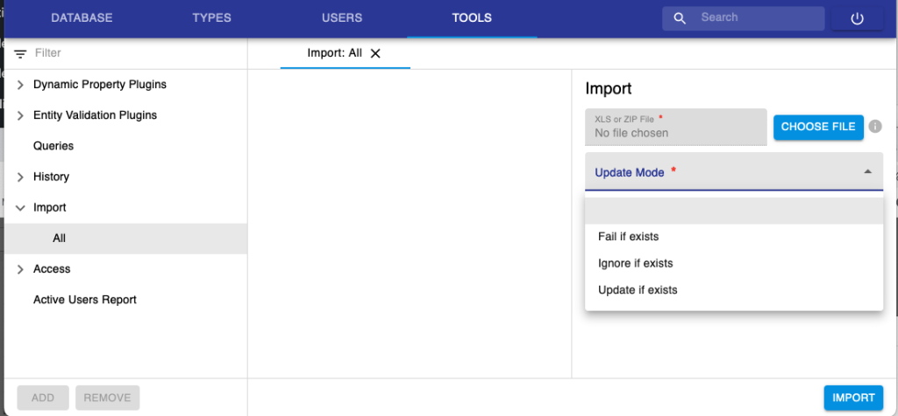

# Masterdata exports and imports

 

With openBIS version 20.10.5 it is possible to export masterdata from
one openBIS instance and import it in another one via the admin UI.

 

## Masterdata export

 

All types tables (*Object Types, Collection Types, Dataset Types,
Vocabulary Types, Property Type*s) can be exported as shown below for
the *Object Types*.

 

 

When you export you have the following options:

1.  **Import Compatible**:
    1.  1.  **Yes**: in this case some columns which are incompatible
            with imports (i.e. modification date) are not exported even
            if selected; some columns that are required by openBIS for
            imports are added to the exported file even if not selected.
        2.  **No**: in this case all columns or selected columns are
            exported.2.
2.  **Columns**:
    1.  **All (default order)**. All columns are exported, in accordance
        with the selection explained above for import compatibility.
    2.  **Selected (shown order)**. Selected columns are exported, in
        accordance with the selection explained above for import
        compatibility.
3.  **Rows**: current page or all pages
4.  **Include dependencies**: yes or no. If you include dependencies,
    all property types, vocabularies and associated objects are also
    exported. Default is “yes”.

 

If the types have validation plugins or dynamic script plugins
associated with them, a zip file containing the scripts is exported from
openBIS.

 

## Masterdata import

 

To import the file with the relevant masterdata that was exported as
explained above:

 

1.  Go to the **Tools** section and select **Import -&gt; All** from the
    menu.
2.  Upload the file you exported before using the **CHOOSE FILE**
    button.
3.  Select one of the 3 possible options for the Update mode:
    1.  **Fail if exists**: if some entries already exist in openBIS,
        the upload will fail;
    2.  **Ignore if exists**: if some entries already exist in openBIS,
        they will be left untouched, even if their definition in the
        file is different from the existing definition in openBIS;
    3.  **Update if exists**: if some entries already exist in openBIS
        and their definition in the file is different from the existing
        definition in openBIS, they will be updated;

 

 

Since openBIS 20.10.6, the import of zip files is supported.

 

Updated on April 26, 2023
