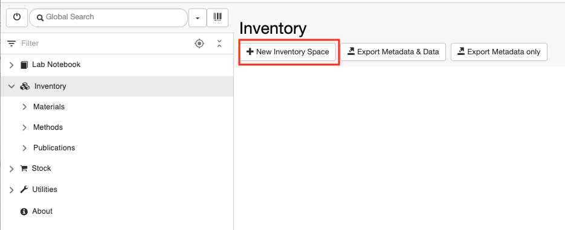
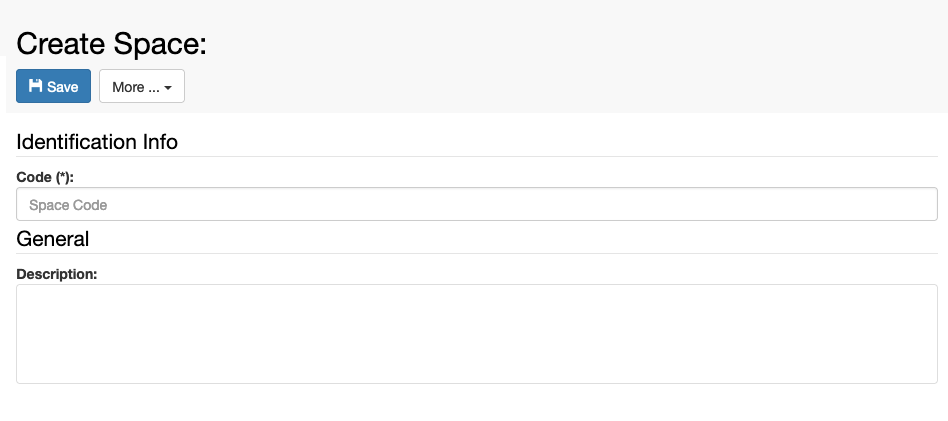
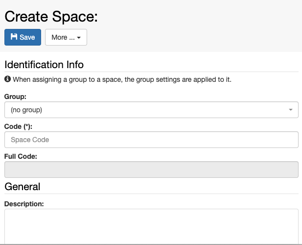
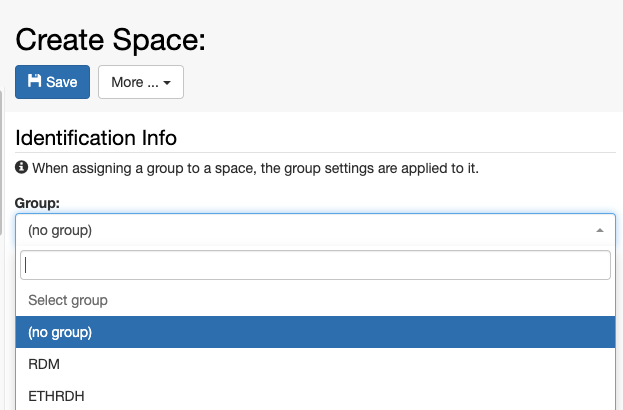
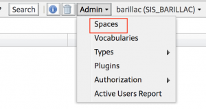
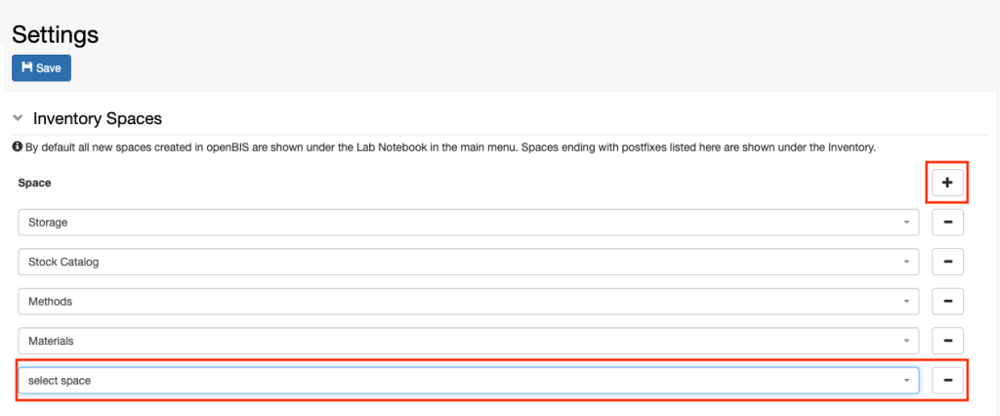
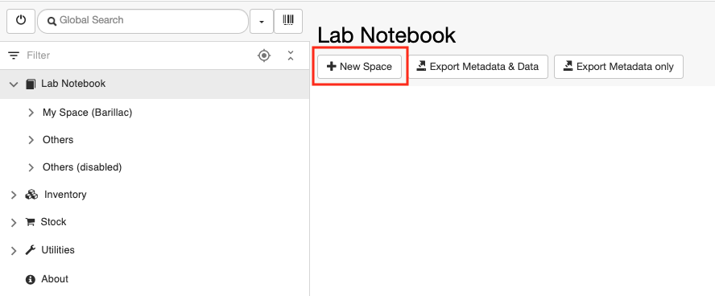
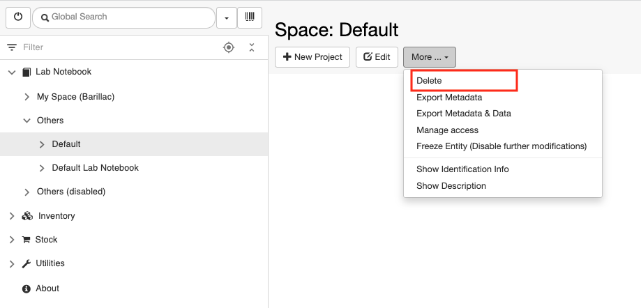

Space Management
====
 
## Create new Inventory Spaces

  
The default Inventory contains two
folders: **Materials** and **Methods**. These are openBIS *Spaces*.

Additional *Spaces* can be created by an *Instance admin*.

 

## Create a new Inventory Space from the ELN UI

 

From openBIS version 20.10.4 it is possible to create *Spaces* directly
from the ELN interface.

To create a new *Space* under the Inventory:

 

1.  Select **Inventory** in the main menu
2.  Click on **+New Inventory Space** in the Inventory page

 

 

3\. Enter the **Code** for the *Space*, e.g. EQUIPMENT. Please note that
codes only accept alphanumeric characters, –, . , \_.

4\. **Save**

 

 

### Multi-group instances

 

In a multi-group instance, the *Instance admin* can choose where to
create a new *Space*:

 

1.  **no group**. The new *Space* will have no prefix and the Settings
    defined in General Settings will apply (see [General ELN
    Settings](https://openbis.ch/index.php/docs/admin-documentation/multi-group-set-up/general-eln-settings/)).
2.  **in one of the existing groups**. The new *Space* will have the
    group prefix and the Settings of that group will apply (see [Group
    ELN
    Settings](https://openbis.ch/index.php/docs/admin-documentation/multi-group-set-up/group-eln-settings/)).

 

 

 

## Create a new Inventory Space from the core UI

 

In the core UI:

 

1.  Select **Admin -&gt; Spaces**
2.  Click **Add Space** at the bottom of the page
3.  Enter the *Space* **Code**, e.g. **EQUIPMENT**
4.  **Save**

 

 

### Set Inventory Spaces

  
When new *Spaces* are created in the core UI, they are automatically
displayed under the *Lab Notebook* part of the ELN main menu.

It is possible to move a new *Space* to the Inventory, by editing the
**Settings** under **Utilities** in the **ELN UI:**

 

1.  Go to the **Settings** and click **Edit.**
2.  Go to the **Inventory Spaces** section in the **Settings** and click
    the **+** button as shown below.
3.  Select the *Space* you want to move to the *Inventory* from the list
    of available *Spaces*.
4.  **Save** the Settings.
5.  Refresh the browser.

 

 

Updated on April 26, 2023
 
## Create new ELN Spaces

## Create a new Lab Notebook Space from the ELN UI

 

From openBIS version 20.10.4 it is possible to create *Spaces* directly
from the ELN interface. To create a new Space under the Inventory:

 

1.  Select **Lab Notebook** in the main menu
2.  Click on **+New** **Space** in the Lab Notebook page

 

   

 

3\. Enter the **Code** for the *Space*. Please note that codes only
accept alphanumeric characters, –, . , \_.

4\. **Save**    

 

### Multi-group instances

 

In a multi-group instance, the *Instance admin* can choose where to
create a new *Space*:

 

1.  **no group**. The new *Space* will have no prefix and the Settings
    defined in General Settings will apply (see [General ELN
    Settings](https://openbis.ch/index.php/docs/admin-documentation/multi-group-set-up/general-eln-settings/)).
2.  **in one of the existing groups**. The new *Space* will have the
    group prefix and the Settings of that group will apply (see [Group
    ELN
    Settings](https://openbis.ch/index.php/docs/admin-documentation/multi-group-set-up/group-eln-settings/)). 

 

 

 

Use cases where this could be useful:

1.  in a multi-group instance with user folders in the Lab Notebook it
    is desired to have in addition some *Spaces* that are not linked to
    a particular user, but maybe rather to some projects.
2.  in a multi-group instance it is not at all desired to have the lab
    notebooks organised by users, but rather by projects. A *system
    admin* can configure the user management config file not to create
    users folders in the lab notebook section (see [Multi group
    instances](https://unlimited.ethz.ch/display/openBISDoc2010/User+Group+Management+for+Multi-groups+openBIS+Instances)).

 

The rights for *Spaces* not belonging to any group need to be manually
assigned by an *Instance admin*.

 

## Create a new Lab Notebook Space from the core UI

 

In the core UI:  

 

1.  Select **Admin -&gt; Spaces**
2.  Click **Add Space** at the bottom of the page
3.  Enter the Space **Code**, e.g. **EQUIPMENT**
4.  **Save**

 

 

By default all *Spaces* created in the core UI are shown under the Lab
Notebook part of the ELN UI.

Updated on April 26, 2023
 
## Delete Spaces

 

*Spaces* can be deleted by *Instance admins* or by *Space admins*.

 

To delete a *Space*:

1.  Click on the **Space** in the main menu
2.  Select **Delete** from the **More..** dropdown

 

3\. Provide a **reason** for deletion

4\. **Accept**

 

 

Notes:

*Spaces* are not moved to the trashcan, but they are permanently deleted
straight away.

*Spaces* can only be deleted when they are empty and no entries
previously belonging to the *Space* are in the trashcan.

 

 

 

Updated on April 26, 2023
 
## Move Spaces between Lab Notebook and Inventory

 

If a *Space* belongs to the Inventory, this information is stored in the
**ELN Settings,** under the section **Inventory Spaces.**

 

To move a *Space* from the Lab Notebook to the Inventory, click on the
**+** button on top of the **Inventory Spaces** section, select the
*Space* you want to move and **Save** the Settings.

 

To move a *Space* from the Inventory to the Lab Notebook, click on the
**–** button next to the *Space* you want to remove in the **Inventory
Spaces** section and **Save** the Settings.

 

ELN Settings can be edited by Instance admins, group admins in
multi-group instances and by anyone with admin rights to the
ELN\_SETTINGS *Space*.

 

Updated on August 2, 2022
