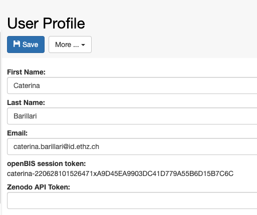
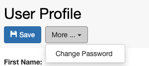

User Registration
====
 
## openBIS roles

 

### Observer

This role can be assigned to the whole openBIS instance (*Instance
Observer*) or to specific *Spaces* or *Projects* (*Space* or *Project
Observer*). Users with this role have read-only access to the whole
openBIS (*Instance Observer*), or to a specified *Space* or *Project*
(*Space* or *Project Observer*).

An Observer can see and search everything in an openBIS instance or the
*Space/Project* which they have access to. They can also download
datasets. They cannot modify nor delete anything.

 

### Space/Project User

Extends Observer permissions with some creating and editing
functionality. Permissions are limited to specified *Space(s)* or
*Project(s)*.

Can do everything that Observer and additionally:

-   create
    -   objects
    -   collections
-   edit
    -   objects
    -   collections
    -   projects

 

### Space/Project Power User

Extends *Space/Projec*t User permissions with some deleting, editing and
processing functionality. Permissions are limited to specified
*Space(s)* or *Project(s)*.

Can do everything that *Space/Project* User and additionally:

-   create projects
-   delete
    -   projects
    -   data sets
    -   objects
    -   collections

Please note that this role cannot be assigned via the ELN UI, only via
admin UI.

### Space/Project Admin

Extends Space/Project Power User permissions allowing to manage roles
and projects inside given *Space(s)* or *Project(s)*.

Can do everything that Space/Project Power User and additionally:

-   assign and remove Space/Project roles

 

### Instance Admin

Has the full access to given openBIS instance.

Can do everything that Space/Project Admin and additionally:

-   create
    -   space
    -   material
    -   person
    -   property type
    -   vocabulary
    -   material type
    -   object type
    -   collection type
    -   data set type
-   create/delete instance admin role
-   edit
    -   material
    -   property type
    -   property type assignment
    -   vocabulary
    -   material type
    -   object type
    -   collection type
    -   data set type
-   assign/unassign property type
-   delete
    -   space
    -   vocabulary terms
    -   material type
    -   sample type
    -   experiment type
    -   data set type

 

Please note that this role cannot be assigned via the ELN UI, only via
admin UI.

 

Updated on April 26, 2023
 
## User Profile

In the User Profile, a user who is logged in into openBIS can find the
following information:

 

1.  **First Name**
2.  **Last Name**
3.  **Email**
4.  **openBIS session token**
5.  **Zenodo API Token** ([Export to
    Zenodo](https://openbis.ch/index.php/docs/user-documentation-20-10-3/data-export/export-to-zenodo/))

 

First name, last name and email are automatically filled in when LDAP or
SSO are used for authentication.

In case of file-based authentication, this information can be entered
here directly from the user.

 

 

For file-based authentication, users can also change their password
here, from the **Change Password** option under the **More..** dropdown.

 

Updated on June 28, 2022
 
## Assign home space to a user

 

When a home space is assigned to a user, this becomes marked as **My
Space** for that user in the lab notebook, as shown below.

 

 

When users are registered via the ELN UI, a *Space* with their username
is created (see [User
Registration)](https://openbis.ch/index.php/docs/admin-documentation/user-registration/)
and this is automatically set as home space for the user.

The same happens in multi-group instances where spaces are created for
each user in the lab notebook section.

An *instance admin* can change the home space of a user or assign one to
a user that does not have a home space assigned from the admin UI, as
shown below.

 

 

Please note that when a user is inactivated, the home space assigned to
that user is moved in the ELN UI to the folder **Others (disabled).** If
this is not desired, the space should be removed as home space from the
inactivated user. This can be done by an *instance admin*.

 

 

 

Updated on April 26, 2023
