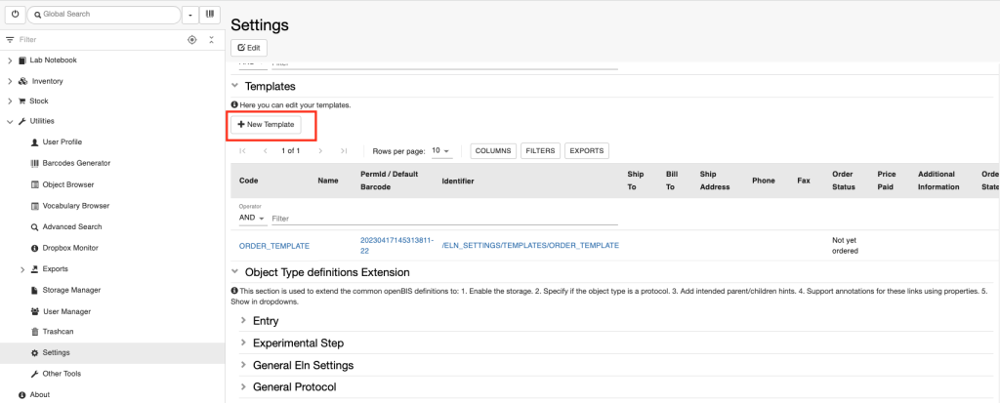
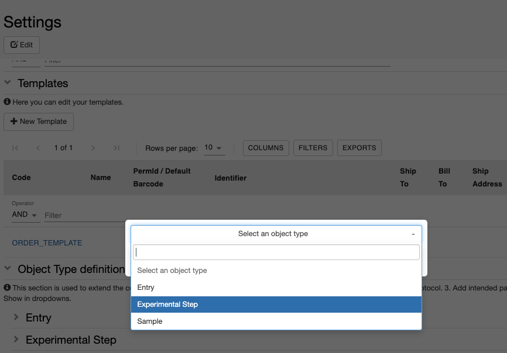
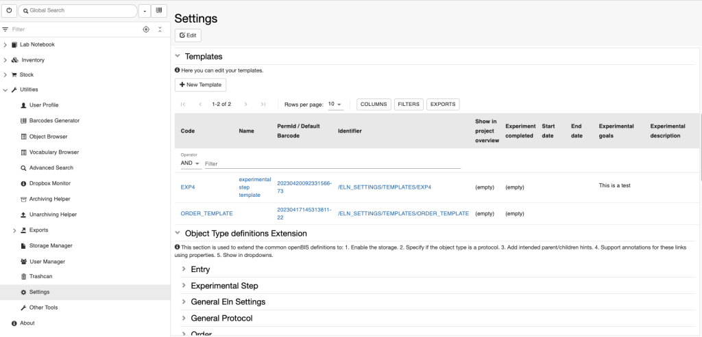

Create Templates for Objects
============================

  
It is possible to create templates for *Objects*. Templates are useful
when one has to register repetitive *Experimental steps* or
*measurements* where some fields should always be pre-defined.

For each *Object* type several templates can be created. This can be
done by the lab manager, who should have admin rights for editing the
**Settings**. It is not necessary to be *Instance admin* for this. In a
multi-group set up, this can be done by the *group admin*.

  
Procedure:  
  

1.  Go to the **Settings**, under **Utilities**
2.  Scroll down to the **Templates** section
3.  From the **New Template** tab select select the *Object type* for
    which you want to have a template.

 

 

1.  Fill in the fields as desired.
2.  **Save.**

  
Your templates will be show in the table in the **Templates** section,
as shown below

 

See [Use template for Experimental
Steps](https://openbis.ch/index.php/docs/user-documentation/lab-notebook/use-templates-for-experimental-steps/)
for more info on how to use templates. 

Updated on April 26, 2023
