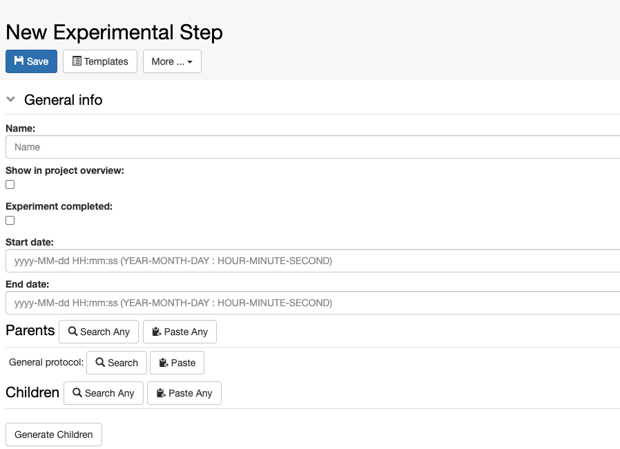
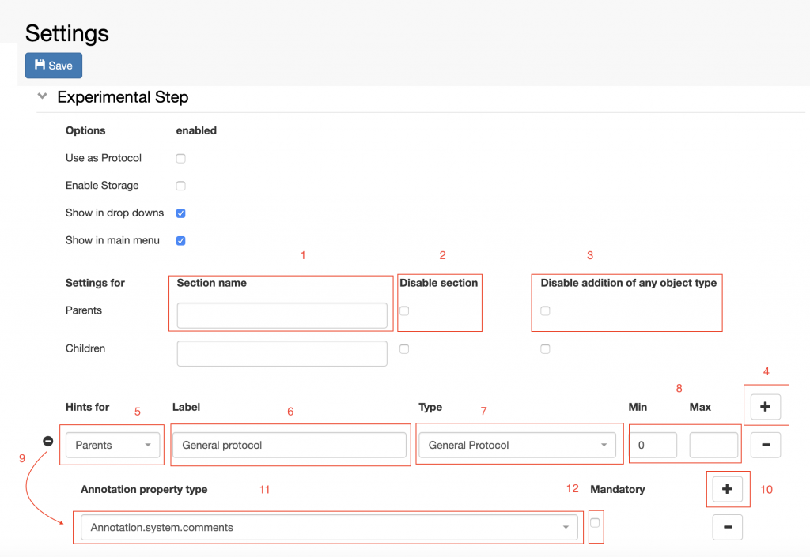
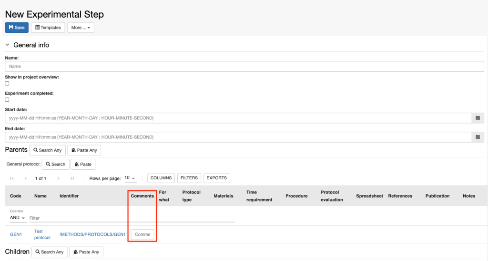

Customise Parents and Children Sections in Object Forms
=======================================================

 

 

The **Parents** and **Children** sections are automatically created in
all *Object* forms. It is possible to customise or remove these
sections, from the **Settings**, under **Utilities**.

  
Let’s consider an example. The default *Experimental Step*, present in
all openBIS instances, looks like the picture below: in the **Parents**
section, **General Protocol** is predefined. If we want to add a General
Protocol to the form, we use the **Search** or **Paste** options next to
General Protocol. If we want to add another parent, for example a
**Sample**, we need to use the **Search Any** or **Paste Any** next to
Parents. See also [Add parents and children to Experimental
Steps.](https://openbis.ch/index.php/docs/user-documentation-20-10-3/lab-notebook/add-parents-and-children-to-experimental-steps/)

 

 

Now let’s see how the **Parents** and **Children** sections of an
*Experimental Ste*p can be configured in the **Object Types Definition
Extension** in the **Settings.**

 

1.  **Section Name**. Enter an alternative name for the **Parents** or 
    **Children** section. If empty the default is used
    (Parents/Children).
2.  **Disable the section** for the *Object* type. No parents/children
    can be added to this *Object* type.
3.  **Disable addition of any object type**. This removes the **+**
    button next to the section name, which enables to add as parent any
    *Object* type. In this way only *Objects* of types pre-defined in
    the form can be added.
4.  To define which *Object* types should always be shown in the form of
    a this *Object* type, click the **+** button.
5.  Select if this is a **Parent** or **Child** from the **drop down**.
6.  Enter a **Label**, which is what is shown in the *Object* form.
7.  Select the *Object* type from the **drop down**.
8.  Specify the **minimum** and **maximum** number of parents needed as
    input for this *Object* type. This can be left empty if parents are
    not mandatory for this type. If a minimum is specified, this makes
    the addition of those parents mandatory. As many parents as
    specified in the minimum field will have to be added in order to be
    able to save the form.
9.  Specify A**nnotations** (e.g. Comments) for this parent *Object*
    type.
10. Click the + button on the section to add an annotation field.
11. Select the **Annotation** field from the list of available fields.
12. Specify if the **Annotation** is mandatory.

  
The figure below shows how the **Annotation** of type **Comments** looks
like in the *Experimental Step* form.

Updated on November 30, 2022
