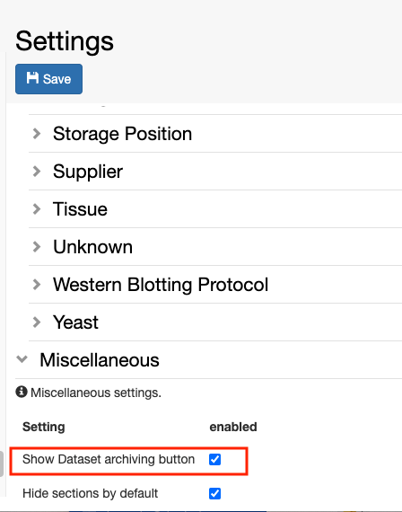
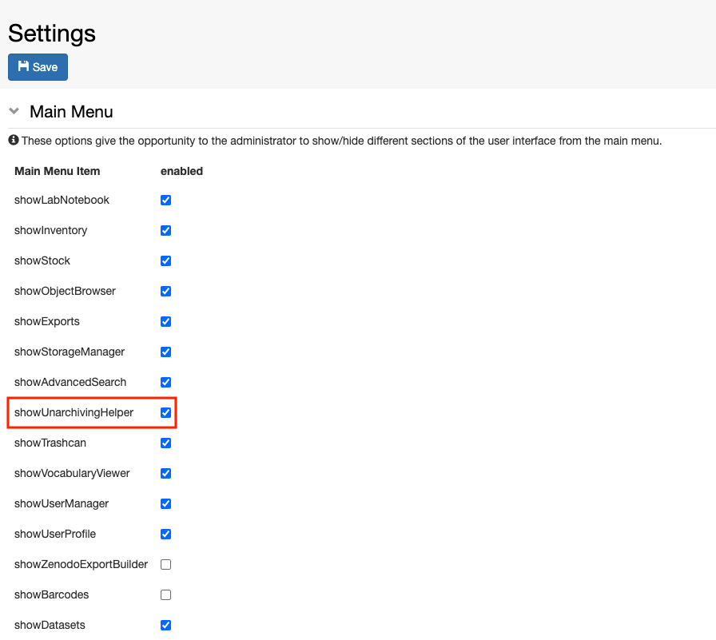

Enable archiving to Long Term Storage
=====================================

 

 

openBIS supports archiving of datasets to Strongbox and StronLink
() as described in [Datasets
Archiving](https://unlimited.ethz.ch/display/openBISDoc2010/Archiving+Datasets)

 

This needs to be set up and configured by a *system admin*.

 

Archiving can be manually triggered from the ELN interface. By default,
the archiving buttons are not shown, and they need to be enabled by an
*Instance admin* or even a *group admin* in the case of a multi-group
instance. This is done in the ELN Settings, as shown below.

 

In addition, the Unarchiving helper tool should also be enabled in the
ELN Settings:

 

More information on archiving and unarchiving datasets can be found
here: [Data
archiving](https://openbis.ch/index.php/docs/user-documentation-20-10-3/data-archiving/)

Updated on April 26, 2023
