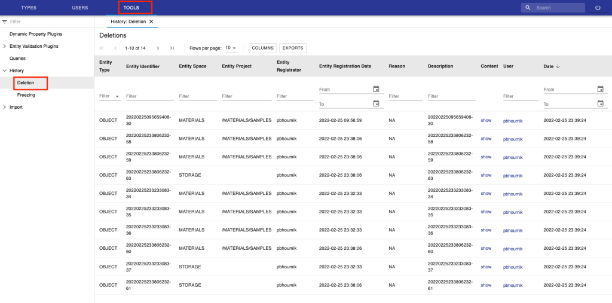
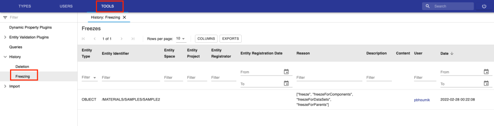

History Overview
====
 
History of deletions
----

 

When *Experiments/Collections*, *Objects* and *Datasets* in openBIS are
permanently deleted, i.e. they are removed from the trashcan, the
information of these permanently deleted entries is stored in the
database and it is visible in the admin UI.

*Spaces* and *Projects* are directly permanently deleted, without going
to the trashcan. Their information is also shown in the table of history
of deletions in the admin UI.

 

The table of history of deletions is under the **Tools** section, as
shown below.

 

For each deleted entry, the table shows:

1.  **Entity type**: this can be *Space*, *Project*, *Collection,
    Object, Dataset;*
2.  **Entity identifier**: this is the PermID of the entity. *Spaces* do
    not have PermID, so the code of the *Space* is shown instead;
3.  **Entity Space**: the *Space* to which the entity belonged;
4.  **Entity Project**: the *Project* to which the entity belonged;
5.  **Entity Registrator**: the user who registered the entity;
6.  **Entity Registration Date**: the date of registration of the
    entity;
7.  **Reason**: the reason of deletion of the entity;
8.  **Description**: the PermID (*Collection*, *Object*), identifier
    (*Space*, *Project*),  dataset path (*Dataset*) of the entity;
9.  **Content**: the metadata of the entity when it was deleted. This is
    available for *Projects*, *Collections*, *Objects*, *Datasets*, but
    not for *Spaces*;
10. **User**: the user who deleted the entity;
11. **Date**: the date and time of deletion of the entity.

 

Updated on October 9, 2022
 
History of freezing
----

 

In the admin UI it is possible to have an overview of all frozen entries
in openBIS. Frozen entries can no longer be modified (see [Freeze
Entities](https://openbis.ch/index.php/docs/user-documentation-20-10-3/additional-functionalities/freeze-entities/)).

The table showing the history of freezing can be found under the
**Tools** section in the admin UI, as shown below.

 

Updated on March 4, 2022
