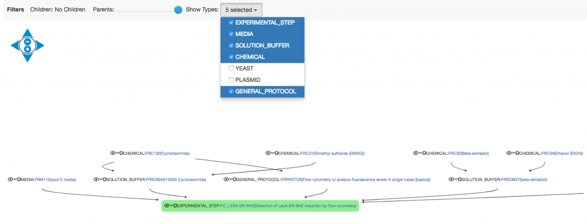
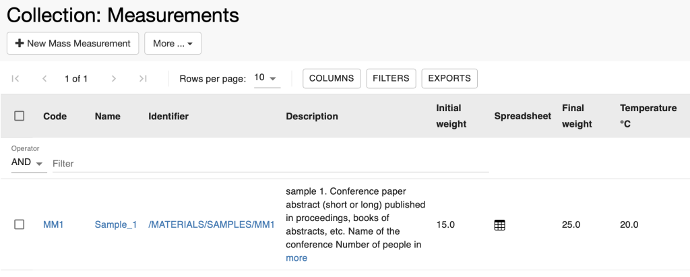
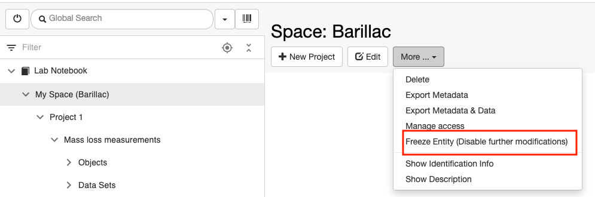
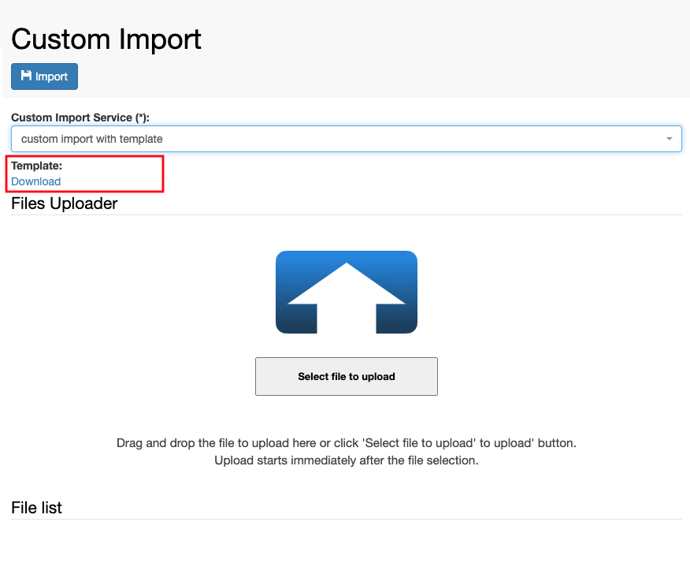

Additional Functionalities
====
 
# Visualise Relationships

<a href="#"
class="wedocs-print-article wedocs-hide-print wedocs-hide-mobile"
title="Print this article">

  
Parent-child relationships between
*Objects* can be visualised as trees or tables in the ELN.

To see the genealogical tree, select the
**Hierarchy Graph** option from the **More…**dropdown in an entity
form*.*

 

class="alignnone wp-image-2122 size-medium"

sizes="(max-width: 300px) 100vw, 300px" width="300" height="229" />

 

Large trees can be pruned, by selecting
how many levels of parents and/or children and which types to
show.

class="wp-image-217"

sizes="(max-width: 1024px) 100vw, 1024px" />

 

To view the genealogy of an *Object* in a
tabular format, select the **Hierarchy Table** option from the **More…**
dropdown.

Updated on March 4, 2022
 
# Tables

<a href="#"
class="wedocs-print-article wedocs-hide-print wedocs-hide-mobile"
title="Print this article">

 

  
All tables in the ELN have a similar
format and functionalities. The tables have been redesigned for the
20.10.3 release of openBIS.

Here we give an overview of the main functionalities of the tables.

 

# Filters

Two filter options are available form the
**Filters** button: **Filter Per Column** and **Global Filter**. The
first allows to filter on individual columns, or multiple columns,
whereas the second filters terms across the entire table using the
**AND** or **OR** operator. 

>  
>

> class="alignnone wp-image-3204 size-large"

> sizes="(max-width: 1024px) 100vw, 1024px" width="1024" height="248" />
>

> class="size-large wp-image-3203 alignnone"

> sizes="(max-width: 1024px) 100vw, 1024px" width="1024" height="219" />
>
>  

>  

# Sorting

It is possible to sort individual columns or also multiple columns. For
multi-column sorting, you should click on the column header and press
the **Cmd** keyboard key. The order of sorting is shown by a number in
each column, as shown below.

 

class="alignnone size-large wp-image-3273"

sizes="(max-width: 1024px) 100vw, 1024px" width="1024" height="334" />

>  

# Exports

Tables can be exported in different ways,
using the export button shown below.

>  

class="alignnone size-large wp-image-4060"

sizes="(max-width: 1024px) 100vw, 1024px" width="1024" height="419" />

>  
>
> 1.  1.  **Import Compatible**:
>         1.  **Yes**: in this case some columns which are incompatible
>             with imports (i.e. registration date, registrator,
>             modification date, modifier) are not exported even if
>             selected; some columns that are required by openBIS for
>             imports are added to the exported file even if not
>             selected (i.e. code, identifier, $ column). Moreover text
>             fields are exported in HTML, to keep the formatting upon
>             import.
>         2.  **No**: in this case all columns or selected columns are
>             exported.
>
>  
>

> class="alignnone size-full wp-image-4056" width="203" height="286" />
>
>  
>
>  
>
> 2\. **Columns**:
>
> 1.  1.  1.  **All (default order)**. All columns are exported, in
>             accordance with the selection explained above for import
>             compatibility.
>         2.  **Selected (shown order)**. Selected columns are exported,
>             in accordance with the selection explained above for
>             import compatibility.
>

> class="alignnone size-full wp-image-4057" width="193" height="277" />
>
>  
>
>  3. **Rows**:
>
> 1.  1.  1.  1.  **All Pages**. All pages of the table are exported.
>             2.  **Current Page**. Only the currently visible page of
>                 the table is exported.
>             3.  **Selected Rows**. Only selected rows in the table are
>                 exported.
>

> class="alignnone size-full wp-image-4058" width="189" height="265" />
>
> 4\. **Value**:
>
> 1.  1.  1.  **Plain Text**. Text fields are exported in plain text,
>             without any formatting. This option is not available if
>             the export is import-compatible.
>         2.  **Rich Text**. Text fields are exported in HTML format.
>

> class="alignnone size-full wp-image-4059"

> sizes="(max-width: 211px) 100vw, 211px" width="211" height="314" />
>
>  
>
> Tables are exported to **XLS** format. Exported tables can be used for
> updates via the **XLS Batch Update Objects**. 
>
>  
>
>  
>
>  

# Columns

Users can select which properties to
display in the table clicking on the **Columns** button. It is also
possible to show all properties or hide all properties. The position of
the columns can also be changed by placing the cursor next to the = sign
in the list and moving the fields. This information is stored in the
database for each user. 

 

class="alignnone size-large wp-image-3205"

sizes="(max-width: 1024px) 100vw, 1024px" width="1024" height="571" />

 

## **Spreadsheets**

If a table contains *Objects* which have a spreadsheet field which is
filled in, a spreadsheet icon is displayed in the table. Upon clicking
on the icon, the content of the spreadsheet can be expanded.  

>  
>

> class="alignnone wp-image-3111"

> sizes="(max-width: 800px) 100vw, 800px" width="800" height="321" />
>

> class="alignnone wp-image-3112"

> sizes="(max-width: 800px) 100vw, 800px" width="800" height="365" />
>
>  

## Text fields

If a table contains Objects which have long text fields, only the
beginning of the text is shown and can be expanded. If the text contains
a picture or a table, an icon is shown in the table and the content of
the text becomes visible by clicking on the icon.

>  
>

> class="alignnone size-large wp-image-3106"

> sizes="(max-width: 1024px) 100vw, 1024px" width="1024" height="398" />
>
>  

# **Selection of entries in table**

Single entries in a table can be selected using the checkbox in the row.
By clicking the checkbox in the table header, all entries of the table
are selected. After selection of entries, some actions become available:

> -   **Delete**: allows to move the selected entries to the trashcan.
> -   **Move**: allows to move the selected entries to a different
>     *Collection/Experiment.*
> -   **Generate barcodes**: allows to generate custom barcodes for the
>     selected entries.
> -   **Update custom barcodes**: allows to update existing custom
>     barcodes of the selected entries.
> -   **Clear selection**: allows to clear the selection made.

 

class="alignnone size-large wp-image-3206"

sizes="(max-width: 1024px) 100vw, 1024px" width="1024" height="425" />

 

In *Object* tables inside
*Experiments/Collections* there is an **Operations** column, which allow
users to perform certain tasks on an *Object*:

> 1.  Upload a file to the *Object*
> 2.  Move the *Object* to another
>     Experiment/Collection.
> 3.  Update Barcode.
> 4.  Open the hierarchy graph. This is
>     the graph showing parent/child connections of the *Object*.
> 5.  Open the hierarchy table. This is
>     the table showing parent/child connections of the *Object*.

 

class="alignnone size-large wp-image-3207"

sizes="(max-width: 1024px) 100vw, 1024px" width="1024" height="405" />

 

 

 

 

Updated on April 26, 2023
 
# Browse Entries by Type

<a href="#"
class="wedocs-print-article wedocs-hide-print wedocs-hide-mobile"
title="Print this article">

  
The **Object Browser** under the
**Utilities** main menu allows to see all entries of the same type and
all *Experimental Steps*, which may be contained in different
*Experiments/Collections* and *Projects*. 

class="alignnone wp-image-1826 size-medium"

sizes="(max-width: 300px) 100vw, 300px" width="300" height="248" />

This is useful when there are entries of a
certain type that belong to different *Collections* (e.g. protocols of
the same type stored in two different protocol collections), or to have
an overview of all *Experimental Steps*, independently of the
*Experiment* they belong to.

 

class="alignnone size-large wp-image-3238"

sizes="(max-width: 1024px) 100vw, 1024px" width="1024" height="646" />

From the **Object Browser** page, it is also possible to **Batch
register** or **Batch update** *Objects* using an XLS or TSV template.

 

class="alignnone size-full wp-image-4028"

sizes="(max-width: 810px) 100vw, 810px" width="810" height="374" />

 

 

Updated on April 25, 2023
 
# Trashcan

<a href="#"
class="wedocs-print-article wedocs-hide-print wedocs-hide-mobile"
title="Print this article">

  
When *Experiments*, *Objects* and
*Datasets* are deleted, they are moved to the openBIS **trashcan**,
under the **Utilities** main menu. Items can be removed from the
trashcan only by someone with *Space admin* or *Instance admin* role.
Deletion from the trashcan is **IRREVERSIBLE**.

 

Note: *Spaces* and *Projects* are directly permanently deleted, they are
not moved to the trashcan first.

 

To empty the whole trashcan, click the
blue **Empty Trash **button above the table.

To delete permanently single entries choose one of two options from the
Operations dropdown:

 

-   **delete permanently**: deletes permanently only the selected entry.
-   **delete permanently (including dependent deletions)**: if the
    selected entry had children which are also in the trashcan, this
    option allows to permanently delete both the entry and its children.

 

If one entity was unintentionally deleted,
the operation can be reverted at this stage by choosing the** Revert
Deletions** option from the **Operations** drop down in the
table.

 

class="alignnone size-large wp-image-3213"

sizes="(max-width: 1024px) 100vw, 1024px" width="1024" height="302" />

Updated on October 9, 2022
 
# Vocabulary Browser

<a href="#"
class="wedocs-print-article wedocs-hide-print wedocs-hide-mobile"
title="Print this article">

  
The **Vocabulary browser** is accessible from the **Utilities** main
menu. This shows all controlled vocabularies registered in openBIS and
the terms they contain. Vocabularies are predefined lists of values to
choose from in given fields. Vocabularies can be created/modified by an
openBIS *Instance admin* (see <a
href="https://openbis.ch/index.php/docs/admin-documentation-openbis-19-06-4/new-entity-type-registration/"
target="_blank" rel="noopener noreferrer">New Entity Type
Registration).

This information is needed for filling the forms for **Batch
Upload **or**Batch Update** of *Objects* via TSV file. If an *Object*
has a property of type *Controlled Vocabulary*, the codes of the
vocabulary have to be entered in the .tsv template file. This is not the
case for XLS Batch registration or update, where labels can be used.

 

class="alignnone size-large wp-image-4030"

sizes="(max-width: 1024px) 100vw, 1024px" width="1024" height="483" />

Updated on April 25, 2023
 
# Freeze Entities

<a href="#"
class="wedocs-print-article wedocs-hide-print wedocs-hide-mobile"
title="Print this article">

  
Each level of the openBIS hierarchy
(Space, Project, Experiment/Collection, Object, Dataset) can be frozen,
so it can be no longer edited and/or deleted.

At every level, everything contained
underneath is selected by default to be frozen. E.g. if I choose to
freeze a Space, everything contained in the Space is automatically
selected to be frozen. Single entities can be manually
unselected.

A Space admin role is necessary to freeze
entities in a given Space.  
  

**IMPORTANT: the freezing is
IRREVERSIBLE!**  
  

This operation cannot be undone from any
UI, not even by an *Instance admin.* Please freeze entities only when
you are absolutely sure that they should not be further modified!

##  **How to freeze an entity**

  
At each level of the openBIS hierarchy
(*Space, Project, Experiment/Collection, Object, Dataset*) the **Freeze
Entity** option is available under the **More..** dropdown menu. See the
example for a *Space* below.

 

class="alignnone size-full wp-image-4032"

sizes="(max-width: 995px) 100vw, 995px" width="995" height="330" />

 

 

 

If you select this, a list of entities
contained or connected to the one selected will be presented to you, as
shown below. By default everything is selected, so you need to unselect
entries that you do not want to freeze.

 

 

class="alignnone wp-image-651 size-large"

sizes="(max-width: 1024px) 100vw, 1024px" width="1024" height="469" />

 

To freeze one or several entities, you
need to provide your login password and save.

##  

**Rules for freezing**

 

1.  **Freeze Space only**

 
Allowed
Not allowed

Create new Project
 
x

Create new Experiment/Collection
x
 

Create new Object
 
x

Create new Dataset in existing
Experiment/Collection
x
 

Create new Dataset in existing Object
x
 

Edit existing Project
x
 

Edit existing Experiment/Collection
x
 

Edit existing Object
x
 

Edit existing Dataset
x
 

Delete Space
 
x

Delete Project
 
x

Delete Experiment/Collection
x
 

Delete Object
x
 

Delete Dataset
x
 

Move Experiment/Collection
x
 

Move Object
x
 

Copy Object
 
x

Export
x
 

 

 

1.  **Freeze Project only**

 

 

 
Allowed
Not allowed

Create new Experiment/Collection
 
x

Create new Object
 
x

Create new Dataset in existing Experiment/Collection
x
 

Create new Dataset in existing Object
x
 

Edit Project
 
x

Edit existing Experiment/Collection
x
 

Edit existing Object
x
 

Edit existing Dataset
x
 

Delete Project
 
x

Delete Experiment/Collection
 
x

Delete Object
 
x

Delete Dataset
 
x

Move Experiment/Collection
 
x

Move Object
 
x

Copy Object
 
x

Export
x
 

 

 

**3. Freeze Experiment/Collection only**

 

 

 
Allowed
Not allowed

Create new Object
 
x

Create new Dataset in existing Experiment/Collection
 
x

Create new Dataset in existing Object
 
x

Edit existing Experiment/Collection
 
x

Edit existing Object
x
 

Edit existing Dataset
x
 

Delete Experiment/Collection
 
x

Delete Object
 
x

Delete Dataset
 
x

Move Experiment/Collection
 
x

Move Object
 
x

Copy Object
 
x

Export
x
 

 

 

**4. Freeze Object only**

 

 

 
Allowed
Not allowed

Create new Dataset in existing Object
 
x

Edit existing Object
 
x

Edit existing Dataset in Object
x
 

Delete Object
 
x

Delete Dataset
 
x

Move Object
 
x

Copy Object
x (only if the Experiment is not frozen)
 

Export
x
 

 

 

 

**5. Freeze Dataset only **  
  

 

 
Allowed
Not allowed

Edit existing Dataset
 
x

Delete Dataset
 
x

Move Dataset
 
x

Export
x
 

##   

Updated on April 25, 2023
 
# Navigation menu

<a href="#"
class="wedocs-print-article wedocs-hide-print wedocs-hide-mobile"
title="Print this article">

 

openBIS 20.10.6 features a new navigation menu.

 

class="alignnone size-full wp-image-4042"

sizes="(max-width: 317px) 100vw, 317px" width="317" height="913" />

 

This has the following functionalities:

 

**1.Filter**. You can filter the menu by names or codes.

 

class="alignnone size-full wp-image-4048"

sizes="(max-width: 315px) 100vw, 315px" width="315" height="177" />

 

 

**2. Root nodes**. If you do not want to navigate the full menu, but
only a section of it, you can set the section you want to navigate as
root node, by clicking the icon shown in the picture below.

 

class="alignnone size-full wp-image-4045"

sizes="(max-width: 556px) 100vw, 556px" width="556" height="798" />

 

This now becomes the root node, as shown below. To restore the full menu
view, you can click on the root node icon shown below.

 

class="alignnone size-full wp-image-4046"

sizes="(max-width: 557px) 100vw, 557px" width="557" height="393" />

**3. Sorting**. The default sorting of the menu is in alphabetical. It
is now possible to sort separately individual sections of the menu
(*ELN, Inventory, Stock*) and individual nodes inside those sections. It
is possible to do a custom sorting by moving around (drag&drop) entities
in the menu. Please note that this is only possible inside a given
level, i.e. you can re-organise *Objects* inside a
*Collection/Experiment*; *Collections/Experiments* inside a *Project*;
*Projects* inside a *Space*. However, you cannot move entities from one
level to another, i.e. you cannot move an *Object* to a different
*Collection/Experiment*; a *Collection/Experimen*t to a different
*Project*; a *Project* to a different *Space*. This can only be done
from the **Move** option under the **More..** dropdown menu in the
forms.

 

class="alignnone size-full wp-image-4049"

sizes="(max-width: 558px) 100vw, 558px" width="558" height="420" />

 

 

class="alignnone size-full wp-image-4044"

sizes="(max-width: 759px) 100vw, 759px" width="759" height="401" />

 

 

**4. Collapse/Expand.** The full menu or individual nodes can be
expanded or collapsed, with the button shown below.

 

 

class="alignnone size-full wp-image-4047"

sizes="(max-width: 556px) 100vw, 556px" width="556" height="412" />

 

 

**5. Scroll to selected node**. In some cases, the view in the main ELN
page does not correspond to an entry selected in the menu. You can
scroll to the selected node in the menu, using the button shown below.

 

class="alignnone size-full wp-image-4051"

sizes="(max-width: 568px) 100vw, 568px" width="568" height="455" />

 

The state of the menu is saved. Every time you change something in the
menu, this change will be saved and when you login next time you will
see the menu in the state you last saved it.

Updated on April 26, 2023
 
# Custom Imports

<a href="#"
class="wedocs-print-article wedocs-hide-print wedocs-hide-mobile"
title="Print this article">

 

From openBIS version 20.10.4, Custom Imports, previously available only
in the core UI, are available in the ELN UI.

 

Custom imports allow users to import metadata in a custom way, by using
a dropbox script in the background. You can use this if you want to
parse a file in a given format and import the information from this file
as metadata in openBIS.

 

Custom imports are not available by default, but need to be enabled on
the server side by a *system admin*, and a dropbox script needs to be
associated with an import (see
<a href="https://unlimited.ethz.ch/display/openBISDoc2010/Custom+Import"
target="_blank" rel="noopener noreferrer">Custom Imports).

 

If one or more custom imports are configured in openBIS, the **Custom
Import** option is available under the **Utilities** in the **main
menu**.

The available custom imports can be selected from the **Custom Import
Service** drop down menu in the Custom Import page (see below)

class="alignnone size-large wp-image-4139"

sizes="(max-width: 1024px) 100vw, 1024px" width="1024" height="459" />

 

 

If the available custom import provides a template that can be used as
input for the import, the template will be available to download from
the Custom Import page.

 

class="alignnone wp-image-3541 size-full"

sizes="(max-width: 876px) 100vw, 876px" width="876" height="714" />

 

If the custom import is not configured to provide a template, no
download link is shown in the Custom Import page.

 

class="alignleft wp-image-3540 size-full"

sizes="(max-width: 888px) 100vw, 888px" width="888" height="664" />

 

Updated on April 26, 2023
 
# Entity history

<a href="#"
class="wedocs-print-article wedocs-hide-print wedocs-hide-mobile"
title="Print this article">

 

Whenever an entity of type *Collection/Experiment*, *Object* or
*Dataset* is modified in openBIS, the changes are stored in the
database. The stored changes are modifications to property fields,
addition and deletion of parents/children for *Objects* and *Datasets*,
changes of *Space/Project/Experiment/Object* ownership if an entity is
moved.

The **History** of changes of each entity is now available in the ELN
UI. In versions prior to openBIS 20.10.3 this was only available in the
core UI.

 

 

## History table for Collections

 

In a *Collection* page, the **History** can be accessed from the
**More..** dropdown list.

 

class="alignnone size-full wp-image-3254"

sizes="(max-width: 766px) 100vw, 766px" width="766" height="393" />

 

The **History** table shows the version number of the changes, the
author of the changes, the changes made (with the values before- in red,
and after the change – in green), and the timestamp, i.e. the time when
the changes were made.

 

For a *Collection*, the **PermID** (Permanent Identifier) of the
*Project* it belongs to is shown. If a *Collection* is moved from one
*Project* to another, the PermID of the old and new *Projects* are shown
in the history table.

 

 

class="alignnone wp-image-3050"

sizes="(max-width: 600px) 100vw, 600px" width="600" height="313" />

 

The **show** option in **Full Document** shows the full metadata of the
entry (not only the changed fields) when changes were applied. This is
displayed in JSON format.

 

class="alignnone wp-image-3251"

sizes="(max-width: 600px) 100vw, 600px" width="600" height="297" />

 

 

## History table for Objects

 

For every *Object*, the history of changes can be accessed from the
**More..** dropdown on the *Object* page.

 

class="alignnone size-full wp-image-3255"

sizes="(max-width: 679px) 100vw, 679px" width="679" height="508" />

 

 

For an *Object*, the **PermID** (Permanent Identifier) of the
*Collection* it belongs to is shown. If an *Object* is moved from one
*Collection* to another, the PermID of the old and new *Collections* are
shown in the history table.

 

## History table for Datasets

 

For every dataset, the history of changes can be accessed from the
**More..** dropdown on the *Dataset* page.

 

class="alignnone size-full wp-image-3256"

sizes="(max-width: 688px) 100vw, 688px" width="688" height="360" />

 

For a *Dataset*, the **PermID** (Permanent Identifier) of the
*Object*/*Collection* it belongs to is shown. If a* Dataset* is moved
from one *Object*/*Collection* to another, the PermID of the old and new
*Objects*/*Collections* are shown in the history table.

Updated on November 10, 2022
