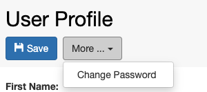

Data Archiving
====
 
    -   collections
    -   projects

 

## Space/Project Power User

Extends *Space/Projec*t User permissions with some deleting, editing and
processing functionality. Permissions are limited to specified
*Space(s)* or *Project(s)*.

Can do everything that *Space/Project* User and additionally:

-   create projects
-   delete
    -   projects
    -   data sets
    -   objects
    -   collections

Please note that this role cannot be assigned via the ELN UI, only via
admin UI.

## Space/Project Admin

Extends Space/Project Power User permissions allowing to manage roles
and projects inside given *Space(s)* or *Project(s)*.

Can do everything that Space/Project Power User and additionally:

-   assign and remove Space/Project roles

 

## Instance Admin

Has the full access to given openBIS instance.

Can do everything that Space/Project Admin and additionally:

-   create
    -   space
    -   material
    -   person
    -   property type
    -   vocabulary
    -   material type
    -   object type
    -   collection type
    -   data set type
-   create/delete instance admin role
-   edit
    -   material
    -   property type
    -   property type assignment
    -   vocabulary
    -   material type
    -   object type
    -   collection type
    -   data set type
-   assign/unassign property type
-   delete
    -   space
    -   vocabulary terms
    -   material type
    -   sample type
    -   experiment type
    -   data set type

 

Please note that this role cannot be assigned via the ELN UI, only via
admin UI.

 

Updated on April 26, 2023
 

Updated on June 28, 2022
 
this is not desired, the space should be removed as home space from the
inactivated user. This can be done by an *instance admin*.

 

 

 

Updated on April 26, 2023
