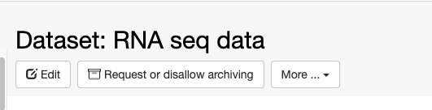
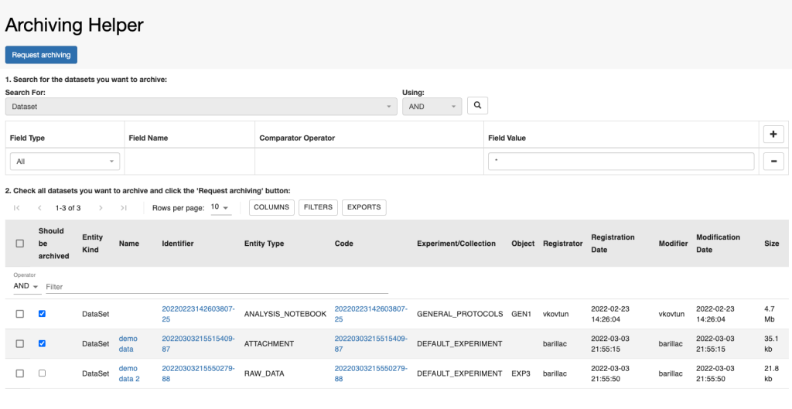
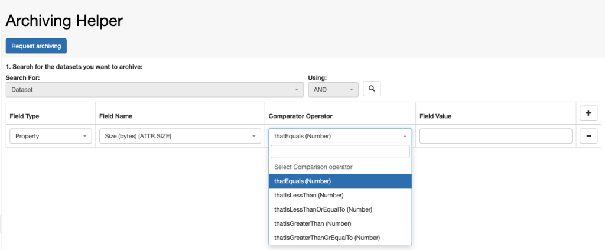
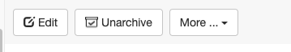
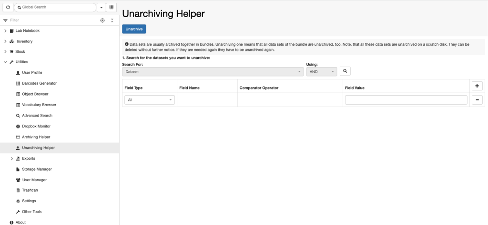

        Relationships](https://openbis.ch/index.php/docs/user-documentation/additional-functionalities/visualise-relationships/)
    -   [Tables](https://openbis.ch/index.php/docs/user-documentation/additional-functionalities/tables/)
    -   [Browse Entries by
        Type](https://openbis.ch/index.php/docs/user-documentation/additional-functionalities/browse-entries-by-type/)
    -   [Trashcan](https://openbis.ch/index.php/docs/user-documentation/additional-functionalities/trashcan/)
    -   [Vocabulary
        Browser](https://openbis.ch/index.php/docs/user-documentation/additional-functionalities/vocabulary-browser/)
    -   [Freeze
        Entities](https://openbis.ch/index.php/docs/user-documentation/additional-functionalities/freeze-entities/)
    -   [Navigation
        menu](https://openbis.ch/index.php/docs/user-documentation/additional-functionalities/navigation-menu/)
    -   [Custom
        Imports](https://openbis.ch/index.php/docs/user-documentation/additional-functionalities/custom-imports/)
    -   [Entity
        history](https://openbis.ch/index.php/docs/user-documentation/additional-functionalities/entity-history/)
    -   [Spreadsheet](https://openbis.ch/index.php/docs/user-documentation/additional-functionalities/spreadsheet/)
-   [Managing Lab Stocks and
    Orders](https://openbis.ch/index.php/docs/user-documentation/managing-lab-stocks-and-orders-2/)
-   [Tools for Analysis of Data Stored in
    openBIS](https://openbis.ch/index.php/docs/user-documentation/tools-for-analysis-of-data-stored-in-openbis/)
    -   [Jupyter
        Notebooks](https://openbis.ch/index.php/docs/user-documentation/tools-for-analysis-of-data-stored-in-openbis/jupyter-notebooks/)
    -   [MATLAB
        toolbox](https://openbis.ch/index.php/docs/user-documentation/tools-for-analysis-of-data-stored-in-openbis/matlab-toolbox/)

1.  
2.  [Home](https://openbis.ch/)
3.  
4.  [Docs](https://openbis.ch/?page_id=36)
5.  
6.  [User
    Documentation](https://openbis.ch/index.php/docs/user-documentation/)
7.  
8.  Data archiving

## Data archiving

 

## Dataset archiving

 

openBIS supports archiving of datasets to Strongbox
([https://www.strongboxdata.com/](https://www.strongboxdata.com/)) as
described in [Datasets
Archiving](https://unlimited.ethz.ch/display/openBISDoc2010/Archiving+Datasets)

 

This needs to be set up and configured by a *system admin*.

 

To trigger archiving manually from the ELN, navigate to a dataset and
use the *Request or disallow archiving* button, as shown below.

 

 

 

 

Please note that the strongbox has a minimum size requirement of
**10GB**. If a single dataset is below this threshold it will be queued
for archiving and it will be archived only when additional datasets in
the same *Space/Project/Experiment* are selected for archiving and the
minimum size is reached. All datasets are bundled together and archived
together. This implies that if unarchiving is requested for one dataset
in a bundle, all other datasets will also be unarchived.

 

### Dataset archiving helper tool

 

If you wish to archive multiple datasets, you can use the **Archiving
Helper** tool under **Utilities** in the main menu. You can search for
datasets and select multiple ones to be archived, by clicking the
**Request Archiving** button on the top of the page.

 

It is possible to search datasets by size, by selecting *Property* in
the **Field Type**, *Size (bytes)\[ATTR.SIZE\]*  in the **Field Name**
and the desired **Comparator Operator**, as shown below.

 

## Dataset unarchiving

 

Once the dataset is archived on tapes, the button on the dataset page
changes to **Unarchive**, as shown below. Datasets can be unarchived by
using this button.

 

 

 

### Dataset unarchiving helper tool

 

To unarchive several datasets it is possible to use the **Unarchiving
Helper** tool, under **Utilities** in the main menu, as shown below. You
can search for datasets and select multiple ones to be unarchived, using
the **Unarchive** button on tope of the page.

 

Updated on April 25, 2023
