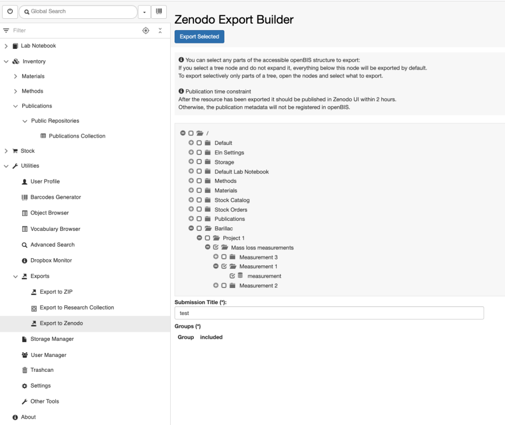

Data Export
====
 

class="mobile" itemprop="image" alt="Logo" />

Search for:

All Docs Admin Documentation Admin Documentation (prior to openBIS
v19.06.4) Admin Documentation (prior to openBIS v20.10.3) User
Documentation User Documentation (prior to openBIS v19.06.4) User
Documentation (prior to openBIS v20.10.3)

-   <a href="https://openbis.ch"
    target="_blank">Home
-   <a href="https://openbis.ch" class="no_link" style="cursor: default;"
    onclick="JavaScript: return false;">Resources
    -   [Overview of openBIS and RDM
        services offered by
        SIS](https://openbis.ch/index.php/overview-of-openbis-and-rdm-services-offered-by-sis/)
    -   [User
        Documentation](https://openbis.ch/index.php/docs/user-documentation/)
    -   [Admin
        Documentation](https://openbis.ch/index.php/docs/admin-documentation/)
    -   [FAQ](https://openbis.ch/index.php/faq/)
    -   [Video
        tutorials](https://openbis.ch/index.php/screencasts/#video%20tutorials)
    -   [Demo](https://openbis.ch/index.php/demo/#demo)
    -   [Downloads](https://openbis.ch/index.php/downloads/#downloads)
    -   [References](https://openbis.ch/index.php/references/)
-   [Community
    forum](https://openbis.ch/index.php/community-forum/)
-   <a href="https://openbis.ch" class="no_link" style="cursor: default;"
    onclick="JavaScript: return false;">Services
    -   [openRDM.swiss](https://openbis.ch/index.php/openrdm-swiss/)
    -   [openRDM.eu](https://openbis.ch/index.php/openrdm-eu/)
-   <a href="https://openbis.ch" class="no_link" style="cursor: default;"
    onclick="JavaScript: return false;">Events
    -   [openBIS UGM
        2023](https://openbis.ch/index.php/openbis-ugm-2023/)
-   <a href="https://openbis.ch" class="no_link" style="cursor: default;"
    onclick="JavaScript: return false;">About
    -   [Our
        team](https://openbis.ch/index.php/our-team/)
    -   [Contact](https://openbis.ch/index.php/contact/)
-   [News](https://openbis.ch/index.php/news/)
-   [Imprint](https://openbis.ch/index.php/imprint/#imprint)

-   Home

-   ### Resources

    
    -   [Overview of openBIS and RDM
        services offered by
        SIS](https://openbis.ch/index.php/overview-of-openbis-and-rdm-services-offered-by-sis/)
    -   [User
        Documentation](https://openbis.ch/index.php/docs/user-documentation/)
    -   [Admin
        Documentation](https://openbis.ch/index.php/docs/admin-documentation/)
    -   [FAQ](https://openbis.ch/index.php/faq/)
    -   [Video
        tutorials](https://openbis.ch/index.php/screencasts/#video%20tutorials)
    -   [Demo](https://openbis.ch/index.php/demo/#demo)
    -   [Downloads](https://openbis.ch/index.php/downloads/#downloads)
    -   [References](https://openbis.ch/index.php/references/)

-   [Community
    forum](https://openbis.ch/index.php/community-forum/)

-   ### Services

    
    -   [openRDM.swiss](https://openbis.ch/index.php/openrdm-swiss/)
    -   [openRDM.eu](https://openbis.ch/index.php/openrdm-eu/)

-   ### Events

    
    -   [openBIS UGM
        2023](https://openbis.ch/index.php/openbis-ugm-2023/)

-   ### About

    
    -   [Our
        team](https://openbis.ch/index.php/our-team/)
    -   [Contact](https://openbis.ch/index.php/contact/)

-   [News](https://openbis.ch/index.php/news/)

-   [Imprint](https://openbis.ch/index.php/imprint/#imprint)

 

### User Documentation

-   [General
    Overview](https://openbis.ch/index.php/docs/user-documentation/general-overview/)
-   [Inventory of Materials and
    Methods](https://openbis.ch/index.php/docs/user-documentation/inventory-of-materials-and-methods/)
    -   [Customise Collection
        View](https://openbis.ch/index.php/docs/user-documentation/inventory-of-materials-and-methods/customise-collection-view/)
    -   [Register single entries in a
        Collection](https://openbis.ch/index.php/docs/user-documentation/inventory-of-materials-and-methods/register-single-entries-in-a-collection/)
    -   [Batch register entries in a
        Collection](https://openbis.ch/index.php/docs/user-documentation/inventory-of-materials-and-methods/batch-register-entries-in-a-collection/)
    -   [Batch register entries in several
        Collections](https://openbis.ch/index.php/docs/user-documentation/inventory-of-materials-and-methods/batch-register-entries-in-several-collections/)
    -   [Batch update entries in a
        Collection](https://openbis.ch/index.php/docs/user-documentation/inventory-of-materials-and-methods/batch-update-entries-in-a-collection/)
    -   [Batch update entries in several
        Collections](https://openbis.ch/index.php/docs/user-documentation/inventory-of-materials-and-methods/batch-update-entries-in-several-collections/)
    -   [Copy
        entries](https://openbis.ch/index.php/docs/user-documentation/inventory-of-materials-and-methods/copy-entries/)
    -   [Move entries to a different
        Collection](https://openbis.ch/index.php/docs/user-documentation/inventory-of-materials-and-methods/move-entries-to-a-different-collection/)
    -   [Register Protocols in the Methods
        Inventory](https://openbis.ch/index.php/docs/user-documentation/inventory-of-materials-and-methods/register-protocols-in-the-methods-inventory/)
-   [Managing storage of
    samples](https://openbis.ch/index.php/docs/user-documentation/managing-storage-of-samples/)
    -   [Allocate storage positions to
        samples](https://openbis.ch/index.php/docs/user-documentation/managing-storage-of-samples/allocate-storage-to-samples/)
    -   [Batch update storage
        positions](https://openbis.ch/index.php/docs/user-documentation/managing-storage-of-samples/batch-update-storage-positions/)
    -   [Delete storage
        positions](https://openbis.ch/index.php/docs/user-documentation/managing-storage-of-samples/delete-storage-positions/)
    -   [Overview of lab
        storages](https://openbis.ch/index.php/docs/user-documentation/managing-storage-of-samples/overview-of-lab-storages/)
-   [Barcodes](https://openbis.ch/index.php/docs/user-documentation/barcodes/)
    -   [Barcodes](https://openbis.ch/index.php/docs/user-documentation/barcodes/barcodes/)
    -   [Printer and Barcode Scanner
        Requirements](https://openbis.ch/index.php/docs/user-documentation/barcodes/printer-and-barcode-scanner-requirements/)
-   [Lab
    notebook](https://openbis.ch/index.php/docs/user-documentation/lab-notebook/)
    -   [Register
        Projects](https://openbis.ch/index.php/docs/user-documentation/lab-notebook/register-projects/)
    -   [Register
        Experiments](https://openbis.ch/index.php/docs/user-documentation/lab-notebook/register-experiments/)
    -   [Register Experimental
        Steps](https://openbis.ch/index.php/docs/user-documentation/lab-notebook/register-experimental-steps/)
    -   [Add parents and children to Experimental
        Steps](https://openbis.ch/index.php/docs/user-documentation/lab-notebook/add-parents-and-children-to-experimental-steps/)
    -   [How to use protocols in Experimental
        Steps](https://openbis.ch/index.php/docs/user-documentation/lab-notebook/how-to-use-protocols-in-experimental-steps/)
    -   [Move Experimental
        Steps](https://openbis.ch/index.php/docs/user-documentation/lab-notebook/move-experimental-steps/)
    -   [Copy Experimental
        Steps](https://openbis.ch/index.php/docs/user-documentation/lab-notebook/copy-experimental-steps/)
    -   [Use templates for Experimental
        Steps](https://openbis.ch/index.php/docs/user-documentation/lab-notebook/use-templates-for-experimental-steps/)
    -   [Data
        Access](https://openbis.ch/index.php/docs/user-documentation/lab-notebook/data-access/)
    -   [Move
        Datasets](https://openbis.ch/index.php/docs/user-documentation/lab-notebook/move-datasets/)
    -   [Move one Experiment to a different
        Project](https://openbis.ch/index.php/docs/user-documentation/lab-notebook/move-one-experiment-to-a-different-project/)
    -   [Project
        Overview](https://openbis.ch/index.php/docs/user-documentation/lab-notebook/project-overview/)
    -   [Edit and Delete Projects, Experiments, Experimental
        Steps](https://openbis.ch/index.php/docs/user-documentation/lab-notebook/edit-and-delete-projects-experiments-experimental-steps/)
    -   [Share Lab Notebooks and
        Projects](https://openbis.ch/index.php/docs/user-documentation/lab-notebook/share-lab-notebooks-and-projects/)
    -   [Rich Text
        Editor](https://openbis.ch/index.php/docs/user-documentation/lab-notebook/rich-text-editor/)
-   [Data
    upload](https://openbis.ch/index.php/docs/user-documentation/data-upload/)
    -   [Data upload via web
        UI](https://openbis.ch/index.php/docs/user-documentation/data-upload/data-upload-via-web-ui/)
    -   [Data upload via
        dropbox](https://openbis.ch/index.php/docs/user-documentation/data-upload/data-upload-via-dropbox/)
-   [Data
    export](https://openbis.ch/index.php/docs/user-documentation/data-export/)
    -   <a
        href="https://openbis.ch/index.php/docs/user-documentation/data-export/export-to-file/"
        aria-current="page">Export to File
    -   [Export to
        Zenodo](https://openbis.ch/index.php/docs/user-documentation/data-export/export-to-zenodo/)
    -   [Export to ETH Research
        Collection](https://openbis.ch/index.php/docs/user-documentation/data-export/export-to-eth-research-collection/)
-   [Data
    archiving](https://openbis.ch/index.php/docs/user-documentation/data-archiving/)
-   [Search](https://openbis.ch/index.php/docs/user-documentation/search/)
    -   [Advanced
        search](https://openbis.ch/index.php/docs/user-documentation/search/advanced-search/)
    -   [Search](https://openbis.ch/index.php/docs/user-documentation/search/search/)
    -   [Save and reuse
        searches](https://openbis.ch/index.php/docs/user-documentation/search/save-and-reuse-searches/)
-   [Additional
    functionalities](https://openbis.ch/index.php/docs/user-documentation/additional-functionalities/)
    -   [Visualise
        Relationships](https://openbis.ch/index.php/docs/user-documentation/additional-functionalities/visualise-relationships/)
    -   [Tables](https://openbis.ch/index.php/docs/user-documentation/additional-functionalities/tables/)
    -   [Browse Entries by
        Type](https://openbis.ch/index.php/docs/user-documentation/additional-functionalities/browse-entries-by-type/)
    -   [Trashcan](https://openbis.ch/index.php/docs/user-documentation/additional-functionalities/trashcan/)
    -   [Vocabulary
        Browser](https://openbis.ch/index.php/docs/user-documentation/additional-functionalities/vocabulary-browser/)
    -   [Freeze
        Entities](https://openbis.ch/index.php/docs/user-documentation/additional-functionalities/freeze-entities/)
    -   [Navigation
        menu](https://openbis.ch/index.php/docs/user-documentation/additional-functionalities/navigation-menu/)
    -   [Custom
        Imports](https://openbis.ch/index.php/docs/user-documentation/additional-functionalities/custom-imports/)
    -   [Entity
        history](https://openbis.ch/index.php/docs/user-documentation/additional-functionalities/entity-history/)
    -   [Spreadsheet](https://openbis.ch/index.php/docs/user-documentation/additional-functionalities/spreadsheet/)
-   [Managing Lab Stocks and
    Orders](https://openbis.ch/index.php/docs/user-documentation/managing-lab-stocks-and-orders-2/)
-   [Tools for Analysis of Data Stored in
    openBIS](https://openbis.ch/index.php/docs/user-documentation/tools-for-analysis-of-data-stored-in-openbis/)
    -   [Jupyter
        Notebooks](https://openbis.ch/index.php/docs/user-documentation/tools-for-analysis-of-data-stored-in-openbis/jupyter-notebooks/)
    -   [MATLAB
        toolbox](https://openbis.ch/index.php/docs/user-documentation/tools-for-analysis-of-data-stored-in-openbis/matlab-toolbox/)

1.  
2.  Home
3.  
4.  Docs
5.  
6.  <a href="https://openbis.ch/index.php/docs/user-documentation/"
    itemprop="item">User Documentation
7.  
8.  <a
    href="https://openbis.ch/index.php/docs/user-documentation/data-export/"
    itemprop="item">Data export
9.  
10. Export to File

# Export to File

<a href="#"
class="wedocs-print-article wedocs-hide-print wedocs-hide-mobile"
title="Print this article">

##  

## Export Lab Notebooks

  
All levels of the *Lab Notebook* and
*Inventory* can be exported, using the 2 export options in the
**More..** drop down, as shown below. It is possible to export metadata
only, or metadata and data (up to 10 GBs). 

 

class="alignnone size-full wp-image-3991"

sizes="(max-width: 855px) 100vw, 855px" width="855" height="326" />

 

 

In this way, users can export their
complete lab notebook with all data contained in it. Everything is
exported to a zip file, which maintains the same structure used in
openBIS. Each folder contains several file formats (*.txt, .html, .json,
.docx*) with the metadata of the corresponding *Project, Experiment,
Object and Datasets* (see below).

 

class="alignnone size-large wp-image-3993"

sizes="(max-width: 1024px) 100vw, 1024px" width="1024" height="302" />

  
A link to download the zip file is sent via email to the user. Email
notification needs to be configured by a *system admin* during or after
installation, as explained in <a
href="https://unlimited.ethz.ch/display/openBISDoc2010/Installation+and+Administrators+Guide+of+the+openBIS+Data+Store+Server"
target="_blank" rel="noopener noreferrer">Configure Data Store
Server <a
href="https://wiki-bsse.ethz.ch/display/openBISDoc1906/Installation+and+Administrators+Guide+of+the+openBIS+Data+Store+Server"
target="_blank" rel="noreferrer noopener"
aria-label=" (opens in a new tab)">.

##  

In a similar way, it is possible to export *Projects*, *Experiments,
Objects, Dataset*s.

##  Export Builder

  
It is also possible to export the content
of openBIS using the **Export** **to ZIP** under **Exports** in
the **Utilities** main menu.  Here users can select items from different
*Spaces* and export them by clicking the **Export Selected**
button.

 

Also in this case, a link to download the data is sent to the user via
email, as described above.

 

 

class="alignnone size-full wp-image-3987"

sizes="(max-width: 990px) 100vw, 990px" width="990" height="930" />

Updated on April 25, 2023
 

class="mobile" itemprop="image" alt="Logo" />

Search for:

All Docs Admin Documentation Admin Documentation (prior to openBIS
v19.06.4) Admin Documentation (prior to openBIS v20.10.3) User
Documentation User Documentation (prior to openBIS v19.06.4) User
Documentation (prior to openBIS v20.10.3)

-   <a href="https://openbis.ch"
    target="_blank">Home
-   <a href="https://openbis.ch" class="no_link" style="cursor: default;"
    onclick="JavaScript: return false;">Resources
    -   [Overview of openBIS and RDM
        services offered by
        SIS](https://openbis.ch/index.php/overview-of-openbis-and-rdm-services-offered-by-sis/)
    -   [User
        Documentation](https://openbis.ch/index.php/docs/user-documentation/)
    -   [Admin
        Documentation](https://openbis.ch/index.php/docs/admin-documentation/)
    -   [FAQ](https://openbis.ch/index.php/faq/)
    -   [Video
        tutorials](https://openbis.ch/index.php/screencasts/#video%20tutorials)
    -   [Demo](https://openbis.ch/index.php/demo/#demo)
    -   [Downloads](https://openbis.ch/index.php/downloads/#downloads)
    -   [References](https://openbis.ch/index.php/references/)
-   [Community
    forum](https://openbis.ch/index.php/community-forum/)
-   <a href="https://openbis.ch" class="no_link" style="cursor: default;"
    onclick="JavaScript: return false;">Services
    -   [openRDM.swiss](https://openbis.ch/index.php/openrdm-swiss/)
    -   [openRDM.eu](https://openbis.ch/index.php/openrdm-eu/)
-   <a href="https://openbis.ch" class="no_link" style="cursor: default;"
    onclick="JavaScript: return false;">Events
    -   [openBIS UGM
        2023](https://openbis.ch/index.php/openbis-ugm-2023/)
-   <a href="https://openbis.ch" class="no_link" style="cursor: default;"
    onclick="JavaScript: return false;">About
    -   [Our
        team](https://openbis.ch/index.php/our-team/)
    -   [Contact](https://openbis.ch/index.php/contact/)
-   [News](https://openbis.ch/index.php/news/)
-   [Imprint](https://openbis.ch/index.php/imprint/#imprint)

-   Home

-   ### Resources

    
    -   [Overview of openBIS and RDM
        services offered by
        SIS](https://openbis.ch/index.php/overview-of-openbis-and-rdm-services-offered-by-sis/)
    -   [User
        Documentation](https://openbis.ch/index.php/docs/user-documentation/)
    -   [Admin
        Documentation](https://openbis.ch/index.php/docs/admin-documentation/)
    -   [FAQ](https://openbis.ch/index.php/faq/)
    -   [Video
        tutorials](https://openbis.ch/index.php/screencasts/#video%20tutorials)
    -   [Demo](https://openbis.ch/index.php/demo/#demo)
    -   [Downloads](https://openbis.ch/index.php/downloads/#downloads)
    -   [References](https://openbis.ch/index.php/references/)

-   [Community
    forum](https://openbis.ch/index.php/community-forum/)

-   ### Services

    
    -   [openRDM.swiss](https://openbis.ch/index.php/openrdm-swiss/)
    -   [openRDM.eu](https://openbis.ch/index.php/openrdm-eu/)

-   ### Events

    
    -   [openBIS UGM
        2023](https://openbis.ch/index.php/openbis-ugm-2023/)

-   ### About

    
    -   [Our
        team](https://openbis.ch/index.php/our-team/)
    -   [Contact](https://openbis.ch/index.php/contact/)

-   [News](https://openbis.ch/index.php/news/)

-   [Imprint](https://openbis.ch/index.php/imprint/#imprint)

 

### User Documentation

-   [General
    Overview](https://openbis.ch/index.php/docs/user-documentation/general-overview/)
-   [Inventory of Materials and
    Methods](https://openbis.ch/index.php/docs/user-documentation/inventory-of-materials-and-methods/)
    -   [Customise Collection
        View](https://openbis.ch/index.php/docs/user-documentation/inventory-of-materials-and-methods/customise-collection-view/)
    -   [Register single entries in a
        Collection](https://openbis.ch/index.php/docs/user-documentation/inventory-of-materials-and-methods/register-single-entries-in-a-collection/)
    -   [Batch register entries in a
        Collection](https://openbis.ch/index.php/docs/user-documentation/inventory-of-materials-and-methods/batch-register-entries-in-a-collection/)
    -   [Batch register entries in several
        Collections](https://openbis.ch/index.php/docs/user-documentation/inventory-of-materials-and-methods/batch-register-entries-in-several-collections/)
    -   [Batch update entries in a
        Collection](https://openbis.ch/index.php/docs/user-documentation/inventory-of-materials-and-methods/batch-update-entries-in-a-collection/)
    -   [Batch update entries in several
        Collections](https://openbis.ch/index.php/docs/user-documentation/inventory-of-materials-and-methods/batch-update-entries-in-several-collections/)
    -   [Copy
        entries](https://openbis.ch/index.php/docs/user-documentation/inventory-of-materials-and-methods/copy-entries/)
    -   [Move entries to a different
        Collection](https://openbis.ch/index.php/docs/user-documentation/inventory-of-materials-and-methods/move-entries-to-a-different-collection/)
    -   [Register Protocols in the Methods
        Inventory](https://openbis.ch/index.php/docs/user-documentation/inventory-of-materials-and-methods/register-protocols-in-the-methods-inventory/)
-   [Managing storage of
    samples](https://openbis.ch/index.php/docs/user-documentation/managing-storage-of-samples/)
    -   [Allocate storage positions to
        samples](https://openbis.ch/index.php/docs/user-documentation/managing-storage-of-samples/allocate-storage-to-samples/)
    -   [Batch update storage
        positions](https://openbis.ch/index.php/docs/user-documentation/managing-storage-of-samples/batch-update-storage-positions/)
    -   [Delete storage
        positions](https://openbis.ch/index.php/docs/user-documentation/managing-storage-of-samples/delete-storage-positions/)
    -   [Overview of lab
        storages](https://openbis.ch/index.php/docs/user-documentation/managing-storage-of-samples/overview-of-lab-storages/)
-   [Barcodes](https://openbis.ch/index.php/docs/user-documentation/barcodes/)
    -   [Barcodes](https://openbis.ch/index.php/docs/user-documentation/barcodes/barcodes/)
    -   [Printer and Barcode Scanner
        Requirements](https://openbis.ch/index.php/docs/user-documentation/barcodes/printer-and-barcode-scanner-requirements/)
-   [Lab
    notebook](https://openbis.ch/index.php/docs/user-documentation/lab-notebook/)
    -   [Register
        Projects](https://openbis.ch/index.php/docs/user-documentation/lab-notebook/register-projects/)
    -   [Register
        Experiments](https://openbis.ch/index.php/docs/user-documentation/lab-notebook/register-experiments/)
    -   [Register Experimental
        Steps](https://openbis.ch/index.php/docs/user-documentation/lab-notebook/register-experimental-steps/)
    -   [Add parents and children to Experimental
        Steps](https://openbis.ch/index.php/docs/user-documentation/lab-notebook/add-parents-and-children-to-experimental-steps/)
    -   [How to use protocols in Experimental
        Steps](https://openbis.ch/index.php/docs/user-documentation/lab-notebook/how-to-use-protocols-in-experimental-steps/)
    -   [Move Experimental
        Steps](https://openbis.ch/index.php/docs/user-documentation/lab-notebook/move-experimental-steps/)
    -   [Copy Experimental
        Steps](https://openbis.ch/index.php/docs/user-documentation/lab-notebook/copy-experimental-steps/)
    -   [Use templates for Experimental
        Steps](https://openbis.ch/index.php/docs/user-documentation/lab-notebook/use-templates-for-experimental-steps/)
    -   [Data
        Access](https://openbis.ch/index.php/docs/user-documentation/lab-notebook/data-access/)
    -   [Move
        Datasets](https://openbis.ch/index.php/docs/user-documentation/lab-notebook/move-datasets/)
    -   [Move one Experiment to a different
        Project](https://openbis.ch/index.php/docs/user-documentation/lab-notebook/move-one-experiment-to-a-different-project/)
    -   [Project
        Overview](https://openbis.ch/index.php/docs/user-documentation/lab-notebook/project-overview/)
    -   [Edit and Delete Projects, Experiments, Experimental
        Steps](https://openbis.ch/index.php/docs/user-documentation/lab-notebook/edit-and-delete-projects-experiments-experimental-steps/)
    -   [Share Lab Notebooks and
        Projects](https://openbis.ch/index.php/docs/user-documentation/lab-notebook/share-lab-notebooks-and-projects/)
    -   [Rich Text
        Editor](https://openbis.ch/index.php/docs/user-documentation/lab-notebook/rich-text-editor/)
-   [Data
    upload](https://openbis.ch/index.php/docs/user-documentation/data-upload/)
    -   [Data upload via web
        UI](https://openbis.ch/index.php/docs/user-documentation/data-upload/data-upload-via-web-ui/)
    -   [Data upload via
        dropbox](https://openbis.ch/index.php/docs/user-documentation/data-upload/data-upload-via-dropbox/)
-   [Data
    export](https://openbis.ch/index.php/docs/user-documentation/data-export/)
    -   [Export to
        File](https://openbis.ch/index.php/docs/user-documentation/data-export/export-to-file/)
    -   <a
        href="https://openbis.ch/index.php/docs/user-documentation/data-export/export-to-zenodo/"
        aria-current="page">Export to Zenodo
    -   [Export to ETH Research
        Collection](https://openbis.ch/index.php/docs/user-documentation/data-export/export-to-eth-research-collection/)
-   [Data
    archiving](https://openbis.ch/index.php/docs/user-documentation/data-archiving/)
-   [Search](https://openbis.ch/index.php/docs/user-documentation/search/)
    -   [Advanced
        search](https://openbis.ch/index.php/docs/user-documentation/search/advanced-search/)
    -   [Search](https://openbis.ch/index.php/docs/user-documentation/search/search/)
    -   [Save and reuse
        searches](https://openbis.ch/index.php/docs/user-documentation/search/save-and-reuse-searches/)
-   [Additional
    functionalities](https://openbis.ch/index.php/docs/user-documentation/additional-functionalities/)
    -   [Visualise
        Relationships](https://openbis.ch/index.php/docs/user-documentation/additional-functionalities/visualise-relationships/)
    -   [Tables](https://openbis.ch/index.php/docs/user-documentation/additional-functionalities/tables/)
    -   [Browse Entries by
        Type](https://openbis.ch/index.php/docs/user-documentation/additional-functionalities/browse-entries-by-type/)
    -   [Trashcan](https://openbis.ch/index.php/docs/user-documentation/additional-functionalities/trashcan/)
    -   [Vocabulary
        Browser](https://openbis.ch/index.php/docs/user-documentation/additional-functionalities/vocabulary-browser/)
    -   [Freeze
        Entities](https://openbis.ch/index.php/docs/user-documentation/additional-functionalities/freeze-entities/)
    -   [Navigation
        menu](https://openbis.ch/index.php/docs/user-documentation/additional-functionalities/navigation-menu/)
    -   [Custom
        Imports](https://openbis.ch/index.php/docs/user-documentation/additional-functionalities/custom-imports/)
    -   [Entity
        history](https://openbis.ch/index.php/docs/user-documentation/additional-functionalities/entity-history/)
    -   [Spreadsheet](https://openbis.ch/index.php/docs/user-documentation/additional-functionalities/spreadsheet/)
-   [Managing Lab Stocks and
    Orders](https://openbis.ch/index.php/docs/user-documentation/managing-lab-stocks-and-orders-2/)
-   [Tools for Analysis of Data Stored in
    openBIS](https://openbis.ch/index.php/docs/user-documentation/tools-for-analysis-of-data-stored-in-openbis/)
    -   [Jupyter
        Notebooks](https://openbis.ch/index.php/docs/user-documentation/tools-for-analysis-of-data-stored-in-openbis/jupyter-notebooks/)
    -   [MATLAB
        toolbox](https://openbis.ch/index.php/docs/user-documentation/tools-for-analysis-of-data-stored-in-openbis/matlab-toolbox/)

1.  
2.  Home
3.  
4.  Docs
5.  
6.  <a href="https://openbis.ch/index.php/docs/user-documentation/"
    itemprop="item">User Documentation
7.  
8.  <a
    href="https://openbis.ch/index.php/docs/user-documentation/data-export/"
    itemprop="item">Data export
9.  
10. Export to Zenodo

# Export to Zenodo

<a href="#"
class="wedocs-print-article wedocs-hide-print wedocs-hide-mobile"
title="Print this article">

  
Currently openBIS offers an integration with the **Zenodo** data
repository
(<a href="https://zenodo.org/" target="_blank" rel="noreferrer noopener"
aria-label=" (opens in a new tab)">https://zenodo.org/).

  
This enables data direct data transfer from openBIS to Zenodo. First of
all the connection to Zenodo needs to be configured by a *system admin*
in the DSS service.properties (see <a
href="https://unlimited.ethz.ch/display/openBISDoc2010/Installation+and+Administrators+Guide+of+the+openBIS+Data+Store+Server"
target="_blank" rel="noopener noreferrer">How to configure the openBIS
DSS) If this is configured, a lab manager, who has admin rights for
the **Settings,** needs to enable it in the ELN, as explained in <a
href="https://openbis.ch/index.php/docs/admin-documentation-openbis-19-06-4/enable-transfer-to-data-repositories/"
target="_blank" rel="noopener noreferrer">Enable Transfer to Data
Repositories**.**

##  Create Zenodo Personal Access Token

  
In order to be able to export data to Zenodo, you need a valid Zenodo
account. You also need to create a **personal access token.** This can
be done from the **Applications** under **Settings** in Zenodo, as shown
below:

class="wp-image-1365"

sizes="(max-width: 1024px) 100vw, 1024px" />

## Save Zenodo Personal Access Token in openBIS

  
After creating the personal access token in Zenodo, this needs to be
stored in openBIS, with the following procedure:

1.  Go to **User Profile** under **Utilities** in the main menu.
2.  Enable editing.
3.  Add the personal access token from Zenodo.
4.  **Save.**

 

class="alignnone size-full wp-image-3995"

sizes="(max-width: 849px) 100vw, 849px" width="849" height="493" />

##  

## Export data to Zenodo

  
To export data to Zenodo:

1.  Go to **Exports** -&gt; **Export to Zenodo** under **Utilities** in
    the main menu.
2.  Select the data you want to export from the menu.
3.  enter a **Submission** **Title.**
4.  Click **Export Selected** on top of the export form.
5.  The selected data are transferred as a zip file to Zenodo. You are
    now redirected to Zenodo, where you should fill in additional
    metadata information.
6.  Publish the entry in Zenodo.

 

class="alignnone size-large wp-image-3996"

sizes="(max-width: 1024px) 100vw, 1024px" width="1024" height="862" />

 

 

After you hit the **Publish** button in Zenodo, a new entry with the
details of this submission will be created in the **Publications**
folder in the **Inventory**. Please note that this may take a few
minutes.

 

class="alignnone size-full wp-image-3998"

sizes="(max-width: 442px) 100vw, 442px" width="442" height="311" />

Updated on April 25, 2023
 

class="mobile" itemprop="image" alt="Logo" />

Search for:

All Docs Admin Documentation Admin Documentation (prior to openBIS
v19.06.4) Admin Documentation (prior to openBIS v20.10.3) User
Documentation User Documentation (prior to openBIS v19.06.4) User
Documentation (prior to openBIS v20.10.3)

-   <a href="https://openbis.ch"
    target="_blank">Home
-   <a href="https://openbis.ch" class="no_link" style="cursor: default;"
    onclick="JavaScript: return false;">Resources
    -   [Overview of openBIS and RDM
        services offered by
        SIS](https://openbis.ch/index.php/overview-of-openbis-and-rdm-services-offered-by-sis/)
    -   [User
        Documentation](https://openbis.ch/index.php/docs/user-documentation/)
    -   [Admin
        Documentation](https://openbis.ch/index.php/docs/admin-documentation/)
    -   [FAQ](https://openbis.ch/index.php/faq/)
    -   [Video
        tutorials](https://openbis.ch/index.php/screencasts/#video%20tutorials)
    -   [Demo](https://openbis.ch/index.php/demo/#demo)
    -   [Downloads](https://openbis.ch/index.php/downloads/#downloads)
    -   [References](https://openbis.ch/index.php/references/)
-   [Community
    forum](https://openbis.ch/index.php/community-forum/)
-   <a href="https://openbis.ch" class="no_link" style="cursor: default;"
    onclick="JavaScript: return false;">Services
    -   [openRDM.swiss](https://openbis.ch/index.php/openrdm-swiss/)
    -   [openRDM.eu](https://openbis.ch/index.php/openrdm-eu/)
-   <a href="https://openbis.ch" class="no_link" style="cursor: default;"
    onclick="JavaScript: return false;">Events
    -   [openBIS UGM
        2023](https://openbis.ch/index.php/openbis-ugm-2023/)
-   <a href="https://openbis.ch" class="no_link" style="cursor: default;"
    onclick="JavaScript: return false;">About
    -   [Our
        team](https://openbis.ch/index.php/our-team/)
    -   [Contact](https://openbis.ch/index.php/contact/)
-   [News](https://openbis.ch/index.php/news/)
-   [Imprint](https://openbis.ch/index.php/imprint/#imprint)

-   Home

-   ### Resources

    
    -   [Overview of openBIS and RDM
        services offered by
        SIS](https://openbis.ch/index.php/overview-of-openbis-and-rdm-services-offered-by-sis/)
    -   [User
        Documentation](https://openbis.ch/index.php/docs/user-documentation/)
    -   [Admin
        Documentation](https://openbis.ch/index.php/docs/admin-documentation/)
    -   [FAQ](https://openbis.ch/index.php/faq/)
    -   [Video
        tutorials](https://openbis.ch/index.php/screencasts/#video%20tutorials)
    -   [Demo](https://openbis.ch/index.php/demo/#demo)
    -   [Downloads](https://openbis.ch/index.php/downloads/#downloads)
    -   [References](https://openbis.ch/index.php/references/)

-   [Community
    forum](https://openbis.ch/index.php/community-forum/)

-   ### Services

    
    -   [openRDM.swiss](https://openbis.ch/index.php/openrdm-swiss/)
    -   [openRDM.eu](https://openbis.ch/index.php/openrdm-eu/)

-   ### Events

    
    -   [openBIS UGM
        2023](https://openbis.ch/index.php/openbis-ugm-2023/)

-   ### About

    
    -   [Our
        team](https://openbis.ch/index.php/our-team/)
    -   [Contact](https://openbis.ch/index.php/contact/)

-   [News](https://openbis.ch/index.php/news/)

-   [Imprint](https://openbis.ch/index.php/imprint/#imprint)

 

### User Documentation

-   [General
    Overview](https://openbis.ch/index.php/docs/user-documentation/general-overview/)
-   [Inventory of Materials and
    Methods](https://openbis.ch/index.php/docs/user-documentation/inventory-of-materials-and-methods/)
    -   [Customise Collection
        View](https://openbis.ch/index.php/docs/user-documentation/inventory-of-materials-and-methods/customise-collection-view/)
    -   [Register single entries in a
        Collection](https://openbis.ch/index.php/docs/user-documentation/inventory-of-materials-and-methods/register-single-entries-in-a-collection/)
    -   [Batch register entries in a
        Collection](https://openbis.ch/index.php/docs/user-documentation/inventory-of-materials-and-methods/batch-register-entries-in-a-collection/)
    -   [Batch register entries in several
        Collections](https://openbis.ch/index.php/docs/user-documentation/inventory-of-materials-and-methods/batch-register-entries-in-several-collections/)
    -   [Batch update entries in a
        Collection](https://openbis.ch/index.php/docs/user-documentation/inventory-of-materials-and-methods/batch-update-entries-in-a-collection/)
    -   [Batch update entries in several
        Collections](https://openbis.ch/index.php/docs/user-documentation/inventory-of-materials-and-methods/batch-update-entries-in-several-collections/)
    -   [Copy
        entries](https://openbis.ch/index.php/docs/user-documentation/inventory-of-materials-and-methods/copy-entries/)
    -   [Move entries to a different
        Collection](https://openbis.ch/index.php/docs/user-documentation/inventory-of-materials-and-methods/move-entries-to-a-different-collection/)
    -   [Register Protocols in the Methods
        Inventory](https://openbis.ch/index.php/docs/user-documentation/inventory-of-materials-and-methods/register-protocols-in-the-methods-inventory/)
-   [Managing storage of
    samples](https://openbis.ch/index.php/docs/user-documentation/managing-storage-of-samples/)
    -   [Allocate storage positions to
        samples](https://openbis.ch/index.php/docs/user-documentation/managing-storage-of-samples/allocate-storage-to-samples/)
    -   [Batch update storage
        positions](https://openbis.ch/index.php/docs/user-documentation/managing-storage-of-samples/batch-update-storage-positions/)
    -   [Delete storage
        positions](https://openbis.ch/index.php/docs/user-documentation/managing-storage-of-samples/delete-storage-positions/)
    -   [Overview of lab
        storages](https://openbis.ch/index.php/docs/user-documentation/managing-storage-of-samples/overview-of-lab-storages/)
-   [Barcodes](https://openbis.ch/index.php/docs/user-documentation/barcodes/)
    -   [Barcodes](https://openbis.ch/index.php/docs/user-documentation/barcodes/barcodes/)
    -   [Printer and Barcode Scanner
        Requirements](https://openbis.ch/index.php/docs/user-documentation/barcodes/printer-and-barcode-scanner-requirements/)
-   [Lab
    notebook](https://openbis.ch/index.php/docs/user-documentation/lab-notebook/)
    -   [Register
        Projects](https://openbis.ch/index.php/docs/user-documentation/lab-notebook/register-projects/)
    -   [Register
        Experiments](https://openbis.ch/index.php/docs/user-documentation/lab-notebook/register-experiments/)
    -   [Register Experimental
        Steps](https://openbis.ch/index.php/docs/user-documentation/lab-notebook/register-experimental-steps/)
    -   [Add parents and children to Experimental
        Steps](https://openbis.ch/index.php/docs/user-documentation/lab-notebook/add-parents-and-children-to-experimental-steps/)
    -   [How to use protocols in Experimental
        Steps](https://openbis.ch/index.php/docs/user-documentation/lab-notebook/how-to-use-protocols-in-experimental-steps/)
    -   [Move Experimental
        Steps](https://openbis.ch/index.php/docs/user-documentation/lab-notebook/move-experimental-steps/)
    -   [Copy Experimental
        Steps](https://openbis.ch/index.php/docs/user-documentation/lab-notebook/copy-experimental-steps/)
    -   [Use templates for Experimental
        Steps](https://openbis.ch/index.php/docs/user-documentation/lab-notebook/use-templates-for-experimental-steps/)
    -   [Data
        Access](https://openbis.ch/index.php/docs/user-documentation/lab-notebook/data-access/)
    -   [Move
        Datasets](https://openbis.ch/index.php/docs/user-documentation/lab-notebook/move-datasets/)
    -   [Move one Experiment to a different
        Project](https://openbis.ch/index.php/docs/user-documentation/lab-notebook/move-one-experiment-to-a-different-project/)
    -   [Project
        Overview](https://openbis.ch/index.php/docs/user-documentation/lab-notebook/project-overview/)
    -   [Edit and Delete Projects, Experiments, Experimental
        Steps](https://openbis.ch/index.php/docs/user-documentation/lab-notebook/edit-and-delete-projects-experiments-experimental-steps/)
    -   [Share Lab Notebooks and
        Projects](https://openbis.ch/index.php/docs/user-documentation/lab-notebook/share-lab-notebooks-and-projects/)
    -   [Rich Text
        Editor](https://openbis.ch/index.php/docs/user-documentation/lab-notebook/rich-text-editor/)
-   [Data
    upload](https://openbis.ch/index.php/docs/user-documentation/data-upload/)
    -   [Data upload via web
        UI](https://openbis.ch/index.php/docs/user-documentation/data-upload/data-upload-via-web-ui/)
    -   [Data upload via
        dropbox](https://openbis.ch/index.php/docs/user-documentation/data-upload/data-upload-via-dropbox/)
-   [Data
    export](https://openbis.ch/index.php/docs/user-documentation/data-export/)
    -   [Export to
        File](https://openbis.ch/index.php/docs/user-documentation/data-export/export-to-file/)
    -   [Export to
        Zenodo](https://openbis.ch/index.php/docs/user-documentation/data-export/export-to-zenodo/)
    -   <a
        href="https://openbis.ch/index.php/docs/user-documentation/data-export/export-to-eth-research-collection/"
        aria-current="page">Export to ETH Research Collection
-   [Data
    archiving](https://openbis.ch/index.php/docs/user-documentation/data-archiving/)
-   [Search](https://openbis.ch/index.php/docs/user-documentation/search/)
    -   [Advanced
        search](https://openbis.ch/index.php/docs/user-documentation/search/advanced-search/)
    -   [Search](https://openbis.ch/index.php/docs/user-documentation/search/search/)
    -   [Save and reuse
        searches](https://openbis.ch/index.php/docs/user-documentation/search/save-and-reuse-searches/)
-   [Additional
    functionalities](https://openbis.ch/index.php/docs/user-documentation/additional-functionalities/)
    -   [Visualise
        Relationships](https://openbis.ch/index.php/docs/user-documentation/additional-functionalities/visualise-relationships/)
    -   [Tables](https://openbis.ch/index.php/docs/user-documentation/additional-functionalities/tables/)
    -   [Browse Entries by
        Type](https://openbis.ch/index.php/docs/user-documentation/additional-functionalities/browse-entries-by-type/)
    -   [Trashcan](https://openbis.ch/index.php/docs/user-documentation/additional-functionalities/trashcan/)
    -   [Vocabulary
        Browser](https://openbis.ch/index.php/docs/user-documentation/additional-functionalities/vocabulary-browser/)
    -   [Freeze
        Entities](https://openbis.ch/index.php/docs/user-documentation/additional-functionalities/freeze-entities/)
    -   [Navigation
        menu](https://openbis.ch/index.php/docs/user-documentation/additional-functionalities/navigation-menu/)
    -   [Custom
        Imports](https://openbis.ch/index.php/docs/user-documentation/additional-functionalities/custom-imports/)
    -   [Entity
        history](https://openbis.ch/index.php/docs/user-documentation/additional-functionalities/entity-history/)
    -   [Spreadsheet](https://openbis.ch/index.php/docs/user-documentation/additional-functionalities/spreadsheet/)
-   [Managing Lab Stocks and
    Orders](https://openbis.ch/index.php/docs/user-documentation/managing-lab-stocks-and-orders-2/)
-   [Tools for Analysis of Data Stored in
    openBIS](https://openbis.ch/index.php/docs/user-documentation/tools-for-analysis-of-data-stored-in-openbis/)
    -   [Jupyter
        Notebooks](https://openbis.ch/index.php/docs/user-documentation/tools-for-analysis-of-data-stored-in-openbis/jupyter-notebooks/)
    -   [MATLAB
        toolbox](https://openbis.ch/index.php/docs/user-documentation/tools-for-analysis-of-data-stored-in-openbis/matlab-toolbox/)

1.  
2.  Home
3.  
4.  Docs
5.  
6.  <a href="https://openbis.ch/index.php/docs/user-documentation/"
    itemprop="item">User Documentation
7.  
8.  <a
    href="https://openbis.ch/index.php/docs/user-documentation/data-export/"
    itemprop="item">Data export
9.  
10. Export to ETH Research Collection

# Export to ETH Research Collection

<a href="#"
class="wedocs-print-article wedocs-hide-print wedocs-hide-mobile"
title="Print this article">

 

The <a href="https://www.research-collection.ethz.ch/" target="_blank"
rel="noopener noreferrer">ETH Research Collection is a FAIR
repository for publications and research data provided by ETH Zurich to
its scientists.

 

Data can be uploaded to the ETH Research Collection **only by members of
ETH Zurich**. This export feature is only available to ETHZ members.

 

To export data to the ETH Research Collection:

class="alignnone size-large wp-image-4001"

sizes="(max-width: 1024px) 100vw, 1024px" width="1024" height="818" />

1.  Go to **Utilities** -&gt; **Exports** -&gt; **Export to Research
    Collection**.
2.  Select what to export from the tree.
3.  Select the **Submission Type** from the available list: *Data
    collection, Dataset, Image, Model, Sound, Video, Other Research
    Data*.
4.  Select the **Retention Period** that will be used in the ETH
    Research Collection: *10 years, 15 years, indefinite.* This is time
    for which the data will be preserved in the Research Collection.
5.  Click the **Export Selected** button on top of the page.
6.  The selected data are transferred as zip file to the ETH Research
    Collection. You will be redirected to the ETH Research Collection
    and will need to complete the submission process there.

 

class="alignnone size-full wp-image-3998"

sizes="(max-width: 442px) 100vw, 442px" width="442" height="311" />

 

A new entry with the details of this submission will be created in the
**Publications** folder in the **Inventory** after the submission
process in complete. This may take a few minutes.

 

The size limit for one single export to the ETH Research Collection is
10GB.

 

 

Updated on April 25, 2023
