Data Upload
====
 

class="mobile" itemprop="image" alt="Logo" />

Search for:

All Docs Admin Documentation Admin Documentation (prior to openBIS
v19.06.4) Admin Documentation (prior to openBIS v20.10.3) User
Documentation User Documentation (prior to openBIS v19.06.4) User
Documentation (prior to openBIS v20.10.3)

-   <a href="https://openbis.ch"
    target="_blank">Home
-   <a href="https://openbis.ch" class="no_link" style="cursor: default;"
    onclick="JavaScript: return false;">Resources
    -   [Overview of openBIS and RDM
        services offered by
        SIS](https://openbis.ch/index.php/overview-of-openbis-and-rdm-services-offered-by-sis/)
    -   [User
        Documentation](https://openbis.ch/index.php/docs/user-documentation/)
    -   [Admin
        Documentation](https://openbis.ch/index.php/docs/admin-documentation/)
    -   [FAQ](https://openbis.ch/index.php/faq/)
    -   [Video
        tutorials](https://openbis.ch/index.php/screencasts/#video%20tutorials)
    -   [Demo](https://openbis.ch/index.php/demo/#demo)
    -   [Downloads](https://openbis.ch/index.php/downloads/#downloads)
    -   [References](https://openbis.ch/index.php/references/)
-   [Community
    forum](https://openbis.ch/index.php/community-forum/)
-   <a href="https://openbis.ch" class="no_link" style="cursor: default;"
    onclick="JavaScript: return false;">Services
    -   [openRDM.swiss](https://openbis.ch/index.php/openrdm-swiss/)
    -   [openRDM.eu](https://openbis.ch/index.php/openrdm-eu/)
-   <a href="https://openbis.ch" class="no_link" style="cursor: default;"
    onclick="JavaScript: return false;">Events
    -   [openBIS UGM
        2023](https://openbis.ch/index.php/openbis-ugm-2023/)
-   <a href="https://openbis.ch" class="no_link" style="cursor: default;"
    onclick="JavaScript: return false;">About
    -   [Our
        team](https://openbis.ch/index.php/our-team/)
    -   [Contact](https://openbis.ch/index.php/contact/)
-   [News](https://openbis.ch/index.php/news/)
-   [Imprint](https://openbis.ch/index.php/imprint/#imprint)

-   Home

-   ### Resources

    
    -   [Overview of openBIS and RDM
        services offered by
        SIS](https://openbis.ch/index.php/overview-of-openbis-and-rdm-services-offered-by-sis/)
    -   [User
        Documentation](https://openbis.ch/index.php/docs/user-documentation/)
    -   [Admin
        Documentation](https://openbis.ch/index.php/docs/admin-documentation/)
    -   [FAQ](https://openbis.ch/index.php/faq/)
    -   [Video
        tutorials](https://openbis.ch/index.php/screencasts/#video%20tutorials)
    -   [Demo](https://openbis.ch/index.php/demo/#demo)
    -   [Downloads](https://openbis.ch/index.php/downloads/#downloads)
    -   [References](https://openbis.ch/index.php/references/)

-   [Community
    forum](https://openbis.ch/index.php/community-forum/)

-   ### Services

    
    -   [openRDM.swiss](https://openbis.ch/index.php/openrdm-swiss/)
    -   [openRDM.eu](https://openbis.ch/index.php/openrdm-eu/)

-   ### Events

    
    -   [openBIS UGM
        2023](https://openbis.ch/index.php/openbis-ugm-2023/)

-   ### About

    
    -   [Our
        team](https://openbis.ch/index.php/our-team/)
    -   [Contact](https://openbis.ch/index.php/contact/)

-   [News](https://openbis.ch/index.php/news/)

-   [Imprint](https://openbis.ch/index.php/imprint/#imprint)

 

### User Documentation

-   [General
    Overview](https://openbis.ch/index.php/docs/user-documentation/general-overview/)
-   [Inventory of Materials and
    Methods](https://openbis.ch/index.php/docs/user-documentation/inventory-of-materials-and-methods/)
    -   [Customise Collection
        View](https://openbis.ch/index.php/docs/user-documentation/inventory-of-materials-and-methods/customise-collection-view/)
    -   [Register single entries in a
        Collection](https://openbis.ch/index.php/docs/user-documentation/inventory-of-materials-and-methods/register-single-entries-in-a-collection/)
    -   [Batch register entries in a
        Collection](https://openbis.ch/index.php/docs/user-documentation/inventory-of-materials-and-methods/batch-register-entries-in-a-collection/)
    -   [Batch register entries in several
        Collections](https://openbis.ch/index.php/docs/user-documentation/inventory-of-materials-and-methods/batch-register-entries-in-several-collections/)
    -   [Batch update entries in a
        Collection](https://openbis.ch/index.php/docs/user-documentation/inventory-of-materials-and-methods/batch-update-entries-in-a-collection/)
    -   [Batch update entries in several
        Collections](https://openbis.ch/index.php/docs/user-documentation/inventory-of-materials-and-methods/batch-update-entries-in-several-collections/)
    -   [Copy
        entries](https://openbis.ch/index.php/docs/user-documentation/inventory-of-materials-and-methods/copy-entries/)
    -   [Move entries to a different
        Collection](https://openbis.ch/index.php/docs/user-documentation/inventory-of-materials-and-methods/move-entries-to-a-different-collection/)
    -   [Register Protocols in the Methods
        Inventory](https://openbis.ch/index.php/docs/user-documentation/inventory-of-materials-and-methods/register-protocols-in-the-methods-inventory/)
-   [Managing storage of
    samples](https://openbis.ch/index.php/docs/user-documentation/managing-storage-of-samples/)
    -   [Allocate storage positions to
        samples](https://openbis.ch/index.php/docs/user-documentation/managing-storage-of-samples/allocate-storage-to-samples/)
    -   [Batch update storage
        positions](https://openbis.ch/index.php/docs/user-documentation/managing-storage-of-samples/batch-update-storage-positions/)
    -   [Delete storage
        positions](https://openbis.ch/index.php/docs/user-documentation/managing-storage-of-samples/delete-storage-positions/)
    -   [Overview of lab
        storages](https://openbis.ch/index.php/docs/user-documentation/managing-storage-of-samples/overview-of-lab-storages/)
-   [Barcodes](https://openbis.ch/index.php/docs/user-documentation/barcodes/)
    -   [Barcodes](https://openbis.ch/index.php/docs/user-documentation/barcodes/barcodes/)
    -   [Printer and Barcode Scanner
        Requirements](https://openbis.ch/index.php/docs/user-documentation/barcodes/printer-and-barcode-scanner-requirements/)
-   [Lab
    notebook](https://openbis.ch/index.php/docs/user-documentation/lab-notebook/)
    -   [Register
        Projects](https://openbis.ch/index.php/docs/user-documentation/lab-notebook/register-projects/)
    -   [Register
        Experiments](https://openbis.ch/index.php/docs/user-documentation/lab-notebook/register-experiments/)
    -   [Register Experimental
        Steps](https://openbis.ch/index.php/docs/user-documentation/lab-notebook/register-experimental-steps/)
    -   [Add parents and children to Experimental
        Steps](https://openbis.ch/index.php/docs/user-documentation/lab-notebook/add-parents-and-children-to-experimental-steps/)
    -   [How to use protocols in Experimental
        Steps](https://openbis.ch/index.php/docs/user-documentation/lab-notebook/how-to-use-protocols-in-experimental-steps/)
    -   [Move Experimental
        Steps](https://openbis.ch/index.php/docs/user-documentation/lab-notebook/move-experimental-steps/)
    -   [Copy Experimental
        Steps](https://openbis.ch/index.php/docs/user-documentation/lab-notebook/copy-experimental-steps/)
    -   [Use templates for Experimental
        Steps](https://openbis.ch/index.php/docs/user-documentation/lab-notebook/use-templates-for-experimental-steps/)
    -   [Data
        Access](https://openbis.ch/index.php/docs/user-documentation/lab-notebook/data-access/)
    -   [Move
        Datasets](https://openbis.ch/index.php/docs/user-documentation/lab-notebook/move-datasets/)
    -   [Move one Experiment to a different
        Project](https://openbis.ch/index.php/docs/user-documentation/lab-notebook/move-one-experiment-to-a-different-project/)
    -   [Project
        Overview](https://openbis.ch/index.php/docs/user-documentation/lab-notebook/project-overview/)
    -   [Edit and Delete Projects, Experiments, Experimental
        Steps](https://openbis.ch/index.php/docs/user-documentation/lab-notebook/edit-and-delete-projects-experiments-experimental-steps/)
    -   [Share Lab Notebooks and
        Projects](https://openbis.ch/index.php/docs/user-documentation/lab-notebook/share-lab-notebooks-and-projects/)
    -   [Rich Text
        Editor](https://openbis.ch/index.php/docs/user-documentation/lab-notebook/rich-text-editor/)
-   [Data
    upload](https://openbis.ch/index.php/docs/user-documentation/data-upload/)
    -   <a
        href="https://openbis.ch/index.php/docs/user-documentation/data-upload/data-upload-via-web-ui/"
        aria-current="page">Data upload via web UI
    -   [Data upload via
        dropbox](https://openbis.ch/index.php/docs/user-documentation/data-upload/data-upload-via-dropbox/)
-   [Data
    export](https://openbis.ch/index.php/docs/user-documentation/data-export/)
    -   [Export to
        File](https://openbis.ch/index.php/docs/user-documentation/data-export/export-to-file/)
    -   [Export to
        Zenodo](https://openbis.ch/index.php/docs/user-documentation/data-export/export-to-zenodo/)
    -   [Export to ETH Research
        Collection](https://openbis.ch/index.php/docs/user-documentation/data-export/export-to-eth-research-collection/)
-   [Data
    archiving](https://openbis.ch/index.php/docs/user-documentation/data-archiving/)
-   [Search](https://openbis.ch/index.php/docs/user-documentation/search/)
    -   [Advanced
        search](https://openbis.ch/index.php/docs/user-documentation/search/advanced-search/)
    -   [Search](https://openbis.ch/index.php/docs/user-documentation/search/search/)
    -   [Save and reuse
        searches](https://openbis.ch/index.php/docs/user-documentation/search/save-and-reuse-searches/)
-   [Additional
    functionalities](https://openbis.ch/index.php/docs/user-documentation/additional-functionalities/)
    -   [Visualise
        Relationships](https://openbis.ch/index.php/docs/user-documentation/additional-functionalities/visualise-relationships/)
    -   [Tables](https://openbis.ch/index.php/docs/user-documentation/additional-functionalities/tables/)
    -   [Browse Entries by
        Type](https://openbis.ch/index.php/docs/user-documentation/additional-functionalities/browse-entries-by-type/)
    -   [Trashcan](https://openbis.ch/index.php/docs/user-documentation/additional-functionalities/trashcan/)
    -   [Vocabulary
        Browser](https://openbis.ch/index.php/docs/user-documentation/additional-functionalities/vocabulary-browser/)
    -   [Freeze
        Entities](https://openbis.ch/index.php/docs/user-documentation/additional-functionalities/freeze-entities/)
    -   [Navigation
        menu](https://openbis.ch/index.php/docs/user-documentation/additional-functionalities/navigation-menu/)
    -   [Custom
        Imports](https://openbis.ch/index.php/docs/user-documentation/additional-functionalities/custom-imports/)
    -   [Entity
        history](https://openbis.ch/index.php/docs/user-documentation/additional-functionalities/entity-history/)
    -   [Spreadsheet](https://openbis.ch/index.php/docs/user-documentation/additional-functionalities/spreadsheet/)
-   [Managing Lab Stocks and
    Orders](https://openbis.ch/index.php/docs/user-documentation/managing-lab-stocks-and-orders-2/)
-   [Tools for Analysis of Data Stored in
    openBIS](https://openbis.ch/index.php/docs/user-documentation/tools-for-analysis-of-data-stored-in-openbis/)
    -   [Jupyter
        Notebooks](https://openbis.ch/index.php/docs/user-documentation/tools-for-analysis-of-data-stored-in-openbis/jupyter-notebooks/)
    -   [MATLAB
        toolbox](https://openbis.ch/index.php/docs/user-documentation/tools-for-analysis-of-data-stored-in-openbis/matlab-toolbox/)

1.  
2.  Home
3.  
4.  Docs
5.  
6.  <a href="https://openbis.ch/index.php/docs/user-documentation/"
    itemprop="item">User Documentation
7.  
8.  <a
    href="https://openbis.ch/index.php/docs/user-documentation/data-upload/"
    itemprop="item">Data upload
9.  
10. Data upload via web UI

# Data upload via web UI

<a href="#"
class="wedocs-print-article wedocs-hide-print wedocs-hide-mobile"
title="Print this article">

 

  To upload data via the web interface:

 

1.Click the **Upload** button in the form, as shown below.

class="alignnone wp-image-2993 size-large"
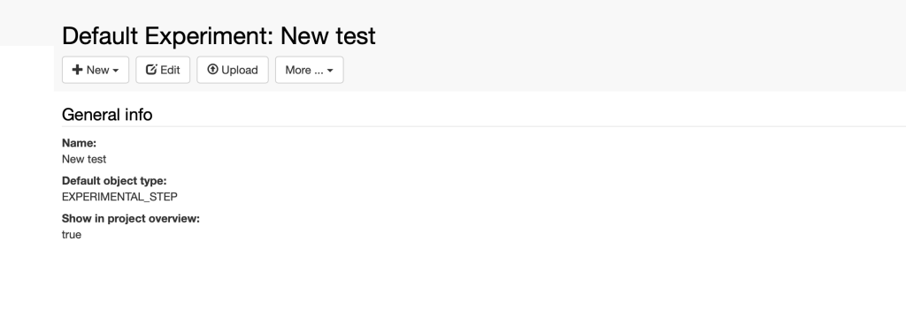
sizes="(max-width: 1024px) 100vw, 1024px" width="1024" height="359" />

2\. Select the dataset type (e.g. Attachment).

3\. Fill in the relevant fields in the form. It is advisable to always
enter a **Name**, because this is shown in the menu. If the name is not
provided, the dataset code is shown.

4\. Drag and drop files in the **Files** **Uploader** area or browse for
files.

5\. When uploading a zip file, the option to **uncompress before
import** will be presented in the form.

6\. **Save.**  

 

class="size-large wp-image-3326 aligncenter"
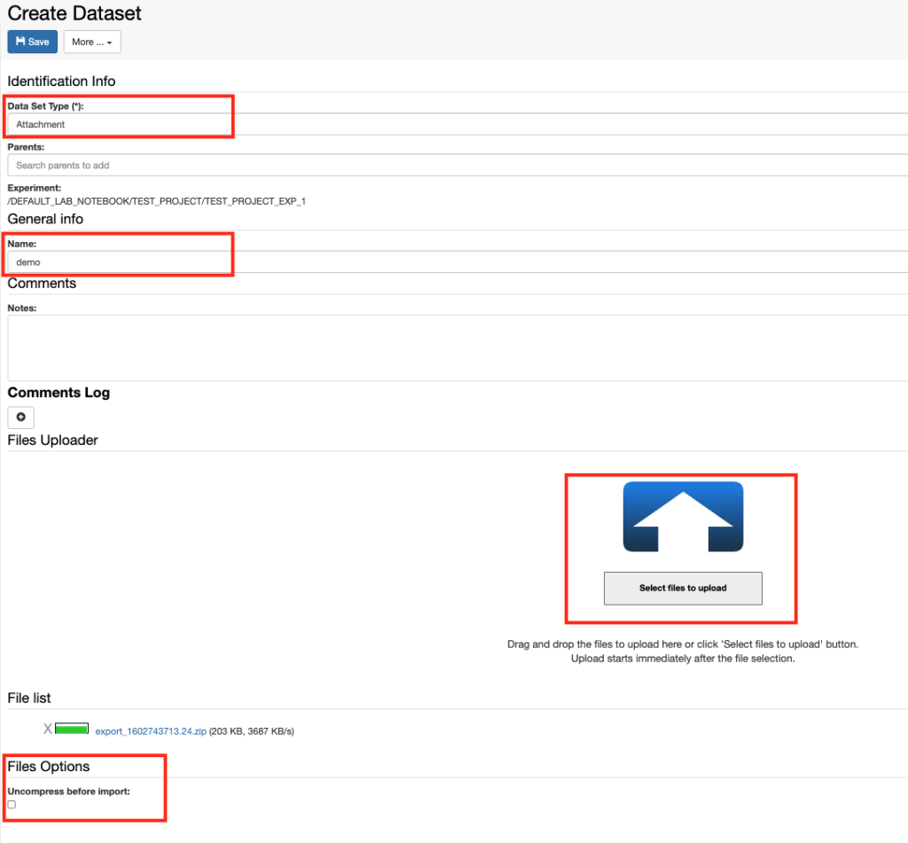
sizes="(max-width: 1024px) 100vw, 1024px" width="1024" height="951" />

 

**Note for MacOS users: **the default
MacOS archiver generates hidden folders that become visible in openBIS
upon unarchive. To avoid this there are two options:

1.  Zip using  the following command on the command-line: *zip -r
     folder-name.zip folder-name/\*  -x “\*.DS\_Store”*
2.  Use an external archiver (e.g. Stuffit Deluxe).

Updated on March 23, 2023
 

class="mobile" itemprop="image" alt="Logo" />

Search for:

All Docs Admin Documentation Admin Documentation (prior to openBIS
v19.06.4) Admin Documentation (prior to openBIS v20.10.3) User
Documentation User Documentation (prior to openBIS v19.06.4) User
Documentation (prior to openBIS v20.10.3)

-   <a href="https://openbis.ch"
    target="_blank">Home
-   <a href="https://openbis.ch" class="no_link" style="cursor: default;"
    onclick="JavaScript: return false;">Resources
    -   [Overview of openBIS and RDM
        services offered by
        SIS](https://openbis.ch/index.php/overview-of-openbis-and-rdm-services-offered-by-sis/)
    -   [User
        Documentation](https://openbis.ch/index.php/docs/user-documentation/)
    -   [Admin
        Documentation](https://openbis.ch/index.php/docs/admin-documentation/)
    -   [FAQ](https://openbis.ch/index.php/faq/)
    -   [Video
        tutorials](https://openbis.ch/index.php/screencasts/#video%20tutorials)
    -   [Demo](https://openbis.ch/index.php/demo/#demo)
    -   [Downloads](https://openbis.ch/index.php/downloads/#downloads)
    -   [References](https://openbis.ch/index.php/references/)
-   [Community
    forum](https://openbis.ch/index.php/community-forum/)
-   <a href="https://openbis.ch" class="no_link" style="cursor: default;"
    onclick="JavaScript: return false;">Services
    -   [openRDM.swiss](https://openbis.ch/index.php/openrdm-swiss/)
    -   [openRDM.eu](https://openbis.ch/index.php/openrdm-eu/)
-   <a href="https://openbis.ch" class="no_link" style="cursor: default;"
    onclick="JavaScript: return false;">Events
    -   [openBIS UGM
        2023](https://openbis.ch/index.php/openbis-ugm-2023/)
-   <a href="https://openbis.ch" class="no_link" style="cursor: default;"
    onclick="JavaScript: return false;">About
    -   [Our
        team](https://openbis.ch/index.php/our-team/)
    -   [Contact](https://openbis.ch/index.php/contact/)
-   [News](https://openbis.ch/index.php/news/)
-   [Imprint](https://openbis.ch/index.php/imprint/#imprint)

-   Home

-   ### Resources

    
    -   [Overview of openBIS and RDM
        services offered by
        SIS](https://openbis.ch/index.php/overview-of-openbis-and-rdm-services-offered-by-sis/)
    -   [User
        Documentation](https://openbis.ch/index.php/docs/user-documentation/)
    -   [Admin
        Documentation](https://openbis.ch/index.php/docs/admin-documentation/)
    -   [FAQ](https://openbis.ch/index.php/faq/)
    -   [Video
        tutorials](https://openbis.ch/index.php/screencasts/#video%20tutorials)
    -   [Demo](https://openbis.ch/index.php/demo/#demo)
    -   [Downloads](https://openbis.ch/index.php/downloads/#downloads)
    -   [References](https://openbis.ch/index.php/references/)

-   [Community
    forum](https://openbis.ch/index.php/community-forum/)

-   ### Services

    
    -   [openRDM.swiss](https://openbis.ch/index.php/openrdm-swiss/)
    -   [openRDM.eu](https://openbis.ch/index.php/openrdm-eu/)

-   ### Events

    
    -   [openBIS UGM
        2023](https://openbis.ch/index.php/openbis-ugm-2023/)

-   ### About

    
    -   [Our
        team](https://openbis.ch/index.php/our-team/)
    -   [Contact](https://openbis.ch/index.php/contact/)

-   [News](https://openbis.ch/index.php/news/)

-   [Imprint](https://openbis.ch/index.php/imprint/#imprint)

 

### User Documentation

-   [General
    Overview](https://openbis.ch/index.php/docs/user-documentation/general-overview/)
-   [Inventory of Materials and
    Methods](https://openbis.ch/index.php/docs/user-documentation/inventory-of-materials-and-methods/)
    -   [Customise Collection
        View](https://openbis.ch/index.php/docs/user-documentation/inventory-of-materials-and-methods/customise-collection-view/)
    -   [Register single entries in a
        Collection](https://openbis.ch/index.php/docs/user-documentation/inventory-of-materials-and-methods/register-single-entries-in-a-collection/)
    -   [Batch register entries in a
        Collection](https://openbis.ch/index.php/docs/user-documentation/inventory-of-materials-and-methods/batch-register-entries-in-a-collection/)
    -   [Batch register entries in several
        Collections](https://openbis.ch/index.php/docs/user-documentation/inventory-of-materials-and-methods/batch-register-entries-in-several-collections/)
    -   [Batch update entries in a
        Collection](https://openbis.ch/index.php/docs/user-documentation/inventory-of-materials-and-methods/batch-update-entries-in-a-collection/)
    -   [Batch update entries in several
        Collections](https://openbis.ch/index.php/docs/user-documentation/inventory-of-materials-and-methods/batch-update-entries-in-several-collections/)
    -   [Copy
        entries](https://openbis.ch/index.php/docs/user-documentation/inventory-of-materials-and-methods/copy-entries/)
    -   [Move entries to a different
        Collection](https://openbis.ch/index.php/docs/user-documentation/inventory-of-materials-and-methods/move-entries-to-a-different-collection/)
    -   [Register Protocols in the Methods
        Inventory](https://openbis.ch/index.php/docs/user-documentation/inventory-of-materials-and-methods/register-protocols-in-the-methods-inventory/)
-   [Managing storage of
    samples](https://openbis.ch/index.php/docs/user-documentation/managing-storage-of-samples/)
    -   [Allocate storage positions to
        samples](https://openbis.ch/index.php/docs/user-documentation/managing-storage-of-samples/allocate-storage-to-samples/)
    -   [Batch update storage
        positions](https://openbis.ch/index.php/docs/user-documentation/managing-storage-of-samples/batch-update-storage-positions/)
    -   [Delete storage
        positions](https://openbis.ch/index.php/docs/user-documentation/managing-storage-of-samples/delete-storage-positions/)
    -   [Overview of lab
        storages](https://openbis.ch/index.php/docs/user-documentation/managing-storage-of-samples/overview-of-lab-storages/)
-   [Barcodes](https://openbis.ch/index.php/docs/user-documentation/barcodes/)
    -   [Barcodes](https://openbis.ch/index.php/docs/user-documentation/barcodes/barcodes/)
    -   [Printer and Barcode Scanner
        Requirements](https://openbis.ch/index.php/docs/user-documentation/barcodes/printer-and-barcode-scanner-requirements/)
-   [Lab
    notebook](https://openbis.ch/index.php/docs/user-documentation/lab-notebook/)
    -   [Register
        Projects](https://openbis.ch/index.php/docs/user-documentation/lab-notebook/register-projects/)
    -   [Register
        Experiments](https://openbis.ch/index.php/docs/user-documentation/lab-notebook/register-experiments/)
    -   [Register Experimental
        Steps](https://openbis.ch/index.php/docs/user-documentation/lab-notebook/register-experimental-steps/)
    -   [Add parents and children to Experimental
        Steps](https://openbis.ch/index.php/docs/user-documentation/lab-notebook/add-parents-and-children-to-experimental-steps/)
    -   [How to use protocols in Experimental
        Steps](https://openbis.ch/index.php/docs/user-documentation/lab-notebook/how-to-use-protocols-in-experimental-steps/)
    -   [Move Experimental
        Steps](https://openbis.ch/index.php/docs/user-documentation/lab-notebook/move-experimental-steps/)
    -   [Copy Experimental
        Steps](https://openbis.ch/index.php/docs/user-documentation/lab-notebook/copy-experimental-steps/)
    -   [Use templates for Experimental
        Steps](https://openbis.ch/index.php/docs/user-documentation/lab-notebook/use-templates-for-experimental-steps/)
    -   [Data
        Access](https://openbis.ch/index.php/docs/user-documentation/lab-notebook/data-access/)
    -   [Move
        Datasets](https://openbis.ch/index.php/docs/user-documentation/lab-notebook/move-datasets/)
    -   [Move one Experiment to a different
        Project](https://openbis.ch/index.php/docs/user-documentation/lab-notebook/move-one-experiment-to-a-different-project/)
    -   [Project
        Overview](https://openbis.ch/index.php/docs/user-documentation/lab-notebook/project-overview/)
    -   [Edit and Delete Projects, Experiments, Experimental
        Steps](https://openbis.ch/index.php/docs/user-documentation/lab-notebook/edit-and-delete-projects-experiments-experimental-steps/)
    -   [Share Lab Notebooks and
        Projects](https://openbis.ch/index.php/docs/user-documentation/lab-notebook/share-lab-notebooks-and-projects/)
    -   [Rich Text
        Editor](https://openbis.ch/index.php/docs/user-documentation/lab-notebook/rich-text-editor/)
-   [Data
    upload](https://openbis.ch/index.php/docs/user-documentation/data-upload/)
    -   [Data upload via web
        UI](https://openbis.ch/index.php/docs/user-documentation/data-upload/data-upload-via-web-ui/)
    -   <a
        href="https://openbis.ch/index.php/docs/user-documentation/data-upload/data-upload-via-dropbox/"
        aria-current="page">Data upload via dropbox
-   [Data
    export](https://openbis.ch/index.php/docs/user-documentation/data-export/)
    -   [Export to
        File](https://openbis.ch/index.php/docs/user-documentation/data-export/export-to-file/)
    -   [Export to
        Zenodo](https://openbis.ch/index.php/docs/user-documentation/data-export/export-to-zenodo/)
    -   [Export to ETH Research
        Collection](https://openbis.ch/index.php/docs/user-documentation/data-export/export-to-eth-research-collection/)
-   [Data
    archiving](https://openbis.ch/index.php/docs/user-documentation/data-archiving/)
-   [Search](https://openbis.ch/index.php/docs/user-documentation/search/)
    -   [Advanced
        search](https://openbis.ch/index.php/docs/user-documentation/search/advanced-search/)
    -   [Search](https://openbis.ch/index.php/docs/user-documentation/search/search/)
    -   [Save and reuse
        searches](https://openbis.ch/index.php/docs/user-documentation/search/save-and-reuse-searches/)
-   [Additional
    functionalities](https://openbis.ch/index.php/docs/user-documentation/additional-functionalities/)
    -   [Visualise
        Relationships](https://openbis.ch/index.php/docs/user-documentation/additional-functionalities/visualise-relationships/)
    -   [Tables](https://openbis.ch/index.php/docs/user-documentation/additional-functionalities/tables/)
    -   [Browse Entries by
        Type](https://openbis.ch/index.php/docs/user-documentation/additional-functionalities/browse-entries-by-type/)
    -   [Trashcan](https://openbis.ch/index.php/docs/user-documentation/additional-functionalities/trashcan/)
    -   [Vocabulary
        Browser](https://openbis.ch/index.php/docs/user-documentation/additional-functionalities/vocabulary-browser/)
    -   [Freeze
        Entities](https://openbis.ch/index.php/docs/user-documentation/additional-functionalities/freeze-entities/)
    -   [Navigation
        menu](https://openbis.ch/index.php/docs/user-documentation/additional-functionalities/navigation-menu/)
    -   [Custom
        Imports](https://openbis.ch/index.php/docs/user-documentation/additional-functionalities/custom-imports/)
    -   [Entity
        history](https://openbis.ch/index.php/docs/user-documentation/additional-functionalities/entity-history/)
    -   [Spreadsheet](https://openbis.ch/index.php/docs/user-documentation/additional-functionalities/spreadsheet/)
-   [Managing Lab Stocks and
    Orders](https://openbis.ch/index.php/docs/user-documentation/managing-lab-stocks-and-orders-2/)
-   [Tools for Analysis of Data Stored in
    openBIS](https://openbis.ch/index.php/docs/user-documentation/tools-for-analysis-of-data-stored-in-openbis/)
    -   [Jupyter
        Notebooks](https://openbis.ch/index.php/docs/user-documentation/tools-for-analysis-of-data-stored-in-openbis/jupyter-notebooks/)
    -   [MATLAB
        toolbox](https://openbis.ch/index.php/docs/user-documentation/tools-for-analysis-of-data-stored-in-openbis/matlab-toolbox/)

1.  
2.  Home
3.  
4.  Docs
5.  
6.  <a href="https://openbis.ch/index.php/docs/user-documentation/"
    itemprop="item">User Documentation
7.  
8.  <a
    href="https://openbis.ch/index.php/docs/user-documentation/data-upload/"
    itemprop="item">Data upload
9.  
10. Data upload via dropbox

# Data upload via dropbox

<a href="#"
class="wedocs-print-article wedocs-hide-print wedocs-hide-mobile"
title="Print this article">

 

Web upload of data files is only suitable
for files of limited size (few GB). To upload larger data, openBIS uses
dropbox scripts that run in the background (see
<a href="https://unlimited.ethz.ch/display/openBISDoc2010/Dropboxes"
target="_blank" rel="noopener noreferrer">Dropboxes). A default
dropbox script is provided with the openBIS ELN-LIMS plugin, and the
dropbox folder needs to be set up by a *system admin*. 

If this is available, users need to
organise their data in a specific way:

 

**Folder 1**

**         Data** (can be single files or folders)

 

**Folder 1** needs to have a specific name that encodes the information
of where the data should be uploaded to openBIS.

The name of **Folder 1** can be generated from the ELN interface:

 

1.  From the page where you want to upload data, select
    **Dataset upload helper tool for
    eln-lims dropbox** from the **More…** dropdown and follow the
    instructions on screen.

 

class="alignnone size-full wp-image-3972"
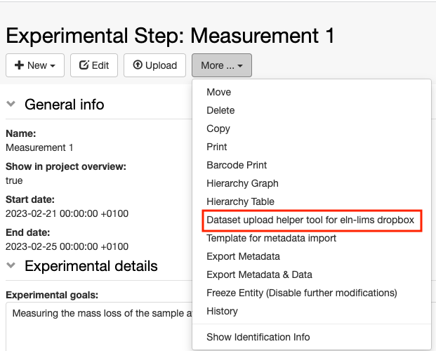
sizes="(max-width: 621px) 100vw, 621px" width="621" height="500" />

 

2\. Select:

1.  The dataset type from the list of available types (mandatory);
2.  Enter the name of your dataset (optional, but recommended);
3.  Copy the generated name of the folder using the copy to clipboard
    icon.

 

class="alignnone size-large wp-image-3973"
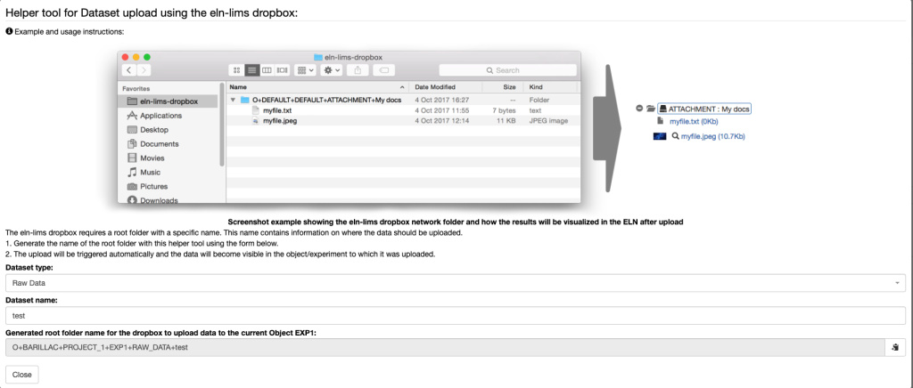
sizes="(max-width: 1024px) 100vw, 1024px" width="1024" height="436" />

 

3\. In your finder/explorer, create a new folder and paste the name you
copied from openBIS. Place your data in this folder.

 

class="alignnone size-full wp-image-3974"
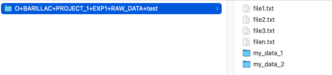
sizes="(max-width: 653px) 100vw, 653px" width="653" height="148" />

 

4\. Place this folder containing your data inside the
**eln-lims-dropbox** folder. openBIS continuously monitors this folder
and when data are placed here, they are **moved** to the final storage.
The move happens after a predefined (and customisable) inactivity period
on the eln-lims-dropbox folder.

 

# Dropbox with markerfile

 

In case of uploads of data &gt;100GB we recommend to configure the
**eln-lims-dropbox-marker**. The set up and configuration need to be
done by a *system admin*. The process of data preparation is the same as
described above, however in this case the data move to the openBIS final
storage only starts when a markerfile is placed in the
eln-lims-dropbox-marker folder. The marker file is an empty file with
this name:
 **.MARKER\_is\_finished\_&lt;folder-to-upload-name&gt;.
**Please note the “.” at the start of the
name, which indicates that this is a hidden file. This file should also
not have any extension. For example, if the folder to be uploaded
has the following name:

 

O+BARILLAC+PROJECT\_1+EXP1+RAW\_DATA+test

 

The marker file should be named:

 

.MARKER\_is\_finished\_O+BARILLAC+PROJECT\_1+EXP1+RAW\_DATA+test

#### 

 

 

#### 

## **How to create the Marker file in Windows**

 

You can create the Marker file in Windows using a text editor such as
**Editor**. Any other text editor will  also work.

1.  open **Editor.**
2.  Save the file with a name such as
    .*MARKER\_is\_finished\_O+BARILLAC+PROJECT\_1+EXP1+RAW\_DATA+test.*
3.  The file is automatically saved with a “.txt” extension. This needs
    to be removed.
4.  Use the *Rename* option to remove the extension from the file.

 

#### 

## **How to create the Marker file on Mac**

 

If you are not familiar with the command line, you can create an empty
text file using for example the **TextEdit** application in a Mac. Any
other text editor will also work.

1.  Open the **TextEdit** application and save an empty file with a name
    such as
    *.MARKER\_is\_finished\_O+BARILLAC+PROJECT\_1+EXP1+RAW\_DATA+test*.
2.  Save to any format.
3.  You will get a message to say that files starting with “.” are
    reserved for the system and will be hidden. Confirm that you want to
    use “.”
4.  To show these hidden files, open the Finder and press **Command +
    Shift + . (period)**.
5.  The file you saved before has an extension, that needs to be
    removed. If the extension is not shown in your Finder, go to Finder
    &gt; Preferences menu, select the Advanced tab, and check the “Show
    all filename extensions” box.
6.  Remove the extension from the file.

 

# Dropbox monitor

 

It is possible to check the status of the upload via dropbox using the
**Dropbox Monitor** under **Utilities** in the main menu.

The Dropbox Monitor shows a table with all available dropboxes for a
given openBIS instance. By default, *default-dropbox, eln-lims-dropbox
and eln-lims-dropbox-marker* are shown.

If data are uploaded in a dropbox folder, users can see the status of
the data upload in the table. A red face in the column **Last Status**
indicates a failure of data import, a green face indicates successful
data import.

 

class="alignnone size-large wp-image-4036"
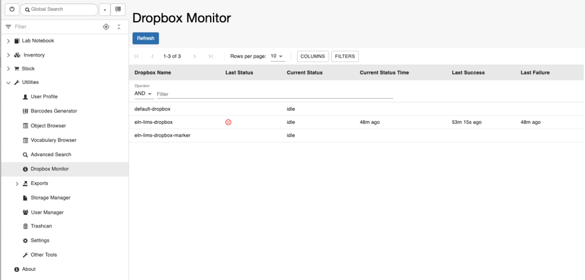
sizes="(max-width: 1024px) 100vw, 1024px" width="1024" height="491" />

 

If you click on the row of the table above, you can see the details of
every upload attempt for a given dropbox, as shown below. For failures,
the log with the error is shown.

 

class="alignnone size-large wp-image-4037"
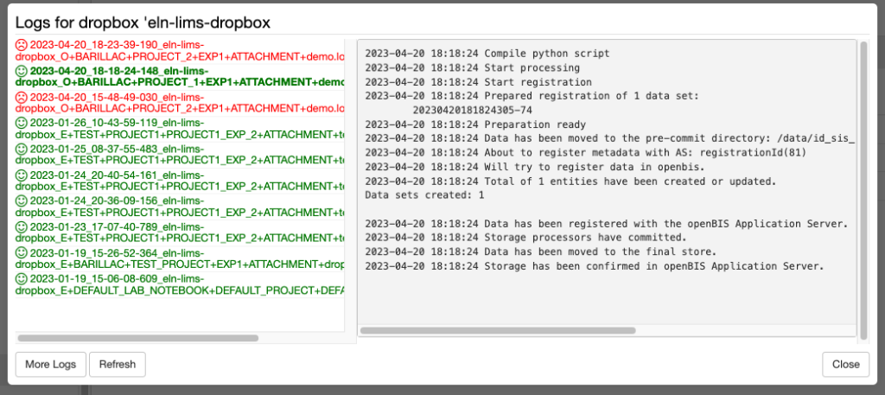
sizes="(max-width: 1024px) 100vw, 1024px" width="1024" height="457" />

 

# Registration of metadata for datasets via dropbox

 

Starting from openBIS version 20.10.2, the default eln-lims dropbox
supports the registration of metadata for datasets. The metadata needs
to be provided in a file called **metadata.json.** This file should be
placed inside the folder with the openBIS-generated name described
above, together with the data. This is shown in the example below.

O+BARILLAC+PROJECT\_1+EXP1+RAW\_DATA+test

is the folder with the openBIS-generated name. Inside this folder there
is the metadata.json file, and the data, which consists of a few files
and 2 folders.

class="alignnone size-full wp-image-3976"
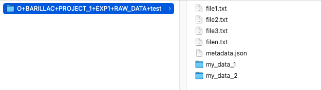
sizes="(max-width: 625px) 100vw, 625px" width="625" height="177" />

 

 

For example, the metadata.json file for the default RAW\_DATA dataset
type would be:

{ “properties” :

{ “$NAME” : “my raw data”,

“NOTES” : “This is a test for metadata upload via dropbox” }

}

 

It is possible to download the template metadata.json file for each
dataset type from the **Other Tools** section under the **Utilities** in
the main menu.

 

class="alignnone size-full wp-image-3975"
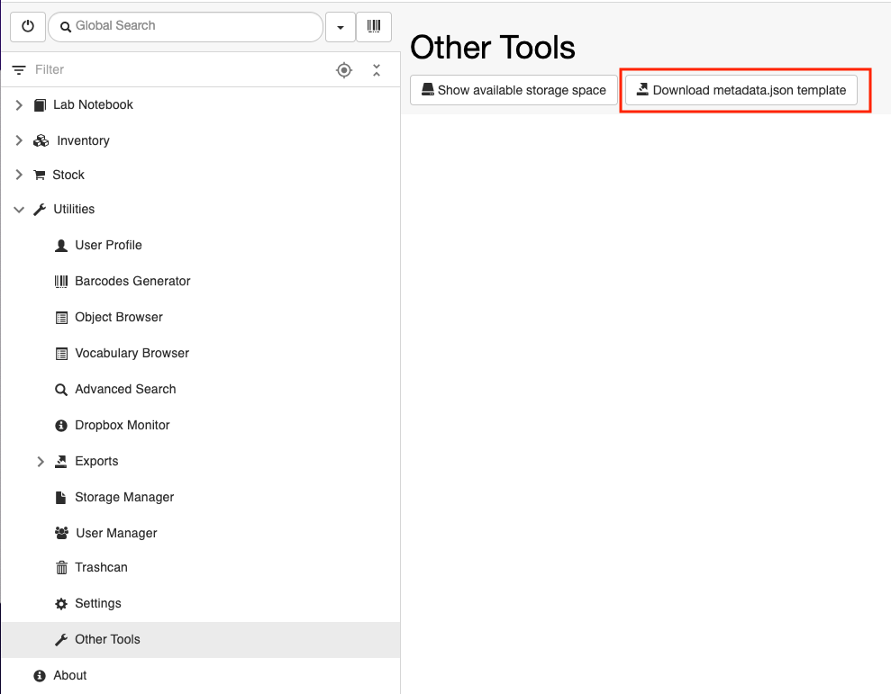
sizes="(max-width: 989px) 100vw, 989px" width="989" height="771" />

 

class="alignnone wp-image-2711 size-full"
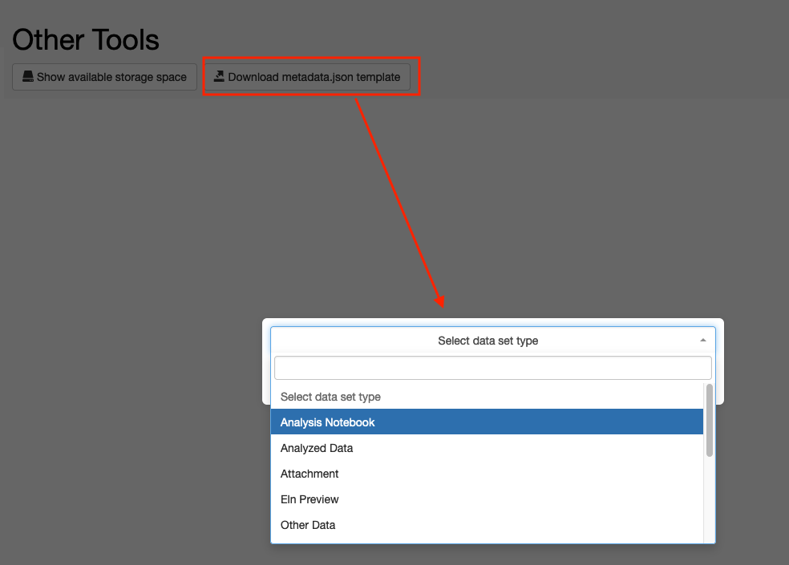
sizes="(max-width: 984px) 100vw, 984px" width="984" height="705" />

 

In **Other Tools**, there is also the **Show available storage space**
button, which shows the available storage space on the openBIS instance.
This is helpful in calculating how much space one might require for
future data upload, especially large data.

 

class="alignnone size-large wp-image-3977"
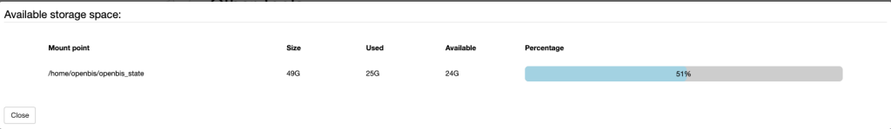
sizes="(max-width: 1024px) 100vw, 1024px" width="1024" height="149" />

Updated on April 26, 2023
