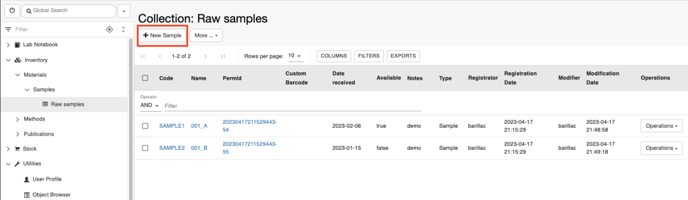
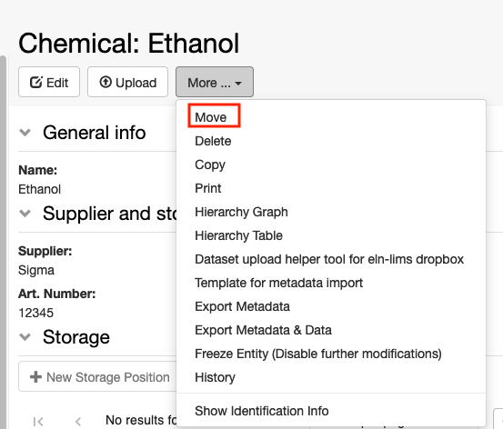

Inventory Of Materials And Methods
====
 

class="mobile" itemprop="image" alt="Logo" />

Search for:

All Docs Admin Documentation Admin Documentation (prior to openBIS
v19.06.4) Admin Documentation (prior to openBIS v20.10.3) User
Documentation User Documentation (prior to openBIS v19.06.4) User
Documentation (prior to openBIS v20.10.3)

-   <a href="https://openbis.ch"
    target="_blank">Home
-   <a href="https://openbis.ch" class="no_link" style="cursor: default;"
    onclick="JavaScript: return false;">Resources
    -   [Overview of openBIS and RDM
        services offered by
        SIS](https://openbis.ch/index.php/overview-of-openbis-and-rdm-services-offered-by-sis/)
    -   [User
        Documentation](https://openbis.ch/index.php/docs/user-documentation/)
    -   [Admin
        Documentation](https://openbis.ch/index.php/docs/admin-documentation/)
    -   [FAQ](https://openbis.ch/index.php/faq/)
    -   [Video
        tutorials](https://openbis.ch/index.php/screencasts/#video%20tutorials)
    -   [Demo](https://openbis.ch/index.php/demo/#demo)
    -   [Downloads](https://openbis.ch/index.php/downloads/#downloads)
    -   [References](https://openbis.ch/index.php/references/)
-   [Community
    forum](https://openbis.ch/index.php/community-forum/)
-   <a href="https://openbis.ch" class="no_link" style="cursor: default;"
    onclick="JavaScript: return false;">Services
    -   [openRDM.swiss](https://openbis.ch/index.php/openrdm-swiss/)
    -   [openRDM.eu](https://openbis.ch/index.php/openrdm-eu/)
-   <a href="https://openbis.ch" class="no_link" style="cursor: default;"
    onclick="JavaScript: return false;">Events
    -   [openBIS UGM
        2023](https://openbis.ch/index.php/openbis-ugm-2023/)
-   <a href="https://openbis.ch" class="no_link" style="cursor: default;"
    onclick="JavaScript: return false;">About
    -   [Our
        team](https://openbis.ch/index.php/our-team/)
    -   [Contact](https://openbis.ch/index.php/contact/)
-   [News](https://openbis.ch/index.php/news/)
-   [Imprint](https://openbis.ch/index.php/imprint/#imprint)

-   Home

-   ### Resources

    
    -   [Overview of openBIS and RDM
        services offered by
        SIS](https://openbis.ch/index.php/overview-of-openbis-and-rdm-services-offered-by-sis/)
    -   [User
        Documentation](https://openbis.ch/index.php/docs/user-documentation/)
    -   [Admin
        Documentation](https://openbis.ch/index.php/docs/admin-documentation/)
    -   [FAQ](https://openbis.ch/index.php/faq/)
    -   [Video
        tutorials](https://openbis.ch/index.php/screencasts/#video%20tutorials)
    -   [Demo](https://openbis.ch/index.php/demo/#demo)
    -   [Downloads](https://openbis.ch/index.php/downloads/#downloads)
    -   [References](https://openbis.ch/index.php/references/)

-   [Community
    forum](https://openbis.ch/index.php/community-forum/)

-   ### Services

    
    -   [openRDM.swiss](https://openbis.ch/index.php/openrdm-swiss/)
    -   [openRDM.eu](https://openbis.ch/index.php/openrdm-eu/)

-   ### Events

    
    -   [openBIS UGM
        2023](https://openbis.ch/index.php/openbis-ugm-2023/)

-   ### About

    
    -   [Our
        team](https://openbis.ch/index.php/our-team/)
    -   [Contact](https://openbis.ch/index.php/contact/)

-   [News](https://openbis.ch/index.php/news/)

-   [Imprint](https://openbis.ch/index.php/imprint/#imprint)

 

### User Documentation

-   [General
    Overview](https://openbis.ch/index.php/docs/user-documentation/general-overview/)
-   [Inventory of Materials and
    Methods](https://openbis.ch/index.php/docs/user-documentation/inventory-of-materials-and-methods/)
    -   <a
        href="https://openbis.ch/index.php/docs/user-documentation/inventory-of-materials-and-methods/customise-collection-view/"
        aria-current="page">Customise Collection View
    -   [Register single entries in a
        Collection](https://openbis.ch/index.php/docs/user-documentation/inventory-of-materials-and-methods/register-single-entries-in-a-collection/)
    -   [Batch register entries in a
        Collection](https://openbis.ch/index.php/docs/user-documentation/inventory-of-materials-and-methods/batch-register-entries-in-a-collection/)
    -   [Batch register entries in several
        Collections](https://openbis.ch/index.php/docs/user-documentation/inventory-of-materials-and-methods/batch-register-entries-in-several-collections/)
    -   [Batch update entries in a
        Collection](https://openbis.ch/index.php/docs/user-documentation/inventory-of-materials-and-methods/batch-update-entries-in-a-collection/)
    -   [Batch update entries in several
        Collections](https://openbis.ch/index.php/docs/user-documentation/inventory-of-materials-and-methods/batch-update-entries-in-several-collections/)
    -   [Copy
        entries](https://openbis.ch/index.php/docs/user-documentation/inventory-of-materials-and-methods/copy-entries/)
    -   [Move entries to a different
        Collection](https://openbis.ch/index.php/docs/user-documentation/inventory-of-materials-and-methods/move-entries-to-a-different-collection/)
    -   [Register Protocols in the Methods
        Inventory](https://openbis.ch/index.php/docs/user-documentation/inventory-of-materials-and-methods/register-protocols-in-the-methods-inventory/)
-   [Managing storage of
    samples](https://openbis.ch/index.php/docs/user-documentation/managing-storage-of-samples/)
    -   [Allocate storage positions to
        samples](https://openbis.ch/index.php/docs/user-documentation/managing-storage-of-samples/allocate-storage-to-samples/)
    -   [Batch update storage
        positions](https://openbis.ch/index.php/docs/user-documentation/managing-storage-of-samples/batch-update-storage-positions/)
    -   [Delete storage
        positions](https://openbis.ch/index.php/docs/user-documentation/managing-storage-of-samples/delete-storage-positions/)
    -   [Overview of lab
        storages](https://openbis.ch/index.php/docs/user-documentation/managing-storage-of-samples/overview-of-lab-storages/)
-   [Barcodes](https://openbis.ch/index.php/docs/user-documentation/barcodes/)
    -   [Barcodes](https://openbis.ch/index.php/docs/user-documentation/barcodes/barcodes/)
    -   [Printer and Barcode Scanner
        Requirements](https://openbis.ch/index.php/docs/user-documentation/barcodes/printer-and-barcode-scanner-requirements/)
-   [Lab
    notebook](https://openbis.ch/index.php/docs/user-documentation/lab-notebook/)
    -   [Register
        Projects](https://openbis.ch/index.php/docs/user-documentation/lab-notebook/register-projects/)
    -   [Register
        Experiments](https://openbis.ch/index.php/docs/user-documentation/lab-notebook/register-experiments/)
    -   [Register Experimental
        Steps](https://openbis.ch/index.php/docs/user-documentation/lab-notebook/register-experimental-steps/)
    -   [Add parents and children to Experimental
        Steps](https://openbis.ch/index.php/docs/user-documentation/lab-notebook/add-parents-and-children-to-experimental-steps/)
    -   [How to use protocols in Experimental
        Steps](https://openbis.ch/index.php/docs/user-documentation/lab-notebook/how-to-use-protocols-in-experimental-steps/)
    -   [Move Experimental
        Steps](https://openbis.ch/index.php/docs/user-documentation/lab-notebook/move-experimental-steps/)
    -   [Copy Experimental
        Steps](https://openbis.ch/index.php/docs/user-documentation/lab-notebook/copy-experimental-steps/)
    -   [Use templates for Experimental
        Steps](https://openbis.ch/index.php/docs/user-documentation/lab-notebook/use-templates-for-experimental-steps/)
    -   [Data
        Access](https://openbis.ch/index.php/docs/user-documentation/lab-notebook/data-access/)
    -   [Move
        Datasets](https://openbis.ch/index.php/docs/user-documentation/lab-notebook/move-datasets/)
    -   [Move one Experiment to a different
        Project](https://openbis.ch/index.php/docs/user-documentation/lab-notebook/move-one-experiment-to-a-different-project/)
    -   [Project
        Overview](https://openbis.ch/index.php/docs/user-documentation/lab-notebook/project-overview/)
    -   [Edit and Delete Projects, Experiments, Experimental
        Steps](https://openbis.ch/index.php/docs/user-documentation/lab-notebook/edit-and-delete-projects-experiments-experimental-steps/)
    -   [Share Lab Notebooks and
        Projects](https://openbis.ch/index.php/docs/user-documentation/lab-notebook/share-lab-notebooks-and-projects/)
    -   [Rich Text
        Editor](https://openbis.ch/index.php/docs/user-documentation/lab-notebook/rich-text-editor/)
-   [Data
    upload](https://openbis.ch/index.php/docs/user-documentation/data-upload/)
    -   [Data upload via web
        UI](https://openbis.ch/index.php/docs/user-documentation/data-upload/data-upload-via-web-ui/)
    -   [Data upload via
        dropbox](https://openbis.ch/index.php/docs/user-documentation/data-upload/data-upload-via-dropbox/)
-   [Data
    export](https://openbis.ch/index.php/docs/user-documentation/data-export/)
    -   [Export to
        File](https://openbis.ch/index.php/docs/user-documentation/data-export/export-to-file/)
    -   [Export to
        Zenodo](https://openbis.ch/index.php/docs/user-documentation/data-export/export-to-zenodo/)
    -   [Export to ETH Research
        Collection](https://openbis.ch/index.php/docs/user-documentation/data-export/export-to-eth-research-collection/)
-   [Data
    archiving](https://openbis.ch/index.php/docs/user-documentation/data-archiving/)
-   [Search](https://openbis.ch/index.php/docs/user-documentation/search/)
    -   [Advanced
        search](https://openbis.ch/index.php/docs/user-documentation/search/advanced-search/)
    -   [Search](https://openbis.ch/index.php/docs/user-documentation/search/search/)
    -   [Save and reuse
        searches](https://openbis.ch/index.php/docs/user-documentation/search/save-and-reuse-searches/)
-   [Additional
    functionalities](https://openbis.ch/index.php/docs/user-documentation/additional-functionalities/)
    -   [Visualise
        Relationships](https://openbis.ch/index.php/docs/user-documentation/additional-functionalities/visualise-relationships/)
    -   [Tables](https://openbis.ch/index.php/docs/user-documentation/additional-functionalities/tables/)
    -   [Browse Entries by
        Type](https://openbis.ch/index.php/docs/user-documentation/additional-functionalities/browse-entries-by-type/)
    -   [Trashcan](https://openbis.ch/index.php/docs/user-documentation/additional-functionalities/trashcan/)
    -   [Vocabulary
        Browser](https://openbis.ch/index.php/docs/user-documentation/additional-functionalities/vocabulary-browser/)
    -   [Freeze
        Entities](https://openbis.ch/index.php/docs/user-documentation/additional-functionalities/freeze-entities/)
    -   [Navigation
        menu](https://openbis.ch/index.php/docs/user-documentation/additional-functionalities/navigation-menu/)
    -   [Custom
        Imports](https://openbis.ch/index.php/docs/user-documentation/additional-functionalities/custom-imports/)
    -   [Entity
        history](https://openbis.ch/index.php/docs/user-documentation/additional-functionalities/entity-history/)
    -   [Spreadsheet](https://openbis.ch/index.php/docs/user-documentation/additional-functionalities/spreadsheet/)
-   [Managing Lab Stocks and
    Orders](https://openbis.ch/index.php/docs/user-documentation/managing-lab-stocks-and-orders-2/)
-   [Tools for Analysis of Data Stored in
    openBIS](https://openbis.ch/index.php/docs/user-documentation/tools-for-analysis-of-data-stored-in-openbis/)
    -   [Jupyter
        Notebooks](https://openbis.ch/index.php/docs/user-documentation/tools-for-analysis-of-data-stored-in-openbis/jupyter-notebooks/)
    -   [MATLAB
        toolbox](https://openbis.ch/index.php/docs/user-documentation/tools-for-analysis-of-data-stored-in-openbis/matlab-toolbox/)

1.  
2.  Home
3.  
4.  Docs
5.  
6.  <a href="https://openbis.ch/index.php/docs/user-documentation/"
    itemprop="item">User Documentation
7.  
8.  <a
    href="https://openbis.ch/index.php/docs/user-documentation/inventory-of-materials-and-methods/"
    itemprop="item">Inventory of Materials and
    Methods
9.  
10. Customise Collection View

# Customise Collection View

<a href="#"
class="wedocs-print-article wedocs-hide-print wedocs-hide-mobile"
title="Print this article">

 

It is possible customise the view of *Collections* in the ELN.

The default *Collection* can have a **Form View** or a **List View**.
Depending on this selection, the collection view will be different.

 

class="alignnone size-full wp-image-3870"

sizes="(max-width: 830px) 100vw, 830px" width="830" height="507" />

 

 

**Form View:** This shows the metadata of the *Collection* along with
the table of objects. This view is useful when a user wants to see
specific metadata for a *Collection*.

class="alignnone size-large wp-image-3876"

sizes="(max-width: 1024px) 100vw, 1024px" width="1024" height="575" />

 

If you do not see the table with the Objects in the form, you need to
enable this by selecting **Show Objects** from the **More..** dropdown

 

class="alignnone size-full wp-image-3877"

sizes="(max-width: 684px) 100vw, 684px" width="684" height="404" />

 

**List View: **The metadata of the *Collection* is not shown in this
view, but only the table of objects is shown.

 

class="alignnone size-large wp-image-3878"

sizes="(max-width: 1024px) 100vw, 1024px" width="1024" height="408" />

 

In this case a user would need to click on **More..**, and **Edit**
**Collection** in order to see the metadata and be able to edit the
*Collection*.

 

class="alignnone size-full wp-image-3879"

sizes="(max-width: 437px) 100vw, 437px" width="437" height="278" />

Updated on April 25, 2023
 

class="mobile" itemprop="image" alt="Logo" />

Search for:

All Docs Admin Documentation Admin Documentation (prior to openBIS
v19.06.4) Admin Documentation (prior to openBIS v20.10.3) User
Documentation User Documentation (prior to openBIS v19.06.4) User
Documentation (prior to openBIS v20.10.3)

-   <a href="https://openbis.ch"
    target="_blank">Home
-   <a href="https://openbis.ch" class="no_link" style="cursor: default;"
    onclick="JavaScript: return false;">Resources
    -   [Overview of openBIS and RDM
        services offered by
        SIS](https://openbis.ch/index.php/overview-of-openbis-and-rdm-services-offered-by-sis/)
    -   [User
        Documentation](https://openbis.ch/index.php/docs/user-documentation/)
    -   [Admin
        Documentation](https://openbis.ch/index.php/docs/admin-documentation/)
    -   [FAQ](https://openbis.ch/index.php/faq/)
    -   [Video
        tutorials](https://openbis.ch/index.php/screencasts/#video%20tutorials)
    -   [Demo](https://openbis.ch/index.php/demo/#demo)
    -   [Downloads](https://openbis.ch/index.php/downloads/#downloads)
    -   [References](https://openbis.ch/index.php/references/)
-   [Community
    forum](https://openbis.ch/index.php/community-forum/)
-   <a href="https://openbis.ch" class="no_link" style="cursor: default;"
    onclick="JavaScript: return false;">Services
    -   [openRDM.swiss](https://openbis.ch/index.php/openrdm-swiss/)
    -   [openRDM.eu](https://openbis.ch/index.php/openrdm-eu/)
-   <a href="https://openbis.ch" class="no_link" style="cursor: default;"
    onclick="JavaScript: return false;">Events
    -   [openBIS UGM
        2023](https://openbis.ch/index.php/openbis-ugm-2023/)
-   <a href="https://openbis.ch" class="no_link" style="cursor: default;"
    onclick="JavaScript: return false;">About
    -   [Our
        team](https://openbis.ch/index.php/our-team/)
    -   [Contact](https://openbis.ch/index.php/contact/)
-   [News](https://openbis.ch/index.php/news/)
-   [Imprint](https://openbis.ch/index.php/imprint/#imprint)

-   Home

-   ### Resources

    
    -   [Overview of openBIS and RDM
        services offered by
        SIS](https://openbis.ch/index.php/overview-of-openbis-and-rdm-services-offered-by-sis/)
    -   [User
        Documentation](https://openbis.ch/index.php/docs/user-documentation/)
    -   [Admin
        Documentation](https://openbis.ch/index.php/docs/admin-documentation/)
    -   [FAQ](https://openbis.ch/index.php/faq/)
    -   [Video
        tutorials](https://openbis.ch/index.php/screencasts/#video%20tutorials)
    -   [Demo](https://openbis.ch/index.php/demo/#demo)
    -   [Downloads](https://openbis.ch/index.php/downloads/#downloads)
    -   [References](https://openbis.ch/index.php/references/)

-   [Community
    forum](https://openbis.ch/index.php/community-forum/)

-   ### Services

    
    -   [openRDM.swiss](https://openbis.ch/index.php/openrdm-swiss/)
    -   [openRDM.eu](https://openbis.ch/index.php/openrdm-eu/)

-   ### Events

    
    -   [openBIS UGM
        2023](https://openbis.ch/index.php/openbis-ugm-2023/)

-   ### About

    
    -   [Our
        team](https://openbis.ch/index.php/our-team/)
    -   [Contact](https://openbis.ch/index.php/contact/)

-   [News](https://openbis.ch/index.php/news/)

-   [Imprint](https://openbis.ch/index.php/imprint/#imprint)

 

### User Documentation

-   [General
    Overview](https://openbis.ch/index.php/docs/user-documentation/general-overview/)
-   [Inventory of Materials and
    Methods](https://openbis.ch/index.php/docs/user-documentation/inventory-of-materials-and-methods/)
    -   [Customise Collection
        View](https://openbis.ch/index.php/docs/user-documentation/inventory-of-materials-and-methods/customise-collection-view/)
    -   <a
        href="https://openbis.ch/index.php/docs/user-documentation/inventory-of-materials-and-methods/register-single-entries-in-a-collection/"
        aria-current="page">Register single entries in a Collection
    -   [Batch register entries in a
        Collection](https://openbis.ch/index.php/docs/user-documentation/inventory-of-materials-and-methods/batch-register-entries-in-a-collection/)
    -   [Batch register entries in several
        Collections](https://openbis.ch/index.php/docs/user-documentation/inventory-of-materials-and-methods/batch-register-entries-in-several-collections/)
    -   [Batch update entries in a
        Collection](https://openbis.ch/index.php/docs/user-documentation/inventory-of-materials-and-methods/batch-update-entries-in-a-collection/)
    -   [Batch update entries in several
        Collections](https://openbis.ch/index.php/docs/user-documentation/inventory-of-materials-and-methods/batch-update-entries-in-several-collections/)
    -   [Copy
        entries](https://openbis.ch/index.php/docs/user-documentation/inventory-of-materials-and-methods/copy-entries/)
    -   [Move entries to a different
        Collection](https://openbis.ch/index.php/docs/user-documentation/inventory-of-materials-and-methods/move-entries-to-a-different-collection/)
    -   [Register Protocols in the Methods
        Inventory](https://openbis.ch/index.php/docs/user-documentation/inventory-of-materials-and-methods/register-protocols-in-the-methods-inventory/)
-   [Managing storage of
    samples](https://openbis.ch/index.php/docs/user-documentation/managing-storage-of-samples/)
    -   [Allocate storage positions to
        samples](https://openbis.ch/index.php/docs/user-documentation/managing-storage-of-samples/allocate-storage-to-samples/)
    -   [Batch update storage
        positions](https://openbis.ch/index.php/docs/user-documentation/managing-storage-of-samples/batch-update-storage-positions/)
    -   [Delete storage
        positions](https://openbis.ch/index.php/docs/user-documentation/managing-storage-of-samples/delete-storage-positions/)
    -   [Overview of lab
        storages](https://openbis.ch/index.php/docs/user-documentation/managing-storage-of-samples/overview-of-lab-storages/)
-   [Barcodes](https://openbis.ch/index.php/docs/user-documentation/barcodes/)
    -   [Barcodes](https://openbis.ch/index.php/docs/user-documentation/barcodes/barcodes/)
    -   [Printer and Barcode Scanner
        Requirements](https://openbis.ch/index.php/docs/user-documentation/barcodes/printer-and-barcode-scanner-requirements/)
-   [Lab
    notebook](https://openbis.ch/index.php/docs/user-documentation/lab-notebook/)
    -   [Register
        Projects](https://openbis.ch/index.php/docs/user-documentation/lab-notebook/register-projects/)
    -   [Register
        Experiments](https://openbis.ch/index.php/docs/user-documentation/lab-notebook/register-experiments/)
    -   [Register Experimental
        Steps](https://openbis.ch/index.php/docs/user-documentation/lab-notebook/register-experimental-steps/)
    -   [Add parents and children to Experimental
        Steps](https://openbis.ch/index.php/docs/user-documentation/lab-notebook/add-parents-and-children-to-experimental-steps/)
    -   [How to use protocols in Experimental
        Steps](https://openbis.ch/index.php/docs/user-documentation/lab-notebook/how-to-use-protocols-in-experimental-steps/)
    -   [Move Experimental
        Steps](https://openbis.ch/index.php/docs/user-documentation/lab-notebook/move-experimental-steps/)
    -   [Copy Experimental
        Steps](https://openbis.ch/index.php/docs/user-documentation/lab-notebook/copy-experimental-steps/)
    -   [Use templates for Experimental
        Steps](https://openbis.ch/index.php/docs/user-documentation/lab-notebook/use-templates-for-experimental-steps/)
    -   [Data
        Access](https://openbis.ch/index.php/docs/user-documentation/lab-notebook/data-access/)
    -   [Move
        Datasets](https://openbis.ch/index.php/docs/user-documentation/lab-notebook/move-datasets/)
    -   [Move one Experiment to a different
        Project](https://openbis.ch/index.php/docs/user-documentation/lab-notebook/move-one-experiment-to-a-different-project/)
    -   [Project
        Overview](https://openbis.ch/index.php/docs/user-documentation/lab-notebook/project-overview/)
    -   [Edit and Delete Projects, Experiments, Experimental
        Steps](https://openbis.ch/index.php/docs/user-documentation/lab-notebook/edit-and-delete-projects-experiments-experimental-steps/)
    -   [Share Lab Notebooks and
        Projects](https://openbis.ch/index.php/docs/user-documentation/lab-notebook/share-lab-notebooks-and-projects/)
    -   [Rich Text
        Editor](https://openbis.ch/index.php/docs/user-documentation/lab-notebook/rich-text-editor/)
-   [Data
    upload](https://openbis.ch/index.php/docs/user-documentation/data-upload/)
    -   [Data upload via web
        UI](https://openbis.ch/index.php/docs/user-documentation/data-upload/data-upload-via-web-ui/)
    -   [Data upload via
        dropbox](https://openbis.ch/index.php/docs/user-documentation/data-upload/data-upload-via-dropbox/)
-   [Data
    export](https://openbis.ch/index.php/docs/user-documentation/data-export/)
    -   [Export to
        File](https://openbis.ch/index.php/docs/user-documentation/data-export/export-to-file/)
    -   [Export to
        Zenodo](https://openbis.ch/index.php/docs/user-documentation/data-export/export-to-zenodo/)
    -   [Export to ETH Research
        Collection](https://openbis.ch/index.php/docs/user-documentation/data-export/export-to-eth-research-collection/)
-   [Data
    archiving](https://openbis.ch/index.php/docs/user-documentation/data-archiving/)
-   [Search](https://openbis.ch/index.php/docs/user-documentation/search/)
    -   [Advanced
        search](https://openbis.ch/index.php/docs/user-documentation/search/advanced-search/)
    -   [Search](https://openbis.ch/index.php/docs/user-documentation/search/search/)
    -   [Save and reuse
        searches](https://openbis.ch/index.php/docs/user-documentation/search/save-and-reuse-searches/)
-   [Additional
    functionalities](https://openbis.ch/index.php/docs/user-documentation/additional-functionalities/)
    -   [Visualise
        Relationships](https://openbis.ch/index.php/docs/user-documentation/additional-functionalities/visualise-relationships/)
    -   [Tables](https://openbis.ch/index.php/docs/user-documentation/additional-functionalities/tables/)
    -   [Browse Entries by
        Type](https://openbis.ch/index.php/docs/user-documentation/additional-functionalities/browse-entries-by-type/)
    -   [Trashcan](https://openbis.ch/index.php/docs/user-documentation/additional-functionalities/trashcan/)
    -   [Vocabulary
        Browser](https://openbis.ch/index.php/docs/user-documentation/additional-functionalities/vocabulary-browser/)
    -   [Freeze
        Entities](https://openbis.ch/index.php/docs/user-documentation/additional-functionalities/freeze-entities/)
    -   [Navigation
        menu](https://openbis.ch/index.php/docs/user-documentation/additional-functionalities/navigation-menu/)
    -   [Custom
        Imports](https://openbis.ch/index.php/docs/user-documentation/additional-functionalities/custom-imports/)
    -   [Entity
        history](https://openbis.ch/index.php/docs/user-documentation/additional-functionalities/entity-history/)
    -   [Spreadsheet](https://openbis.ch/index.php/docs/user-documentation/additional-functionalities/spreadsheet/)
-   [Managing Lab Stocks and
    Orders](https://openbis.ch/index.php/docs/user-documentation/managing-lab-stocks-and-orders-2/)
-   [Tools for Analysis of Data Stored in
    openBIS](https://openbis.ch/index.php/docs/user-documentation/tools-for-analysis-of-data-stored-in-openbis/)
    -   [Jupyter
        Notebooks](https://openbis.ch/index.php/docs/user-documentation/tools-for-analysis-of-data-stored-in-openbis/jupyter-notebooks/)
    -   [MATLAB
        toolbox](https://openbis.ch/index.php/docs/user-documentation/tools-for-analysis-of-data-stored-in-openbis/matlab-toolbox/)

1.  
2.  Home
3.  
4.  Docs
5.  
6.  <a href="https://openbis.ch/index.php/docs/user-documentation/"
    itemprop="item">User Documentation
7.  
8.  <a
    href="https://openbis.ch/index.php/docs/user-documentation/inventory-of-materials-and-methods/"
    itemprop="item">Inventory of Materials and
    Methods
9.  
10. Register single entries in a Collection

# Register single entries in a Collection

<a href="#"
class="wedocs-print-article wedocs-hide-print wedocs-hide-mobile"
title="Print this article">

 

 

In this example, we will see how to
register one *Object* of type **Sample** in the **Raw Samples**
*Collection.* The same procedure should be followed to register any
other *Object* in other *Collections*.

 

1.  Click on the **Raw Samples** *Collection* folder in the main menu.
2.  Click the **+ New Sample ** in the main page
3.  Fill in the form
4.  **Save**

 

Please note that the *Object type* shown in the **+New** button (in this
case **Sample**), is what is defined as *default object type* for the
*Collection*. If this is missing in the *Collection,* the button will
not be present.

 

class="alignnone size-large wp-image-3881"

sizes="(max-width: 1024px) 100vw, 1024px" width="1024" height="299" />

 

To register a different object type in the
Collection:

 

1.  Select **New Object** from the **More** drop down menu (as shown
    below)
2.  Select the relevant *Object type* from the list *(Sample,* in this
    case*).*
3.  Fill in the form
4.  **Save**

 

class="alignnone size-large wp-image-3882"

sizes="(max-width: 1024px) 100vw, 1024px" width="1024" height="300" />  

Updated on April 25, 2023
 

class="mobile" itemprop="image" alt="Logo" />

Search for:

All Docs Admin Documentation Admin Documentation (prior to openBIS
v19.06.4) Admin Documentation (prior to openBIS v20.10.3) User
Documentation User Documentation (prior to openBIS v19.06.4) User
Documentation (prior to openBIS v20.10.3)

-   <a href="https://openbis.ch"
    target="_blank">Home
-   <a href="https://openbis.ch" class="no_link" style="cursor: default;"
    onclick="JavaScript: return false;">Resources
    -   [Overview of openBIS and RDM
        services offered by
        SIS](https://openbis.ch/index.php/overview-of-openbis-and-rdm-services-offered-by-sis/)
    -   [User
        Documentation](https://openbis.ch/index.php/docs/user-documentation/)
    -   [Admin
        Documentation](https://openbis.ch/index.php/docs/admin-documentation/)
    -   [FAQ](https://openbis.ch/index.php/faq/)
    -   [Video
        tutorials](https://openbis.ch/index.php/screencasts/#video%20tutorials)
    -   [Demo](https://openbis.ch/index.php/demo/#demo)
    -   [Downloads](https://openbis.ch/index.php/downloads/#downloads)
    -   [References](https://openbis.ch/index.php/references/)
-   [Community
    forum](https://openbis.ch/index.php/community-forum/)
-   <a href="https://openbis.ch" class="no_link" style="cursor: default;"
    onclick="JavaScript: return false;">Services
    -   [openRDM.swiss](https://openbis.ch/index.php/openrdm-swiss/)
    -   [openRDM.eu](https://openbis.ch/index.php/openrdm-eu/)
-   <a href="https://openbis.ch" class="no_link" style="cursor: default;"
    onclick="JavaScript: return false;">Events
    -   [openBIS UGM
        2023](https://openbis.ch/index.php/openbis-ugm-2023/)
-   <a href="https://openbis.ch" class="no_link" style="cursor: default;"
    onclick="JavaScript: return false;">About
    -   [Our
        team](https://openbis.ch/index.php/our-team/)
    -   [Contact](https://openbis.ch/index.php/contact/)
-   [News](https://openbis.ch/index.php/news/)
-   [Imprint](https://openbis.ch/index.php/imprint/#imprint)

-   Home

-   ### Resources

    
    -   [Overview of openBIS and RDM
        services offered by
        SIS](https://openbis.ch/index.php/overview-of-openbis-and-rdm-services-offered-by-sis/)
    -   [User
        Documentation](https://openbis.ch/index.php/docs/user-documentation/)
    -   [Admin
        Documentation](https://openbis.ch/index.php/docs/admin-documentation/)
    -   [FAQ](https://openbis.ch/index.php/faq/)
    -   [Video
        tutorials](https://openbis.ch/index.php/screencasts/#video%20tutorials)
    -   [Demo](https://openbis.ch/index.php/demo/#demo)
    -   [Downloads](https://openbis.ch/index.php/downloads/#downloads)
    -   [References](https://openbis.ch/index.php/references/)

-   [Community
    forum](https://openbis.ch/index.php/community-forum/)

-   ### Services

    
    -   [openRDM.swiss](https://openbis.ch/index.php/openrdm-swiss/)
    -   [openRDM.eu](https://openbis.ch/index.php/openrdm-eu/)

-   ### Events

    
    -   [openBIS UGM
        2023](https://openbis.ch/index.php/openbis-ugm-2023/)

-   ### About

    
    -   [Our
        team](https://openbis.ch/index.php/our-team/)
    -   [Contact](https://openbis.ch/index.php/contact/)

-   [News](https://openbis.ch/index.php/news/)

-   [Imprint](https://openbis.ch/index.php/imprint/#imprint)

 

### User Documentation

-   [General
    Overview](https://openbis.ch/index.php/docs/user-documentation/general-overview/)
-   [Inventory of Materials and
    Methods](https://openbis.ch/index.php/docs/user-documentation/inventory-of-materials-and-methods/)
    -   [Customise Collection
        View](https://openbis.ch/index.php/docs/user-documentation/inventory-of-materials-and-methods/customise-collection-view/)
    -   [Register single entries in a
        Collection](https://openbis.ch/index.php/docs/user-documentation/inventory-of-materials-and-methods/register-single-entries-in-a-collection/)
    -   <a
        href="https://openbis.ch/index.php/docs/user-documentation/inventory-of-materials-and-methods/batch-register-entries-in-a-collection/"
        aria-current="page">Batch register entries in a Collection
    -   [Batch register entries in several
        Collections](https://openbis.ch/index.php/docs/user-documentation/inventory-of-materials-and-methods/batch-register-entries-in-several-collections/)
    -   [Batch update entries in a
        Collection](https://openbis.ch/index.php/docs/user-documentation/inventory-of-materials-and-methods/batch-update-entries-in-a-collection/)
    -   [Batch update entries in several
        Collections](https://openbis.ch/index.php/docs/user-documentation/inventory-of-materials-and-methods/batch-update-entries-in-several-collections/)
    -   [Copy
        entries](https://openbis.ch/index.php/docs/user-documentation/inventory-of-materials-and-methods/copy-entries/)
    -   [Move entries to a different
        Collection](https://openbis.ch/index.php/docs/user-documentation/inventory-of-materials-and-methods/move-entries-to-a-different-collection/)
    -   [Register Protocols in the Methods
        Inventory](https://openbis.ch/index.php/docs/user-documentation/inventory-of-materials-and-methods/register-protocols-in-the-methods-inventory/)
-   [Managing storage of
    samples](https://openbis.ch/index.php/docs/user-documentation/managing-storage-of-samples/)
    -   [Allocate storage positions to
        samples](https://openbis.ch/index.php/docs/user-documentation/managing-storage-of-samples/allocate-storage-to-samples/)
    -   [Batch update storage
        positions](https://openbis.ch/index.php/docs/user-documentation/managing-storage-of-samples/batch-update-storage-positions/)
    -   [Delete storage
        positions](https://openbis.ch/index.php/docs/user-documentation/managing-storage-of-samples/delete-storage-positions/)
    -   [Overview of lab
        storages](https://openbis.ch/index.php/docs/user-documentation/managing-storage-of-samples/overview-of-lab-storages/)
-   [Barcodes](https://openbis.ch/index.php/docs/user-documentation/barcodes/)
    -   [Barcodes](https://openbis.ch/index.php/docs/user-documentation/barcodes/barcodes/)
    -   [Printer and Barcode Scanner
        Requirements](https://openbis.ch/index.php/docs/user-documentation/barcodes/printer-and-barcode-scanner-requirements/)
-   [Lab
    notebook](https://openbis.ch/index.php/docs/user-documentation/lab-notebook/)
    -   [Register
        Projects](https://openbis.ch/index.php/docs/user-documentation/lab-notebook/register-projects/)
    -   [Register
        Experiments](https://openbis.ch/index.php/docs/user-documentation/lab-notebook/register-experiments/)
    -   [Register Experimental
        Steps](https://openbis.ch/index.php/docs/user-documentation/lab-notebook/register-experimental-steps/)
    -   [Add parents and children to Experimental
        Steps](https://openbis.ch/index.php/docs/user-documentation/lab-notebook/add-parents-and-children-to-experimental-steps/)
    -   [How to use protocols in Experimental
        Steps](https://openbis.ch/index.php/docs/user-documentation/lab-notebook/how-to-use-protocols-in-experimental-steps/)
    -   [Move Experimental
        Steps](https://openbis.ch/index.php/docs/user-documentation/lab-notebook/move-experimental-steps/)
    -   [Copy Experimental
        Steps](https://openbis.ch/index.php/docs/user-documentation/lab-notebook/copy-experimental-steps/)
    -   [Use templates for Experimental
        Steps](https://openbis.ch/index.php/docs/user-documentation/lab-notebook/use-templates-for-experimental-steps/)
    -   [Data
        Access](https://openbis.ch/index.php/docs/user-documentation/lab-notebook/data-access/)
    -   [Move
        Datasets](https://openbis.ch/index.php/docs/user-documentation/lab-notebook/move-datasets/)
    -   [Move one Experiment to a different
        Project](https://openbis.ch/index.php/docs/user-documentation/lab-notebook/move-one-experiment-to-a-different-project/)
    -   [Project
        Overview](https://openbis.ch/index.php/docs/user-documentation/lab-notebook/project-overview/)
    -   [Edit and Delete Projects, Experiments, Experimental
        Steps](https://openbis.ch/index.php/docs/user-documentation/lab-notebook/edit-and-delete-projects-experiments-experimental-steps/)
    -   [Share Lab Notebooks and
        Projects](https://openbis.ch/index.php/docs/user-documentation/lab-notebook/share-lab-notebooks-and-projects/)
    -   [Rich Text
        Editor](https://openbis.ch/index.php/docs/user-documentation/lab-notebook/rich-text-editor/)
-   [Data
    upload](https://openbis.ch/index.php/docs/user-documentation/data-upload/)
    -   [Data upload via web
        UI](https://openbis.ch/index.php/docs/user-documentation/data-upload/data-upload-via-web-ui/)
    -   [Data upload via
        dropbox](https://openbis.ch/index.php/docs/user-documentation/data-upload/data-upload-via-dropbox/)
-   [Data
    export](https://openbis.ch/index.php/docs/user-documentation/data-export/)
    -   [Export to
        File](https://openbis.ch/index.php/docs/user-documentation/data-export/export-to-file/)
    -   [Export to
        Zenodo](https://openbis.ch/index.php/docs/user-documentation/data-export/export-to-zenodo/)
    -   [Export to ETH Research
        Collection](https://openbis.ch/index.php/docs/user-documentation/data-export/export-to-eth-research-collection/)
-   [Data
    archiving](https://openbis.ch/index.php/docs/user-documentation/data-archiving/)
-   [Search](https://openbis.ch/index.php/docs/user-documentation/search/)
    -   [Advanced
        search](https://openbis.ch/index.php/docs/user-documentation/search/advanced-search/)
    -   [Search](https://openbis.ch/index.php/docs/user-documentation/search/search/)
    -   [Save and reuse
        searches](https://openbis.ch/index.php/docs/user-documentation/search/save-and-reuse-searches/)
-   [Additional
    functionalities](https://openbis.ch/index.php/docs/user-documentation/additional-functionalities/)
    -   [Visualise
        Relationships](https://openbis.ch/index.php/docs/user-documentation/additional-functionalities/visualise-relationships/)
    -   [Tables](https://openbis.ch/index.php/docs/user-documentation/additional-functionalities/tables/)
    -   [Browse Entries by
        Type](https://openbis.ch/index.php/docs/user-documentation/additional-functionalities/browse-entries-by-type/)
    -   [Trashcan](https://openbis.ch/index.php/docs/user-documentation/additional-functionalities/trashcan/)
    -   [Vocabulary
        Browser](https://openbis.ch/index.php/docs/user-documentation/additional-functionalities/vocabulary-browser/)
    -   [Freeze
        Entities](https://openbis.ch/index.php/docs/user-documentation/additional-functionalities/freeze-entities/)
    -   [Navigation
        menu](https://openbis.ch/index.php/docs/user-documentation/additional-functionalities/navigation-menu/)
    -   [Custom
        Imports](https://openbis.ch/index.php/docs/user-documentation/additional-functionalities/custom-imports/)
    -   [Entity
        history](https://openbis.ch/index.php/docs/user-documentation/additional-functionalities/entity-history/)
    -   [Spreadsheet](https://openbis.ch/index.php/docs/user-documentation/additional-functionalities/spreadsheet/)
-   [Managing Lab Stocks and
    Orders](https://openbis.ch/index.php/docs/user-documentation/managing-lab-stocks-and-orders-2/)
-   [Tools for Analysis of Data Stored in
    openBIS](https://openbis.ch/index.php/docs/user-documentation/tools-for-analysis-of-data-stored-in-openbis/)
    -   [Jupyter
        Notebooks](https://openbis.ch/index.php/docs/user-documentation/tools-for-analysis-of-data-stored-in-openbis/jupyter-notebooks/)
    -   [MATLAB
        toolbox](https://openbis.ch/index.php/docs/user-documentation/tools-for-analysis-of-data-stored-in-openbis/matlab-toolbox/)

1.  
2.  Home
3.  
4.  Docs
5.  
6.  <a href="https://openbis.ch/index.php/docs/user-documentation/"
    itemprop="item">User Documentation
7.  
8.  <a
    href="https://openbis.ch/index.php/docs/user-documentation/inventory-of-materials-and-methods/"
    itemprop="item">Inventory of Materials and
    Methods
9.  
10. Batch register entries in a Collection

# Batch register entries in a Collection

<a href="#"
class="wedocs-print-article wedocs-hide-print wedocs-hide-mobile"
title="Print this article">

 

It is possible to register several samples at once via file upload. Two
methods are currently available:

1.  Batch registration via Excel template file (XLS Batch Register
    Objects)
2.  Batch registration via TSV template file (TSV Batch Register
    Objects)

 

class="alignnone size-large wp-image-3886"

sizes="(max-width: 1024px) 100vw, 1024px" width="1024" height="300" />

#  

class="wp-image-3740 alignnone"

sizes="(max-width: 37px) 100vw, 37px" width="37" height="33" /> In
openBIS versions prior to 20.10.6, the XLS batch registration is not
recommended to register several hundreds of entries. The use of the TSV
batch upload to register several hundreds of entries is recommended in
those cases.

 

# Batch registration via Excel template file 

 

To register several entries of the same
type with an Excel file:

1.  Navigate to the relevant collection (e.g.** Samples**).
2.  Select **XLS Batch Register Object*****s*** from the
    **More*** *drop-down menu (see figure above)
3.  Download the **template** file and fill in the relevant information.
    (Example file:
    [SAMPLE-COLLECTION-REGISTRATION-SAMPLE-STORAGE\_POSITION-template](https://openbis.ch/wp-content/uploads/2022/02/SAMPLE-COLLECTION-REGISTRATION-SAMPLE-STORAGE_POSITION-template-2.xlsx))
4.  Upload the file.

 

### **Codes**

 

In most cases, *Object* types have the option to auto-generate codes set
to true in the admin UI. In this case, openBIS automatically generates
codes and identifiers when *Objects* are registered. If that is not the
case, the code needs to be manually entered by the users in the Excel
template. The current template does not have a **Code** column. This can
however be manually added if codes should be provided by the user and
not automatically generated by openBIS.  If codes should be manually
entered and are missing, openBIS will show the error message
“*UserFailureExceptionmessage: Code cannot be empty for a non auto
generated code.*” 

 

### **Controlled vocabularies**

 

For Controlled Vocabularies fields, i.e. fields with a drop down menu,
you can enter either the **code** or the **label** of the terms in the
Excel file.

Please note that codes are not case-sensitive, but labels are.

Codes and labels of vocabulary terms can be seen under
**Utilities -&gt; Vocabulary Browser**.

 

### Assign parents

 

1.  **Assign already existing parents**

 

If the parents you want to assign to your Objects are already registered
in openBIS, in the **Parents** column of the Excel file, you can assign
the relationship, by providing the identifier of the parent (i.e. /SPACE
code/PROJECT code/OBJECT code). If you want to add multiple parents to
one Object, every identifier should be in a new line in the
corresponding Excel cell. A new line in an Excel cell is entered with
the keyboard shortcuts **Alt** + **Enter.**

Example file:
[SAMPLE-COLLECTION-REGISTRATION-ANTIBODY-STORAGE\_POSITION-template](https://openbis.ch/wp-content/uploads/2022/02/SAMPLE-COLLECTION-REGISTRATION-ANTIBODY-STORAGE_POSITION-template-1.xlsx)

 

** Note:** no other separators (e.g “,”
or  “;”) should be used, otherwise an error will be thrown.

 

**2. Register Objects and assign parents in the same batch registration
process. **

 

If you want to register a few *Objects* and at the same time establish a
parent-child relationship between some of them, you can do so by using
the **$** and **Parents** columns. In the example below we want to
register 2 *Objects*, antibody 1 and antibody 2. We want to assign
antibody 1 as parent of antibody 2. In the **$ column** corresponding to
antibody 1 we need to enter numbers or letters proceeded by the $ symbol
(i.e. $1, or $parent1). In the **Parents** column of antibody 2, we need
to use the same value used in the **$ column** for antibody 1.

 

class="alignnone size-full wp-image-3557"

sizes="(max-width: 701px) 100vw, 701px" width="701" height="163" /> 

 

### Date format

For date fields, the expected format is YYYY-MM-DD.

 

## Register storage positions and samples in the same XLS file

 

A **sample** and its **storage** **position** can be registered
together, as shown in the template provided above:

 

-   The info in the **$** column of the **sample** spreadsheet should
    match the **Parents** column in **Storage Positions** spreadsheet.
    In the $ column you can enter numbers or letters proceeded by the $
    symbol (i.e. $1, $2 or $parent1, $parent2)**.**

 

# Batch registration via TSV template file

 

1.  Select **TSV** **Batch Register Object*****s*** from the
    **More*** *drop-down menu
2.  Select the *Object* type (E.g. Sample or Storage)
3.  Download the **template** file and fill in the relevant information
4.  Upload the file

** **

## **Rules to follow to fill in the template .tsv file**

 

1.  **Identifiers**:
    1.  Identifiers are given by **/SPACE code/PROJECT code/OBJECT
        code**, e.g **/MATERIALS/EQUIPMENT/INS1**. Users can provide
        their own identifiers, or these can be automatically generated
        by openBIS.
    2.  To have identifiers automatically generated by openBIS,
        completely remove the **identifier** column from the file.
2.  **Lists**. In fields that have lists to choose from (called
    **Controlled Vocabularies**), the code of the term needs to be
    entered. Term codes can be seen under **Utilities -&gt; Vocabulary
    Browser**.
3.  **Parents**. Use the following syntax to enter parents:
    **identifier1, identifier2, identifier3.**
4.  **Parents annotations**. Use the following syntax to annotate
    parents:
    **identifier:xxx;COMMENTS:xxxx\identifier:yyy;COMMENTS:yyyy**. Where
    **COMMENTS** is the property used for the annotation in this case
    (to be replaced with the actual property used).
5.  **Date fields**. The expected syntax for dates is YYYY-MM-DD.

##  

# Advantages of XLS batch registration vs the old batch registration

 

1.  XLS batch registration uses labels instead of codes in the column
    headers in the template file.
2.  Fields which are Controlled Vocabularies can use labels instead of
    codes.
3.  The template can be used as it is, and no modifications are
    necessary by removing the identifier column, as it was in case of
    the old batch registration.
4.  Upload of samples and storage positions can now be performed using
    single template file. 

 

The *old* batch register mode is being maintained for backward
compatibility and will be phased out. 

 

 

Updated on April 25, 2023
 

class="mobile" itemprop="image" alt="Logo" />

Search for:

All Docs Admin Documentation Admin Documentation (prior to openBIS
v19.06.4) Admin Documentation (prior to openBIS v20.10.3) User
Documentation User Documentation (prior to openBIS v19.06.4) User
Documentation (prior to openBIS v20.10.3)

-   <a href="https://openbis.ch"
    target="_blank">Home
-   <a href="https://openbis.ch" class="no_link" style="cursor: default;"
    onclick="JavaScript: return false;">Resources
    -   [Overview of openBIS and RDM
        services offered by
        SIS](https://openbis.ch/index.php/overview-of-openbis-and-rdm-services-offered-by-sis/)
    -   [User
        Documentation](https://openbis.ch/index.php/docs/user-documentation/)
    -   [Admin
        Documentation](https://openbis.ch/index.php/docs/admin-documentation/)
    -   [FAQ](https://openbis.ch/index.php/faq/)
    -   [Video
        tutorials](https://openbis.ch/index.php/screencasts/#video%20tutorials)
    -   [Demo](https://openbis.ch/index.php/demo/#demo)
    -   [Downloads](https://openbis.ch/index.php/downloads/#downloads)
    -   [References](https://openbis.ch/index.php/references/)
-   [Community
    forum](https://openbis.ch/index.php/community-forum/)
-   <a href="https://openbis.ch" class="no_link" style="cursor: default;"
    onclick="JavaScript: return false;">Services
    -   [openRDM.swiss](https://openbis.ch/index.php/openrdm-swiss/)
    -   [openRDM.eu](https://openbis.ch/index.php/openrdm-eu/)
-   <a href="https://openbis.ch" class="no_link" style="cursor: default;"
    onclick="JavaScript: return false;">Events
    -   [openBIS UGM
        2023](https://openbis.ch/index.php/openbis-ugm-2023/)
-   <a href="https://openbis.ch" class="no_link" style="cursor: default;"
    onclick="JavaScript: return false;">About
    -   [Our
        team](https://openbis.ch/index.php/our-team/)
    -   [Contact](https://openbis.ch/index.php/contact/)
-   [News](https://openbis.ch/index.php/news/)
-   [Imprint](https://openbis.ch/index.php/imprint/#imprint)

-   Home

-   ### Resources

    
    -   [Overview of openBIS and RDM
        services offered by
        SIS](https://openbis.ch/index.php/overview-of-openbis-and-rdm-services-offered-by-sis/)
    -   [User
        Documentation](https://openbis.ch/index.php/docs/user-documentation/)
    -   [Admin
        Documentation](https://openbis.ch/index.php/docs/admin-documentation/)
    -   [FAQ](https://openbis.ch/index.php/faq/)
    -   [Video
        tutorials](https://openbis.ch/index.php/screencasts/#video%20tutorials)
    -   [Demo](https://openbis.ch/index.php/demo/#demo)
    -   [Downloads](https://openbis.ch/index.php/downloads/#downloads)
    -   [References](https://openbis.ch/index.php/references/)

-   [Community
    forum](https://openbis.ch/index.php/community-forum/)

-   ### Services

    
    -   [openRDM.swiss](https://openbis.ch/index.php/openrdm-swiss/)
    -   [openRDM.eu](https://openbis.ch/index.php/openrdm-eu/)

-   ### Events

    
    -   [openBIS UGM
        2023](https://openbis.ch/index.php/openbis-ugm-2023/)

-   ### About

    
    -   [Our
        team](https://openbis.ch/index.php/our-team/)
    -   [Contact](https://openbis.ch/index.php/contact/)

-   [News](https://openbis.ch/index.php/news/)

-   [Imprint](https://openbis.ch/index.php/imprint/#imprint)

 

### User Documentation

-   [General
    Overview](https://openbis.ch/index.php/docs/user-documentation/general-overview/)
-   [Inventory of Materials and
    Methods](https://openbis.ch/index.php/docs/user-documentation/inventory-of-materials-and-methods/)
    -   [Customise Collection
        View](https://openbis.ch/index.php/docs/user-documentation/inventory-of-materials-and-methods/customise-collection-view/)
    -   [Register single entries in a
        Collection](https://openbis.ch/index.php/docs/user-documentation/inventory-of-materials-and-methods/register-single-entries-in-a-collection/)
    -   [Batch register entries in a
        Collection](https://openbis.ch/index.php/docs/user-documentation/inventory-of-materials-and-methods/batch-register-entries-in-a-collection/)
    -   <a
        href="https://openbis.ch/index.php/docs/user-documentation/inventory-of-materials-and-methods/batch-register-entries-in-several-collections/"
        aria-current="page">Batch register entries in several Collections
    -   [Batch update entries in a
        Collection](https://openbis.ch/index.php/docs/user-documentation/inventory-of-materials-and-methods/batch-update-entries-in-a-collection/)
    -   [Batch update entries in several
        Collections](https://openbis.ch/index.php/docs/user-documentation/inventory-of-materials-and-methods/batch-update-entries-in-several-collections/)
    -   [Copy
        entries](https://openbis.ch/index.php/docs/user-documentation/inventory-of-materials-and-methods/copy-entries/)
    -   [Move entries to a different
        Collection](https://openbis.ch/index.php/docs/user-documentation/inventory-of-materials-and-methods/move-entries-to-a-different-collection/)
    -   [Register Protocols in the Methods
        Inventory](https://openbis.ch/index.php/docs/user-documentation/inventory-of-materials-and-methods/register-protocols-in-the-methods-inventory/)
-   [Managing storage of
    samples](https://openbis.ch/index.php/docs/user-documentation/managing-storage-of-samples/)
    -   [Allocate storage positions to
        samples](https://openbis.ch/index.php/docs/user-documentation/managing-storage-of-samples/allocate-storage-to-samples/)
    -   [Batch update storage
        positions](https://openbis.ch/index.php/docs/user-documentation/managing-storage-of-samples/batch-update-storage-positions/)
    -   [Delete storage
        positions](https://openbis.ch/index.php/docs/user-documentation/managing-storage-of-samples/delete-storage-positions/)
    -   [Overview of lab
        storages](https://openbis.ch/index.php/docs/user-documentation/managing-storage-of-samples/overview-of-lab-storages/)
-   [Barcodes](https://openbis.ch/index.php/docs/user-documentation/barcodes/)
    -   [Barcodes](https://openbis.ch/index.php/docs/user-documentation/barcodes/barcodes/)
    -   [Printer and Barcode Scanner
        Requirements](https://openbis.ch/index.php/docs/user-documentation/barcodes/printer-and-barcode-scanner-requirements/)
-   [Lab
    notebook](https://openbis.ch/index.php/docs/user-documentation/lab-notebook/)
    -   [Register
        Projects](https://openbis.ch/index.php/docs/user-documentation/lab-notebook/register-projects/)
    -   [Register
        Experiments](https://openbis.ch/index.php/docs/user-documentation/lab-notebook/register-experiments/)
    -   [Register Experimental
        Steps](https://openbis.ch/index.php/docs/user-documentation/lab-notebook/register-experimental-steps/)
    -   [Add parents and children to Experimental
        Steps](https://openbis.ch/index.php/docs/user-documentation/lab-notebook/add-parents-and-children-to-experimental-steps/)
    -   [How to use protocols in Experimental
        Steps](https://openbis.ch/index.php/docs/user-documentation/lab-notebook/how-to-use-protocols-in-experimental-steps/)
    -   [Move Experimental
        Steps](https://openbis.ch/index.php/docs/user-documentation/lab-notebook/move-experimental-steps/)
    -   [Copy Experimental
        Steps](https://openbis.ch/index.php/docs/user-documentation/lab-notebook/copy-experimental-steps/)
    -   [Use templates for Experimental
        Steps](https://openbis.ch/index.php/docs/user-documentation/lab-notebook/use-templates-for-experimental-steps/)
    -   [Data
        Access](https://openbis.ch/index.php/docs/user-documentation/lab-notebook/data-access/)
    -   [Move
        Datasets](https://openbis.ch/index.php/docs/user-documentation/lab-notebook/move-datasets/)
    -   [Move one Experiment to a different
        Project](https://openbis.ch/index.php/docs/user-documentation/lab-notebook/move-one-experiment-to-a-different-project/)
    -   [Project
        Overview](https://openbis.ch/index.php/docs/user-documentation/lab-notebook/project-overview/)
    -   [Edit and Delete Projects, Experiments, Experimental
        Steps](https://openbis.ch/index.php/docs/user-documentation/lab-notebook/edit-and-delete-projects-experiments-experimental-steps/)
    -   [Share Lab Notebooks and
        Projects](https://openbis.ch/index.php/docs/user-documentation/lab-notebook/share-lab-notebooks-and-projects/)
    -   [Rich Text
        Editor](https://openbis.ch/index.php/docs/user-documentation/lab-notebook/rich-text-editor/)
-   [Data
    upload](https://openbis.ch/index.php/docs/user-documentation/data-upload/)
    -   [Data upload via web
        UI](https://openbis.ch/index.php/docs/user-documentation/data-upload/data-upload-via-web-ui/)
    -   [Data upload via
        dropbox](https://openbis.ch/index.php/docs/user-documentation/data-upload/data-upload-via-dropbox/)
-   [Data
    export](https://openbis.ch/index.php/docs/user-documentation/data-export/)
    -   [Export to
        File](https://openbis.ch/index.php/docs/user-documentation/data-export/export-to-file/)
    -   [Export to
        Zenodo](https://openbis.ch/index.php/docs/user-documentation/data-export/export-to-zenodo/)
    -   [Export to ETH Research
        Collection](https://openbis.ch/index.php/docs/user-documentation/data-export/export-to-eth-research-collection/)
-   [Data
    archiving](https://openbis.ch/index.php/docs/user-documentation/data-archiving/)
-   [Search](https://openbis.ch/index.php/docs/user-documentation/search/)
    -   [Advanced
        search](https://openbis.ch/index.php/docs/user-documentation/search/advanced-search/)
    -   [Search](https://openbis.ch/index.php/docs/user-documentation/search/search/)
    -   [Save and reuse
        searches](https://openbis.ch/index.php/docs/user-documentation/search/save-and-reuse-searches/)
-   [Additional
    functionalities](https://openbis.ch/index.php/docs/user-documentation/additional-functionalities/)
    -   [Visualise
        Relationships](https://openbis.ch/index.php/docs/user-documentation/additional-functionalities/visualise-relationships/)
    -   [Tables](https://openbis.ch/index.php/docs/user-documentation/additional-functionalities/tables/)
    -   [Browse Entries by
        Type](https://openbis.ch/index.php/docs/user-documentation/additional-functionalities/browse-entries-by-type/)
    -   [Trashcan](https://openbis.ch/index.php/docs/user-documentation/additional-functionalities/trashcan/)
    -   [Vocabulary
        Browser](https://openbis.ch/index.php/docs/user-documentation/additional-functionalities/vocabulary-browser/)
    -   [Freeze
        Entities](https://openbis.ch/index.php/docs/user-documentation/additional-functionalities/freeze-entities/)
    -   [Navigation
        menu](https://openbis.ch/index.php/docs/user-documentation/additional-functionalities/navigation-menu/)
    -   [Custom
        Imports](https://openbis.ch/index.php/docs/user-documentation/additional-functionalities/custom-imports/)
    -   [Entity
        history](https://openbis.ch/index.php/docs/user-documentation/additional-functionalities/entity-history/)
    -   [Spreadsheet](https://openbis.ch/index.php/docs/user-documentation/additional-functionalities/spreadsheet/)
-   [Managing Lab Stocks and
    Orders](https://openbis.ch/index.php/docs/user-documentation/managing-lab-stocks-and-orders-2/)
-   [Tools for Analysis of Data Stored in
    openBIS](https://openbis.ch/index.php/docs/user-documentation/tools-for-analysis-of-data-stored-in-openbis/)
    -   [Jupyter
        Notebooks](https://openbis.ch/index.php/docs/user-documentation/tools-for-analysis-of-data-stored-in-openbis/jupyter-notebooks/)
    -   [MATLAB
        toolbox](https://openbis.ch/index.php/docs/user-documentation/tools-for-analysis-of-data-stored-in-openbis/matlab-toolbox/)

1.  
2.  Home
3.  
4.  Docs
5.  
6.  <a href="https://openbis.ch/index.php/docs/user-documentation/"
    itemprop="item">User Documentation
7.  
8.  <a
    href="https://openbis.ch/index.php/docs/user-documentation/inventory-of-materials-and-methods/"
    itemprop="item">Inventory of Materials and
    Methods
9.  
10. Batch register entries in several
    Collections

# Batch register entries in several Collections

<a href="#"
class="wedocs-print-article wedocs-hide-print wedocs-hide-mobile"
title="Print this article">

 

It is possible to batch register *Objects* that belong to different
*Collections*.

This can be done from the **Object Browser** page, under **Utilities**.
Two options are available:

 

1.  **XLS Batch Register Objects**: batch registration via Excel
    template file.
2.  **TSV Batch Register Objects**: batch registration via .tsv template
    file.

 

class="alignnone size-full wp-image-3889"

sizes="(max-width: 810px) 100vw, 810px" width="810" height="374" />

 

## XLS Batch Register Objects

 

This option for batch registration is available since openBIS version
20.10.3. It allows to register *Objects* of different types to multiple
*Collections*.

You can select which types you want to register from the list of
available types.

class="alignnone size-full wp-image-3262"

sizes="(max-width: 608px) 100vw, 608px" width="608" height="230" />

 

You can then download the template that will allow you to register
*Objects* of the selected types to single or multiple *Collections*. The
*Space, Project, Collection* need to be entered in the file. The
complete path for *Projects* and *Collections* need to be used, as shown
in this example file:
[SAMPLE-GENERAL-REGISTRATION-EXPERIMENTAL\_STEP-MASS\_MEASUREMENT-SAMPLE-template](https://openbis.ch/wp-content/uploads/2022/03/SAMPLE-GENERAL-REGISTRATION-EXPERIMENTAL_STEP-MASS_MEASUREMENT-SAMPLE-template.xlsx)

 

## TSV Batch Register Objects

 

The batch registration via .tsv file allows to batch register only one
type of *Object* at a time. *Objects* however can be registered to
several *Collections*.

This batch upload method is kept for backward compatibility, but it will
be phased out.

 

class="alignnone size-full wp-image-3264"

sizes="(max-width: 556px) 100vw, 556px" width="556" height="309" />

 

In this case, if *Objects* are to be registered to multiple
*Collections*, an **identifier** for the *Objects* needs to be provided,
as shown below. This is not the case with the XLS batch registration,
where identifiers can be automatically generated by openBIS.

 

class="alignnone size-large wp-image-3265"

sizes="(max-width: 1024px) 100vw, 1024px" width="1024" height="221" />

 

Updated on April 25, 2023
 

class="mobile" itemprop="image" alt="Logo" />

Search for:

All Docs Admin Documentation Admin Documentation (prior to openBIS
v19.06.4) Admin Documentation (prior to openBIS v20.10.3) User
Documentation User Documentation (prior to openBIS v19.06.4) User
Documentation (prior to openBIS v20.10.3)

-   <a href="https://openbis.ch"
    target="_blank">Home
-   <a href="https://openbis.ch" class="no_link" style="cursor: default;"
    onclick="JavaScript: return false;">Resources
    -   [Overview of openBIS and RDM
        services offered by
        SIS](https://openbis.ch/index.php/overview-of-openbis-and-rdm-services-offered-by-sis/)
    -   [User
        Documentation](https://openbis.ch/index.php/docs/user-documentation/)
    -   [Admin
        Documentation](https://openbis.ch/index.php/docs/admin-documentation/)
    -   [FAQ](https://openbis.ch/index.php/faq/)
    -   [Video
        tutorials](https://openbis.ch/index.php/screencasts/#video%20tutorials)
    -   [Demo](https://openbis.ch/index.php/demo/#demo)
    -   [Downloads](https://openbis.ch/index.php/downloads/#downloads)
    -   [References](https://openbis.ch/index.php/references/)
-   [Community
    forum](https://openbis.ch/index.php/community-forum/)
-   <a href="https://openbis.ch" class="no_link" style="cursor: default;"
    onclick="JavaScript: return false;">Services
    -   [openRDM.swiss](https://openbis.ch/index.php/openrdm-swiss/)
    -   [openRDM.eu](https://openbis.ch/index.php/openrdm-eu/)
-   <a href="https://openbis.ch" class="no_link" style="cursor: default;"
    onclick="JavaScript: return false;">Events
    -   [openBIS UGM
        2023](https://openbis.ch/index.php/openbis-ugm-2023/)
-   <a href="https://openbis.ch" class="no_link" style="cursor: default;"
    onclick="JavaScript: return false;">About
    -   [Our
        team](https://openbis.ch/index.php/our-team/)
    -   [Contact](https://openbis.ch/index.php/contact/)
-   [News](https://openbis.ch/index.php/news/)
-   [Imprint](https://openbis.ch/index.php/imprint/#imprint)

-   Home

-   ### Resources

    
    -   [Overview of openBIS and RDM
        services offered by
        SIS](https://openbis.ch/index.php/overview-of-openbis-and-rdm-services-offered-by-sis/)
    -   [User
        Documentation](https://openbis.ch/index.php/docs/user-documentation/)
    -   [Admin
        Documentation](https://openbis.ch/index.php/docs/admin-documentation/)
    -   [FAQ](https://openbis.ch/index.php/faq/)
    -   [Video
        tutorials](https://openbis.ch/index.php/screencasts/#video%20tutorials)
    -   [Demo](https://openbis.ch/index.php/demo/#demo)
    -   [Downloads](https://openbis.ch/index.php/downloads/#downloads)
    -   [References](https://openbis.ch/index.php/references/)

-   [Community
    forum](https://openbis.ch/index.php/community-forum/)

-   ### Services

    
    -   [openRDM.swiss](https://openbis.ch/index.php/openrdm-swiss/)
    -   [openRDM.eu](https://openbis.ch/index.php/openrdm-eu/)

-   ### Events

    
    -   [openBIS UGM
        2023](https://openbis.ch/index.php/openbis-ugm-2023/)

-   ### About

    
    -   [Our
        team](https://openbis.ch/index.php/our-team/)
    -   [Contact](https://openbis.ch/index.php/contact/)

-   [News](https://openbis.ch/index.php/news/)

-   [Imprint](https://openbis.ch/index.php/imprint/#imprint)

 

### User Documentation

-   [General
    Overview](https://openbis.ch/index.php/docs/user-documentation/general-overview/)
-   [Inventory of Materials and
    Methods](https://openbis.ch/index.php/docs/user-documentation/inventory-of-materials-and-methods/)
    -   [Customise Collection
        View](https://openbis.ch/index.php/docs/user-documentation/inventory-of-materials-and-methods/customise-collection-view/)
    -   [Register single entries in a
        Collection](https://openbis.ch/index.php/docs/user-documentation/inventory-of-materials-and-methods/register-single-entries-in-a-collection/)
    -   [Batch register entries in a
        Collection](https://openbis.ch/index.php/docs/user-documentation/inventory-of-materials-and-methods/batch-register-entries-in-a-collection/)
    -   [Batch register entries in several
        Collections](https://openbis.ch/index.php/docs/user-documentation/inventory-of-materials-and-methods/batch-register-entries-in-several-collections/)
    -   <a
        href="https://openbis.ch/index.php/docs/user-documentation/inventory-of-materials-and-methods/batch-update-entries-in-a-collection/"
        aria-current="page">Batch update entries in a Collection
    -   [Batch update entries in several
        Collections](https://openbis.ch/index.php/docs/user-documentation/inventory-of-materials-and-methods/batch-update-entries-in-several-collections/)
    -   [Copy
        entries](https://openbis.ch/index.php/docs/user-documentation/inventory-of-materials-and-methods/copy-entries/)
    -   [Move entries to a different
        Collection](https://openbis.ch/index.php/docs/user-documentation/inventory-of-materials-and-methods/move-entries-to-a-different-collection/)
    -   [Register Protocols in the Methods
        Inventory](https://openbis.ch/index.php/docs/user-documentation/inventory-of-materials-and-methods/register-protocols-in-the-methods-inventory/)
-   [Managing storage of
    samples](https://openbis.ch/index.php/docs/user-documentation/managing-storage-of-samples/)
    -   [Allocate storage positions to
        samples](https://openbis.ch/index.php/docs/user-documentation/managing-storage-of-samples/allocate-storage-to-samples/)
    -   [Batch update storage
        positions](https://openbis.ch/index.php/docs/user-documentation/managing-storage-of-samples/batch-update-storage-positions/)
    -   [Delete storage
        positions](https://openbis.ch/index.php/docs/user-documentation/managing-storage-of-samples/delete-storage-positions/)
    -   [Overview of lab
        storages](https://openbis.ch/index.php/docs/user-documentation/managing-storage-of-samples/overview-of-lab-storages/)
-   [Barcodes](https://openbis.ch/index.php/docs/user-documentation/barcodes/)
    -   [Barcodes](https://openbis.ch/index.php/docs/user-documentation/barcodes/barcodes/)
    -   [Printer and Barcode Scanner
        Requirements](https://openbis.ch/index.php/docs/user-documentation/barcodes/printer-and-barcode-scanner-requirements/)
-   [Lab
    notebook](https://openbis.ch/index.php/docs/user-documentation/lab-notebook/)
    -   [Register
        Projects](https://openbis.ch/index.php/docs/user-documentation/lab-notebook/register-projects/)
    -   [Register
        Experiments](https://openbis.ch/index.php/docs/user-documentation/lab-notebook/register-experiments/)
    -   [Register Experimental
        Steps](https://openbis.ch/index.php/docs/user-documentation/lab-notebook/register-experimental-steps/)
    -   [Add parents and children to Experimental
        Steps](https://openbis.ch/index.php/docs/user-documentation/lab-notebook/add-parents-and-children-to-experimental-steps/)
    -   [How to use protocols in Experimental
        Steps](https://openbis.ch/index.php/docs/user-documentation/lab-notebook/how-to-use-protocols-in-experimental-steps/)
    -   [Move Experimental
        Steps](https://openbis.ch/index.php/docs/user-documentation/lab-notebook/move-experimental-steps/)
    -   [Copy Experimental
        Steps](https://openbis.ch/index.php/docs/user-documentation/lab-notebook/copy-experimental-steps/)
    -   [Use templates for Experimental
        Steps](https://openbis.ch/index.php/docs/user-documentation/lab-notebook/use-templates-for-experimental-steps/)
    -   [Data
        Access](https://openbis.ch/index.php/docs/user-documentation/lab-notebook/data-access/)
    -   [Move
        Datasets](https://openbis.ch/index.php/docs/user-documentation/lab-notebook/move-datasets/)
    -   [Move one Experiment to a different
        Project](https://openbis.ch/index.php/docs/user-documentation/lab-notebook/move-one-experiment-to-a-different-project/)
    -   [Project
        Overview](https://openbis.ch/index.php/docs/user-documentation/lab-notebook/project-overview/)
    -   [Edit and Delete Projects, Experiments, Experimental
        Steps](https://openbis.ch/index.php/docs/user-documentation/lab-notebook/edit-and-delete-projects-experiments-experimental-steps/)
    -   [Share Lab Notebooks and
        Projects](https://openbis.ch/index.php/docs/user-documentation/lab-notebook/share-lab-notebooks-and-projects/)
    -   [Rich Text
        Editor](https://openbis.ch/index.php/docs/user-documentation/lab-notebook/rich-text-editor/)
-   [Data
    upload](https://openbis.ch/index.php/docs/user-documentation/data-upload/)
    -   [Data upload via web
        UI](https://openbis.ch/index.php/docs/user-documentation/data-upload/data-upload-via-web-ui/)
    -   [Data upload via
        dropbox](https://openbis.ch/index.php/docs/user-documentation/data-upload/data-upload-via-dropbox/)
-   [Data
    export](https://openbis.ch/index.php/docs/user-documentation/data-export/)
    -   [Export to
        File](https://openbis.ch/index.php/docs/user-documentation/data-export/export-to-file/)
    -   [Export to
        Zenodo](https://openbis.ch/index.php/docs/user-documentation/data-export/export-to-zenodo/)
    -   [Export to ETH Research
        Collection](https://openbis.ch/index.php/docs/user-documentation/data-export/export-to-eth-research-collection/)
-   [Data
    archiving](https://openbis.ch/index.php/docs/user-documentation/data-archiving/)
-   [Search](https://openbis.ch/index.php/docs/user-documentation/search/)
    -   [Advanced
        search](https://openbis.ch/index.php/docs/user-documentation/search/advanced-search/)
    -   [Search](https://openbis.ch/index.php/docs/user-documentation/search/search/)
    -   [Save and reuse
        searches](https://openbis.ch/index.php/docs/user-documentation/search/save-and-reuse-searches/)
-   [Additional
    functionalities](https://openbis.ch/index.php/docs/user-documentation/additional-functionalities/)
    -   [Visualise
        Relationships](https://openbis.ch/index.php/docs/user-documentation/additional-functionalities/visualise-relationships/)
    -   [Tables](https://openbis.ch/index.php/docs/user-documentation/additional-functionalities/tables/)
    -   [Browse Entries by
        Type](https://openbis.ch/index.php/docs/user-documentation/additional-functionalities/browse-entries-by-type/)
    -   [Trashcan](https://openbis.ch/index.php/docs/user-documentation/additional-functionalities/trashcan/)
    -   [Vocabulary
        Browser](https://openbis.ch/index.php/docs/user-documentation/additional-functionalities/vocabulary-browser/)
    -   [Freeze
        Entities](https://openbis.ch/index.php/docs/user-documentation/additional-functionalities/freeze-entities/)
    -   [Navigation
        menu](https://openbis.ch/index.php/docs/user-documentation/additional-functionalities/navigation-menu/)
    -   [Custom
        Imports](https://openbis.ch/index.php/docs/user-documentation/additional-functionalities/custom-imports/)
    -   [Entity
        history](https://openbis.ch/index.php/docs/user-documentation/additional-functionalities/entity-history/)
    -   [Spreadsheet](https://openbis.ch/index.php/docs/user-documentation/additional-functionalities/spreadsheet/)
-   [Managing Lab Stocks and
    Orders](https://openbis.ch/index.php/docs/user-documentation/managing-lab-stocks-and-orders-2/)
-   [Tools for Analysis of Data Stored in
    openBIS](https://openbis.ch/index.php/docs/user-documentation/tools-for-analysis-of-data-stored-in-openbis/)
    -   [Jupyter
        Notebooks](https://openbis.ch/index.php/docs/user-documentation/tools-for-analysis-of-data-stored-in-openbis/jupyter-notebooks/)
    -   [MATLAB
        toolbox](https://openbis.ch/index.php/docs/user-documentation/tools-for-analysis-of-data-stored-in-openbis/matlab-toolbox/)

1.  
2.  Home
3.  
4.  Docs
5.  
6.  <a href="https://openbis.ch/index.php/docs/user-documentation/"
    itemprop="item">User Documentation
7.  
8.  <a
    href="https://openbis.ch/index.php/docs/user-documentation/inventory-of-materials-and-methods/"
    itemprop="item">Inventory of Materials and
    Methods
9.  
10. Batch update entries in a Collection

# Batch update entries in a Collection

<a href="#"
class="wedocs-print-article wedocs-hide-print wedocs-hide-mobile"
title="Print this article">

 

It is possible to modify the values of one
or more fields in several objects simultaneously via batch update. This
can be done in two ways:

 

1.  **XLS Batch Update Objects**
2.  **TSV Batch Update Objects**

 

 

## XLS Batch Update Objects

 

1.  Navigate to the relevant collection (e.g. **Raw Samples**).
2.  In the Collection table, from the **Columns,** select **Identifier**
    and the field(s) you want to update (e.g. **Source**), as shown
    below

 

class="alignnone size-large wp-image-3893"

sizes="(max-width: 1024px) 100vw, 1024px" width="1024" height="584" />

3\. If you have several entries you can filter the table (see <a
href="https://openbis.ch/index.php/docs/user-documentation-20-10-3/additional-functionalities/tables/"
target="_blank" rel="noopener noreferrer">Tables)

4\. **Export** the table choosing the options **Import Compatible= YES;
Selected Columns; All pages/Current page/Selected rows** (depending on
what you want to export)**.**

 

class="alignnone size-large wp-image-3894"

sizes="(max-width: 1024px) 100vw, 1024px" width="1024" height="419" />

5\. Modify the file you just exported and save it.

6\. Select **XLS Batch Update Objects** from the **More..** dropdown

 

class="alignnone size-full wp-image-3895"

sizes="(max-width: 672px) 100vw, 672px" width="672" height="283" />

6\. Upload the file you saved before and click **Accept**. Your entries
will be updated.

 

**Note**: 

If a column is removed from the file or a cell in a column is left empty
the corresponding values of updated samples will be preserved.

To delete a value or a parent/child connection from openBIS one needs to

class="alignnone size-full wp-image-3634" width="95" height="33" />
  into the corresponding cell in the XLS file.

##  

## TSV Batch Update Objects

 

1.  Navigate to the relevant collection (e.g. **Raw Samples**).

2\. Select **TSV** **Batch Update Objects** from the **More…** dropdown.

 

class="alignnone size-full wp-image-3896"

sizes="(max-width: 672px) 100vw, 672px" width="672" height="283" />

 

3\. Select the relevant *Object* *type*, e.g. **Sample **

 

class="alignnone size-full wp-image-3165"

sizes="(max-width: 463px) 100vw, 463px" width="463" height="251" />

4\. Download the available **template**

5\. Fill in the **identifiers** of the objects you want to update
(identifiers are unique in openBIS. This is how openBIS knows what to
update). You can copy the identifiers from the identifier column in the
table and paste them in the file. Identifiers have this format:
/MATERIALS/SAMPLES/SAMPLE1.

6\. Fill in the values in the columns you want to update

7\. Save the file and upload it via the **XLS Batch Update
Objects** from the **More..** dropdown

 

**Note**:

If a column is removed from the file or a cell in a column is left empty
the corresponding values of updated samples will be preserved.

class="alignnone size-full wp-image-3637" width="95" height="33" /> or
**\_ \_DELETE\_ \_** into the corresponding cell in the file.

Updated on April 25, 2023
 

class="mobile" itemprop="image" alt="Logo" />

Search for:

All Docs Admin Documentation Admin Documentation (prior to openBIS
v19.06.4) Admin Documentation (prior to openBIS v20.10.3) User
Documentation User Documentation (prior to openBIS v19.06.4) User
Documentation (prior to openBIS v20.10.3)

-   <a href="https://openbis.ch"
    target="_blank">Home
-   <a href="https://openbis.ch" class="no_link" style="cursor: default;"
    onclick="JavaScript: return false;">Resources
    -   [Overview of openBIS and RDM
        services offered by
        SIS](https://openbis.ch/index.php/overview-of-openbis-and-rdm-services-offered-by-sis/)
    -   [User
        Documentation](https://openbis.ch/index.php/docs/user-documentation/)
    -   [Admin
        Documentation](https://openbis.ch/index.php/docs/admin-documentation/)
    -   [FAQ](https://openbis.ch/index.php/faq/)
    -   [Video
        tutorials](https://openbis.ch/index.php/screencasts/#video%20tutorials)
    -   [Demo](https://openbis.ch/index.php/demo/#demo)
    -   [Downloads](https://openbis.ch/index.php/downloads/#downloads)
    -   [References](https://openbis.ch/index.php/references/)
-   [Community
    forum](https://openbis.ch/index.php/community-forum/)
-   <a href="https://openbis.ch" class="no_link" style="cursor: default;"
    onclick="JavaScript: return false;">Services
    -   [openRDM.swiss](https://openbis.ch/index.php/openrdm-swiss/)
    -   [openRDM.eu](https://openbis.ch/index.php/openrdm-eu/)
-   <a href="https://openbis.ch" class="no_link" style="cursor: default;"
    onclick="JavaScript: return false;">Events
    -   [openBIS UGM
        2023](https://openbis.ch/index.php/openbis-ugm-2023/)
-   <a href="https://openbis.ch" class="no_link" style="cursor: default;"
    onclick="JavaScript: return false;">About
    -   [Our
        team](https://openbis.ch/index.php/our-team/)
    -   [Contact](https://openbis.ch/index.php/contact/)
-   [News](https://openbis.ch/index.php/news/)
-   [Imprint](https://openbis.ch/index.php/imprint/#imprint)

-   Home

-   ### Resources

    
    -   [Overview of openBIS and RDM
        services offered by
        SIS](https://openbis.ch/index.php/overview-of-openbis-and-rdm-services-offered-by-sis/)
    -   [User
        Documentation](https://openbis.ch/index.php/docs/user-documentation/)
    -   [Admin
        Documentation](https://openbis.ch/index.php/docs/admin-documentation/)
    -   [FAQ](https://openbis.ch/index.php/faq/)
    -   [Video
        tutorials](https://openbis.ch/index.php/screencasts/#video%20tutorials)
    -   [Demo](https://openbis.ch/index.php/demo/#demo)
    -   [Downloads](https://openbis.ch/index.php/downloads/#downloads)
    -   [References](https://openbis.ch/index.php/references/)

-   [Community
    forum](https://openbis.ch/index.php/community-forum/)

-   ### Services

    
    -   [openRDM.swiss](https://openbis.ch/index.php/openrdm-swiss/)
    -   [openRDM.eu](https://openbis.ch/index.php/openrdm-eu/)

-   ### Events

    
    -   [openBIS UGM
        2023](https://openbis.ch/index.php/openbis-ugm-2023/)

-   ### About

    
    -   [Our
        team](https://openbis.ch/index.php/our-team/)
    -   [Contact](https://openbis.ch/index.php/contact/)

-   [News](https://openbis.ch/index.php/news/)

-   [Imprint](https://openbis.ch/index.php/imprint/#imprint)

 

### User Documentation

-   [General
    Overview](https://openbis.ch/index.php/docs/user-documentation/general-overview/)
-   [Inventory of Materials and
    Methods](https://openbis.ch/index.php/docs/user-documentation/inventory-of-materials-and-methods/)
    -   [Customise Collection
        View](https://openbis.ch/index.php/docs/user-documentation/inventory-of-materials-and-methods/customise-collection-view/)
    -   [Register single entries in a
        Collection](https://openbis.ch/index.php/docs/user-documentation/inventory-of-materials-and-methods/register-single-entries-in-a-collection/)
    -   [Batch register entries in a
        Collection](https://openbis.ch/index.php/docs/user-documentation/inventory-of-materials-and-methods/batch-register-entries-in-a-collection/)
    -   [Batch register entries in several
        Collections](https://openbis.ch/index.php/docs/user-documentation/inventory-of-materials-and-methods/batch-register-entries-in-several-collections/)
    -   [Batch update entries in a
        Collection](https://openbis.ch/index.php/docs/user-documentation/inventory-of-materials-and-methods/batch-update-entries-in-a-collection/)
    -   <a
        href="https://openbis.ch/index.php/docs/user-documentation/inventory-of-materials-and-methods/batch-update-entries-in-several-collections/"
        aria-current="page">Batch update entries in several Collections
    -   [Copy
        entries](https://openbis.ch/index.php/docs/user-documentation/inventory-of-materials-and-methods/copy-entries/)
    -   [Move entries to a different
        Collection](https://openbis.ch/index.php/docs/user-documentation/inventory-of-materials-and-methods/move-entries-to-a-different-collection/)
    -   [Register Protocols in the Methods
        Inventory](https://openbis.ch/index.php/docs/user-documentation/inventory-of-materials-and-methods/register-protocols-in-the-methods-inventory/)
-   [Managing storage of
    samples](https://openbis.ch/index.php/docs/user-documentation/managing-storage-of-samples/)
    -   [Allocate storage positions to
        samples](https://openbis.ch/index.php/docs/user-documentation/managing-storage-of-samples/allocate-storage-to-samples/)
    -   [Batch update storage
        positions](https://openbis.ch/index.php/docs/user-documentation/managing-storage-of-samples/batch-update-storage-positions/)
    -   [Delete storage
        positions](https://openbis.ch/index.php/docs/user-documentation/managing-storage-of-samples/delete-storage-positions/)
    -   [Overview of lab
        storages](https://openbis.ch/index.php/docs/user-documentation/managing-storage-of-samples/overview-of-lab-storages/)
-   [Barcodes](https://openbis.ch/index.php/docs/user-documentation/barcodes/)
    -   [Barcodes](https://openbis.ch/index.php/docs/user-documentation/barcodes/barcodes/)
    -   [Printer and Barcode Scanner
        Requirements](https://openbis.ch/index.php/docs/user-documentation/barcodes/printer-and-barcode-scanner-requirements/)
-   [Lab
    notebook](https://openbis.ch/index.php/docs/user-documentation/lab-notebook/)
    -   [Register
        Projects](https://openbis.ch/index.php/docs/user-documentation/lab-notebook/register-projects/)
    -   [Register
        Experiments](https://openbis.ch/index.php/docs/user-documentation/lab-notebook/register-experiments/)
    -   [Register Experimental
        Steps](https://openbis.ch/index.php/docs/user-documentation/lab-notebook/register-experimental-steps/)
    -   [Add parents and children to Experimental
        Steps](https://openbis.ch/index.php/docs/user-documentation/lab-notebook/add-parents-and-children-to-experimental-steps/)
    -   [How to use protocols in Experimental
        Steps](https://openbis.ch/index.php/docs/user-documentation/lab-notebook/how-to-use-protocols-in-experimental-steps/)
    -   [Move Experimental
        Steps](https://openbis.ch/index.php/docs/user-documentation/lab-notebook/move-experimental-steps/)
    -   [Copy Experimental
        Steps](https://openbis.ch/index.php/docs/user-documentation/lab-notebook/copy-experimental-steps/)
    -   [Use templates for Experimental
        Steps](https://openbis.ch/index.php/docs/user-documentation/lab-notebook/use-templates-for-experimental-steps/)
    -   [Data
        Access](https://openbis.ch/index.php/docs/user-documentation/lab-notebook/data-access/)
    -   [Move
        Datasets](https://openbis.ch/index.php/docs/user-documentation/lab-notebook/move-datasets/)
    -   [Move one Experiment to a different
        Project](https://openbis.ch/index.php/docs/user-documentation/lab-notebook/move-one-experiment-to-a-different-project/)
    -   [Project
        Overview](https://openbis.ch/index.php/docs/user-documentation/lab-notebook/project-overview/)
    -   [Edit and Delete Projects, Experiments, Experimental
        Steps](https://openbis.ch/index.php/docs/user-documentation/lab-notebook/edit-and-delete-projects-experiments-experimental-steps/)
    -   [Share Lab Notebooks and
        Projects](https://openbis.ch/index.php/docs/user-documentation/lab-notebook/share-lab-notebooks-and-projects/)
    -   [Rich Text
        Editor](https://openbis.ch/index.php/docs/user-documentation/lab-notebook/rich-text-editor/)
-   [Data
    upload](https://openbis.ch/index.php/docs/user-documentation/data-upload/)
    -   [Data upload via web
        UI](https://openbis.ch/index.php/docs/user-documentation/data-upload/data-upload-via-web-ui/)
    -   [Data upload via
        dropbox](https://openbis.ch/index.php/docs/user-documentation/data-upload/data-upload-via-dropbox/)
-   [Data
    export](https://openbis.ch/index.php/docs/user-documentation/data-export/)
    -   [Export to
        File](https://openbis.ch/index.php/docs/user-documentation/data-export/export-to-file/)
    -   [Export to
        Zenodo](https://openbis.ch/index.php/docs/user-documentation/data-export/export-to-zenodo/)
    -   [Export to ETH Research
        Collection](https://openbis.ch/index.php/docs/user-documentation/data-export/export-to-eth-research-collection/)
-   [Data
    archiving](https://openbis.ch/index.php/docs/user-documentation/data-archiving/)
-   [Search](https://openbis.ch/index.php/docs/user-documentation/search/)
    -   [Advanced
        search](https://openbis.ch/index.php/docs/user-documentation/search/advanced-search/)
    -   [Search](https://openbis.ch/index.php/docs/user-documentation/search/search/)
    -   [Save and reuse
        searches](https://openbis.ch/index.php/docs/user-documentation/search/save-and-reuse-searches/)
-   [Additional
    functionalities](https://openbis.ch/index.php/docs/user-documentation/additional-functionalities/)
    -   [Visualise
        Relationships](https://openbis.ch/index.php/docs/user-documentation/additional-functionalities/visualise-relationships/)
    -   [Tables](https://openbis.ch/index.php/docs/user-documentation/additional-functionalities/tables/)
    -   [Browse Entries by
        Type](https://openbis.ch/index.php/docs/user-documentation/additional-functionalities/browse-entries-by-type/)
    -   [Trashcan](https://openbis.ch/index.php/docs/user-documentation/additional-functionalities/trashcan/)
    -   [Vocabulary
        Browser](https://openbis.ch/index.php/docs/user-documentation/additional-functionalities/vocabulary-browser/)
    -   [Freeze
        Entities](https://openbis.ch/index.php/docs/user-documentation/additional-functionalities/freeze-entities/)
    -   [Navigation
        menu](https://openbis.ch/index.php/docs/user-documentation/additional-functionalities/navigation-menu/)
    -   [Custom
        Imports](https://openbis.ch/index.php/docs/user-documentation/additional-functionalities/custom-imports/)
    -   [Entity
        history](https://openbis.ch/index.php/docs/user-documentation/additional-functionalities/entity-history/)
    -   [Spreadsheet](https://openbis.ch/index.php/docs/user-documentation/additional-functionalities/spreadsheet/)
-   [Managing Lab Stocks and
    Orders](https://openbis.ch/index.php/docs/user-documentation/managing-lab-stocks-and-orders-2/)
-   [Tools for Analysis of Data Stored in
    openBIS](https://openbis.ch/index.php/docs/user-documentation/tools-for-analysis-of-data-stored-in-openbis/)
    -   [Jupyter
        Notebooks](https://openbis.ch/index.php/docs/user-documentation/tools-for-analysis-of-data-stored-in-openbis/jupyter-notebooks/)
    -   [MATLAB
        toolbox](https://openbis.ch/index.php/docs/user-documentation/tools-for-analysis-of-data-stored-in-openbis/matlab-toolbox/)

1.  
2.  Home
3.  
4.  Docs
5.  
6.  <a href="https://openbis.ch/index.php/docs/user-documentation/"
    itemprop="item">User Documentation
7.  
8.  <a
    href="https://openbis.ch/index.php/docs/user-documentation/inventory-of-materials-and-methods/"
    itemprop="item">Inventory of Materials and
    Methods
9.  
10. Batch update entries in several
    Collections

# Batch update entries in several Collections

<a href="#"
class="wedocs-print-article wedocs-hide-print wedocs-hide-mobile"
title="Print this article">

 

It is possible to batch update *Objects* that belong to different
*Collections*.

This can be done from the **Object Browser** page, under **Utilities**.
Two options are available:

 

1.  **XLS Batch Update Objects**: batch update via Excel template file.
2.  **TSV Batch Update Objects**: batch update via .tsv template file.

 

class="alignnone size-full wp-image-3898"

sizes="(max-width: 810px) 100vw, 810px" width="810" height="374" />

## 

## 

## XLS Batch Update Objects

This option for batch update is available since openBIS version 20.10.3.
It allows to update *Objects* of different types that belong to
different *Collections*.

You can select which types you want to update from the list of available
types.

class="alignnone size-full wp-image-3269"

sizes="(max-width: 587px) 100vw, 587px" width="587" height="222" />

 

You can then download the template that will allow you to update
*Objects* of the selected types to single or multiple *Collections*. The
*Space, Project, Collection* need to be entered in the file. The
complete path for *Projects* and *Collections* need to be used. In
addition, identifiers for the *Objects* need to be provided: identifiers
are unique in openBIS, by providing them openBIS will know which
*Objects* have to be updated. Example file:
[SAMPLE-GENERAL-REGISTRATION-EXPERIMENTAL\_STEP-MASS\_MEASUREMENT-SAMPLE-template](https://openbis.ch/wp-content/uploads/2022/03/SAMPLE-GENERAL-REGISTRATION-EXPERIMENTAL_STEP-MASS_MEASUREMENT-SAMPLE-template-1.xlsx)

 

 

## TSV Batch Update Objects

 

The batch update via .tsv file allows to batch update only one type of
*Object* at a time. However, it is possible to update *Objects* that
belong to several *Collections*.

This batch update method is kept for backward compatibility, but it will
be phased out.

 

class="alignnone size-full wp-image-3271"

sizes="(max-width: 531px) 100vw, 531px" width="531" height="324" />

 

The *Space, Project, Collection* need to be entered in the file. The
complete path for *Projects* and *Collections* need to be used. In
addition, identifiers for the *Objects* need to be provided: identifiers
are unique in openBIS, by providing them openBIS will know which
*Objects* have to be updated.

 

class="alignnone size-large wp-image-3265"

sizes="(max-width: 1024px) 100vw, 1024px" width="1024" height="221" />

 

Updated on April 25, 2023
 

class="mobile" itemprop="image" alt="Logo" />

Search for:

All Docs Admin Documentation Admin Documentation (prior to openBIS
v19.06.4) Admin Documentation (prior to openBIS v20.10.3) User
Documentation User Documentation (prior to openBIS v19.06.4) User
Documentation (prior to openBIS v20.10.3)

-   <a href="https://openbis.ch"
    target="_blank">Home
-   <a href="https://openbis.ch" class="no_link" style="cursor: default;"
    onclick="JavaScript: return false;">Resources
    -   [Overview of openBIS and RDM
        services offered by
        SIS](https://openbis.ch/index.php/overview-of-openbis-and-rdm-services-offered-by-sis/)
    -   [User
        Documentation](https://openbis.ch/index.php/docs/user-documentation/)
    -   [Admin
        Documentation](https://openbis.ch/index.php/docs/admin-documentation/)
    -   [FAQ](https://openbis.ch/index.php/faq/)
    -   [Video
        tutorials](https://openbis.ch/index.php/screencasts/#video%20tutorials)
    -   [Demo](https://openbis.ch/index.php/demo/#demo)
    -   [Downloads](https://openbis.ch/index.php/downloads/#downloads)
    -   [References](https://openbis.ch/index.php/references/)
-   [Community
    forum](https://openbis.ch/index.php/community-forum/)
-   <a href="https://openbis.ch" class="no_link" style="cursor: default;"
    onclick="JavaScript: return false;">Services
    -   [openRDM.swiss](https://openbis.ch/index.php/openrdm-swiss/)
    -   [openRDM.eu](https://openbis.ch/index.php/openrdm-eu/)
-   <a href="https://openbis.ch" class="no_link" style="cursor: default;"
    onclick="JavaScript: return false;">Events
    -   [openBIS UGM
        2023](https://openbis.ch/index.php/openbis-ugm-2023/)
-   <a href="https://openbis.ch" class="no_link" style="cursor: default;"
    onclick="JavaScript: return false;">About
    -   [Our
        team](https://openbis.ch/index.php/our-team/)
    -   [Contact](https://openbis.ch/index.php/contact/)
-   [News](https://openbis.ch/index.php/news/)
-   [Imprint](https://openbis.ch/index.php/imprint/#imprint)

-   Home

-   ### Resources

    
    -   [Overview of openBIS and RDM
        services offered by
        SIS](https://openbis.ch/index.php/overview-of-openbis-and-rdm-services-offered-by-sis/)
    -   [User
        Documentation](https://openbis.ch/index.php/docs/user-documentation/)
    -   [Admin
        Documentation](https://openbis.ch/index.php/docs/admin-documentation/)
    -   [FAQ](https://openbis.ch/index.php/faq/)
    -   [Video
        tutorials](https://openbis.ch/index.php/screencasts/#video%20tutorials)
    -   [Demo](https://openbis.ch/index.php/demo/#demo)
    -   [Downloads](https://openbis.ch/index.php/downloads/#downloads)
    -   [References](https://openbis.ch/index.php/references/)

-   [Community
    forum](https://openbis.ch/index.php/community-forum/)

-   ### Services

    
    -   [openRDM.swiss](https://openbis.ch/index.php/openrdm-swiss/)
    -   [openRDM.eu](https://openbis.ch/index.php/openrdm-eu/)

-   ### Events

    
    -   [openBIS UGM
        2023](https://openbis.ch/index.php/openbis-ugm-2023/)

-   ### About

    
    -   [Our
        team](https://openbis.ch/index.php/our-team/)
    -   [Contact](https://openbis.ch/index.php/contact/)

-   [News](https://openbis.ch/index.php/news/)

-   [Imprint](https://openbis.ch/index.php/imprint/#imprint)

 

### User Documentation

-   [General
    Overview](https://openbis.ch/index.php/docs/user-documentation/general-overview/)
-   [Inventory of Materials and
    Methods](https://openbis.ch/index.php/docs/user-documentation/inventory-of-materials-and-methods/)
    -   [Customise Collection
        View](https://openbis.ch/index.php/docs/user-documentation/inventory-of-materials-and-methods/customise-collection-view/)
    -   [Register single entries in a
        Collection](https://openbis.ch/index.php/docs/user-documentation/inventory-of-materials-and-methods/register-single-entries-in-a-collection/)
    -   [Batch register entries in a
        Collection](https://openbis.ch/index.php/docs/user-documentation/inventory-of-materials-and-methods/batch-register-entries-in-a-collection/)
    -   [Batch register entries in several
        Collections](https://openbis.ch/index.php/docs/user-documentation/inventory-of-materials-and-methods/batch-register-entries-in-several-collections/)
    -   [Batch update entries in a
        Collection](https://openbis.ch/index.php/docs/user-documentation/inventory-of-materials-and-methods/batch-update-entries-in-a-collection/)
    -   [Batch update entries in several
        Collections](https://openbis.ch/index.php/docs/user-documentation/inventory-of-materials-and-methods/batch-update-entries-in-several-collections/)
    -   <a
        href="https://openbis.ch/index.php/docs/user-documentation/inventory-of-materials-and-methods/copy-entries/"
        aria-current="page">Copy entries
    -   [Move entries to a different
        Collection](https://openbis.ch/index.php/docs/user-documentation/inventory-of-materials-and-methods/move-entries-to-a-different-collection/)
    -   [Register Protocols in the Methods
        Inventory](https://openbis.ch/index.php/docs/user-documentation/inventory-of-materials-and-methods/register-protocols-in-the-methods-inventory/)
-   [Managing storage of
    samples](https://openbis.ch/index.php/docs/user-documentation/managing-storage-of-samples/)
    -   [Allocate storage positions to
        samples](https://openbis.ch/index.php/docs/user-documentation/managing-storage-of-samples/allocate-storage-to-samples/)
    -   [Batch update storage
        positions](https://openbis.ch/index.php/docs/user-documentation/managing-storage-of-samples/batch-update-storage-positions/)
    -   [Delete storage
        positions](https://openbis.ch/index.php/docs/user-documentation/managing-storage-of-samples/delete-storage-positions/)
    -   [Overview of lab
        storages](https://openbis.ch/index.php/docs/user-documentation/managing-storage-of-samples/overview-of-lab-storages/)
-   [Barcodes](https://openbis.ch/index.php/docs/user-documentation/barcodes/)
    -   [Barcodes](https://openbis.ch/index.php/docs/user-documentation/barcodes/barcodes/)
    -   [Printer and Barcode Scanner
        Requirements](https://openbis.ch/index.php/docs/user-documentation/barcodes/printer-and-barcode-scanner-requirements/)
-   [Lab
    notebook](https://openbis.ch/index.php/docs/user-documentation/lab-notebook/)
    -   [Register
        Projects](https://openbis.ch/index.php/docs/user-documentation/lab-notebook/register-projects/)
    -   [Register
        Experiments](https://openbis.ch/index.php/docs/user-documentation/lab-notebook/register-experiments/)
    -   [Register Experimental
        Steps](https://openbis.ch/index.php/docs/user-documentation/lab-notebook/register-experimental-steps/)
    -   [Add parents and children to Experimental
        Steps](https://openbis.ch/index.php/docs/user-documentation/lab-notebook/add-parents-and-children-to-experimental-steps/)
    -   [How to use protocols in Experimental
        Steps](https://openbis.ch/index.php/docs/user-documentation/lab-notebook/how-to-use-protocols-in-experimental-steps/)
    -   [Move Experimental
        Steps](https://openbis.ch/index.php/docs/user-documentation/lab-notebook/move-experimental-steps/)
    -   [Copy Experimental
        Steps](https://openbis.ch/index.php/docs/user-documentation/lab-notebook/copy-experimental-steps/)
    -   [Use templates for Experimental
        Steps](https://openbis.ch/index.php/docs/user-documentation/lab-notebook/use-templates-for-experimental-steps/)
    -   [Data
        Access](https://openbis.ch/index.php/docs/user-documentation/lab-notebook/data-access/)
    -   [Move
        Datasets](https://openbis.ch/index.php/docs/user-documentation/lab-notebook/move-datasets/)
    -   [Move one Experiment to a different
        Project](https://openbis.ch/index.php/docs/user-documentation/lab-notebook/move-one-experiment-to-a-different-project/)
    -   [Project
        Overview](https://openbis.ch/index.php/docs/user-documentation/lab-notebook/project-overview/)
    -   [Edit and Delete Projects, Experiments, Experimental
        Steps](https://openbis.ch/index.php/docs/user-documentation/lab-notebook/edit-and-delete-projects-experiments-experimental-steps/)
    -   [Share Lab Notebooks and
        Projects](https://openbis.ch/index.php/docs/user-documentation/lab-notebook/share-lab-notebooks-and-projects/)
    -   [Rich Text
        Editor](https://openbis.ch/index.php/docs/user-documentation/lab-notebook/rich-text-editor/)
-   [Data
    upload](https://openbis.ch/index.php/docs/user-documentation/data-upload/)
    -   [Data upload via web
        UI](https://openbis.ch/index.php/docs/user-documentation/data-upload/data-upload-via-web-ui/)
    -   [Data upload via
        dropbox](https://openbis.ch/index.php/docs/user-documentation/data-upload/data-upload-via-dropbox/)
-   [Data
    export](https://openbis.ch/index.php/docs/user-documentation/data-export/)
    -   [Export to
        File](https://openbis.ch/index.php/docs/user-documentation/data-export/export-to-file/)
    -   [Export to
        Zenodo](https://openbis.ch/index.php/docs/user-documentation/data-export/export-to-zenodo/)
    -   [Export to ETH Research
        Collection](https://openbis.ch/index.php/docs/user-documentation/data-export/export-to-eth-research-collection/)
-   [Data
    archiving](https://openbis.ch/index.php/docs/user-documentation/data-archiving/)
-   [Search](https://openbis.ch/index.php/docs/user-documentation/search/)
    -   [Advanced
        search](https://openbis.ch/index.php/docs/user-documentation/search/advanced-search/)
    -   [Search](https://openbis.ch/index.php/docs/user-documentation/search/search/)
    -   [Save and reuse
        searches](https://openbis.ch/index.php/docs/user-documentation/search/save-and-reuse-searches/)
-   [Additional
    functionalities](https://openbis.ch/index.php/docs/user-documentation/additional-functionalities/)
    -   [Visualise
        Relationships](https://openbis.ch/index.php/docs/user-documentation/additional-functionalities/visualise-relationships/)
    -   [Tables](https://openbis.ch/index.php/docs/user-documentation/additional-functionalities/tables/)
    -   [Browse Entries by
        Type](https://openbis.ch/index.php/docs/user-documentation/additional-functionalities/browse-entries-by-type/)
    -   [Trashcan](https://openbis.ch/index.php/docs/user-documentation/additional-functionalities/trashcan/)
    -   [Vocabulary
        Browser](https://openbis.ch/index.php/docs/user-documentation/additional-functionalities/vocabulary-browser/)
    -   [Freeze
        Entities](https://openbis.ch/index.php/docs/user-documentation/additional-functionalities/freeze-entities/)
    -   [Navigation
        menu](https://openbis.ch/index.php/docs/user-documentation/additional-functionalities/navigation-menu/)
    -   [Custom
        Imports](https://openbis.ch/index.php/docs/user-documentation/additional-functionalities/custom-imports/)
    -   [Entity
        history](https://openbis.ch/index.php/docs/user-documentation/additional-functionalities/entity-history/)
    -   [Spreadsheet](https://openbis.ch/index.php/docs/user-documentation/additional-functionalities/spreadsheet/)
-   [Managing Lab Stocks and
    Orders](https://openbis.ch/index.php/docs/user-documentation/managing-lab-stocks-and-orders-2/)
-   [Tools for Analysis of Data Stored in
    openBIS](https://openbis.ch/index.php/docs/user-documentation/tools-for-analysis-of-data-stored-in-openbis/)
    -   [Jupyter
        Notebooks](https://openbis.ch/index.php/docs/user-documentation/tools-for-analysis-of-data-stored-in-openbis/jupyter-notebooks/)
    -   [MATLAB
        toolbox](https://openbis.ch/index.php/docs/user-documentation/tools-for-analysis-of-data-stored-in-openbis/matlab-toolbox/)

1.  
2.  Home
3.  
4.  Docs
5.  
6.  <a href="https://openbis.ch/index.php/docs/user-documentation/"
    itemprop="item">User Documentation
7.  
8.  <a
    href="https://openbis.ch/index.php/docs/user-documentation/inventory-of-materials-and-methods/"
    itemprop="item">Inventory of Materials and
    Methods
9.  
10. Copy entries

# Copy entries

<a href="#"
class="wedocs-print-article wedocs-hide-print wedocs-hide-mobile"
title="Print this article">

 

 

To create a copy of an existing entry,
select **Copy** from the **More..** drop down menu in the *Collection*
page. 

 

class="alignnone wp-image-2741 size-full"

sizes="(max-width: 553px) 100vw, 553px" width="553" height="472" />

 

  When an entry is copied, the user has
the option to **link parents**, **copy children into the Parents’
collection** and **copy the comments log**.

All these options are disabled by default.

 

class="alignnone wp-image-2742 size-full"

sizes="(max-width: 438px) 100vw, 438px" width="438" height="292" />

Updated on July 27, 2022
 

class="mobile" itemprop="image" alt="Logo" />

Search for:

All Docs Admin Documentation Admin Documentation (prior to openBIS
v19.06.4) Admin Documentation (prior to openBIS v20.10.3) User
Documentation User Documentation (prior to openBIS v19.06.4) User
Documentation (prior to openBIS v20.10.3)

-   <a href="https://openbis.ch"
    target="_blank">Home
-   <a href="https://openbis.ch" class="no_link" style="cursor: default;"
    onclick="JavaScript: return false;">Resources
    -   [Overview of openBIS and RDM
        services offered by
        SIS](https://openbis.ch/index.php/overview-of-openbis-and-rdm-services-offered-by-sis/)
    -   [User
        Documentation](https://openbis.ch/index.php/docs/user-documentation/)
    -   [Admin
        Documentation](https://openbis.ch/index.php/docs/admin-documentation/)
    -   [FAQ](https://openbis.ch/index.php/faq/)
    -   [Video
        tutorials](https://openbis.ch/index.php/screencasts/#video%20tutorials)
    -   [Demo](https://openbis.ch/index.php/demo/#demo)
    -   [Downloads](https://openbis.ch/index.php/downloads/#downloads)
    -   [References](https://openbis.ch/index.php/references/)
-   [Community
    forum](https://openbis.ch/index.php/community-forum/)
-   <a href="https://openbis.ch" class="no_link" style="cursor: default;"
    onclick="JavaScript: return false;">Services
    -   [openRDM.swiss](https://openbis.ch/index.php/openrdm-swiss/)
    -   [openRDM.eu](https://openbis.ch/index.php/openrdm-eu/)
-   <a href="https://openbis.ch" class="no_link" style="cursor: default;"
    onclick="JavaScript: return false;">Events
    -   [openBIS UGM
        2023](https://openbis.ch/index.php/openbis-ugm-2023/)
-   <a href="https://openbis.ch" class="no_link" style="cursor: default;"
    onclick="JavaScript: return false;">About
    -   [Our
        team](https://openbis.ch/index.php/our-team/)
    -   [Contact](https://openbis.ch/index.php/contact/)
-   [News](https://openbis.ch/index.php/news/)
-   [Imprint](https://openbis.ch/index.php/imprint/#imprint)

-   Home

-   ### Resources

    
    -   [Overview of openBIS and RDM
        services offered by
        SIS](https://openbis.ch/index.php/overview-of-openbis-and-rdm-services-offered-by-sis/)
    -   [User
        Documentation](https://openbis.ch/index.php/docs/user-documentation/)
    -   [Admin
        Documentation](https://openbis.ch/index.php/docs/admin-documentation/)
    -   [FAQ](https://openbis.ch/index.php/faq/)
    -   [Video
        tutorials](https://openbis.ch/index.php/screencasts/#video%20tutorials)
    -   [Demo](https://openbis.ch/index.php/demo/#demo)
    -   [Downloads](https://openbis.ch/index.php/downloads/#downloads)
    -   [References](https://openbis.ch/index.php/references/)

-   [Community
    forum](https://openbis.ch/index.php/community-forum/)

-   ### Services

    
    -   [openRDM.swiss](https://openbis.ch/index.php/openrdm-swiss/)
    -   [openRDM.eu](https://openbis.ch/index.php/openrdm-eu/)

-   ### Events

    
    -   [openBIS UGM
        2023](https://openbis.ch/index.php/openbis-ugm-2023/)

-   ### About

    
    -   [Our
        team](https://openbis.ch/index.php/our-team/)
    -   [Contact](https://openbis.ch/index.php/contact/)

-   [News](https://openbis.ch/index.php/news/)

-   [Imprint](https://openbis.ch/index.php/imprint/#imprint)

 

### User Documentation

-   [General
    Overview](https://openbis.ch/index.php/docs/user-documentation/general-overview/)
-   [Inventory of Materials and
    Methods](https://openbis.ch/index.php/docs/user-documentation/inventory-of-materials-and-methods/)
    -   [Customise Collection
        View](https://openbis.ch/index.php/docs/user-documentation/inventory-of-materials-and-methods/customise-collection-view/)
    -   [Register single entries in a
        Collection](https://openbis.ch/index.php/docs/user-documentation/inventory-of-materials-and-methods/register-single-entries-in-a-collection/)
    -   [Batch register entries in a
        Collection](https://openbis.ch/index.php/docs/user-documentation/inventory-of-materials-and-methods/batch-register-entries-in-a-collection/)
    -   [Batch register entries in several
        Collections](https://openbis.ch/index.php/docs/user-documentation/inventory-of-materials-and-methods/batch-register-entries-in-several-collections/)
    -   [Batch update entries in a
        Collection](https://openbis.ch/index.php/docs/user-documentation/inventory-of-materials-and-methods/batch-update-entries-in-a-collection/)
    -   [Batch update entries in several
        Collections](https://openbis.ch/index.php/docs/user-documentation/inventory-of-materials-and-methods/batch-update-entries-in-several-collections/)
    -   [Copy
        entries](https://openbis.ch/index.php/docs/user-documentation/inventory-of-materials-and-methods/copy-entries/)
    -   <a
        href="https://openbis.ch/index.php/docs/user-documentation/inventory-of-materials-and-methods/move-entries-to-a-different-collection/"
        aria-current="page">Move entries to a different Collection
    -   [Register Protocols in the Methods
        Inventory](https://openbis.ch/index.php/docs/user-documentation/inventory-of-materials-and-methods/register-protocols-in-the-methods-inventory/)
-   [Managing storage of
    samples](https://openbis.ch/index.php/docs/user-documentation/managing-storage-of-samples/)
    -   [Allocate storage positions to
        samples](https://openbis.ch/index.php/docs/user-documentation/managing-storage-of-samples/allocate-storage-to-samples/)
    -   [Batch update storage
        positions](https://openbis.ch/index.php/docs/user-documentation/managing-storage-of-samples/batch-update-storage-positions/)
    -   [Delete storage
        positions](https://openbis.ch/index.php/docs/user-documentation/managing-storage-of-samples/delete-storage-positions/)
    -   [Overview of lab
        storages](https://openbis.ch/index.php/docs/user-documentation/managing-storage-of-samples/overview-of-lab-storages/)
-   [Barcodes](https://openbis.ch/index.php/docs/user-documentation/barcodes/)
    -   [Barcodes](https://openbis.ch/index.php/docs/user-documentation/barcodes/barcodes/)
    -   [Printer and Barcode Scanner
        Requirements](https://openbis.ch/index.php/docs/user-documentation/barcodes/printer-and-barcode-scanner-requirements/)
-   [Lab
    notebook](https://openbis.ch/index.php/docs/user-documentation/lab-notebook/)
    -   [Register
        Projects](https://openbis.ch/index.php/docs/user-documentation/lab-notebook/register-projects/)
    -   [Register
        Experiments](https://openbis.ch/index.php/docs/user-documentation/lab-notebook/register-experiments/)
    -   [Register Experimental
        Steps](https://openbis.ch/index.php/docs/user-documentation/lab-notebook/register-experimental-steps/)
    -   [Add parents and children to Experimental
        Steps](https://openbis.ch/index.php/docs/user-documentation/lab-notebook/add-parents-and-children-to-experimental-steps/)
    -   [How to use protocols in Experimental
        Steps](https://openbis.ch/index.php/docs/user-documentation/lab-notebook/how-to-use-protocols-in-experimental-steps/)
    -   [Move Experimental
        Steps](https://openbis.ch/index.php/docs/user-documentation/lab-notebook/move-experimental-steps/)
    -   [Copy Experimental
        Steps](https://openbis.ch/index.php/docs/user-documentation/lab-notebook/copy-experimental-steps/)
    -   [Use templates for Experimental
        Steps](https://openbis.ch/index.php/docs/user-documentation/lab-notebook/use-templates-for-experimental-steps/)
    -   [Data
        Access](https://openbis.ch/index.php/docs/user-documentation/lab-notebook/data-access/)
    -   [Move
        Datasets](https://openbis.ch/index.php/docs/user-documentation/lab-notebook/move-datasets/)
    -   [Move one Experiment to a different
        Project](https://openbis.ch/index.php/docs/user-documentation/lab-notebook/move-one-experiment-to-a-different-project/)
    -   [Project
        Overview](https://openbis.ch/index.php/docs/user-documentation/lab-notebook/project-overview/)
    -   [Edit and Delete Projects, Experiments, Experimental
        Steps](https://openbis.ch/index.php/docs/user-documentation/lab-notebook/edit-and-delete-projects-experiments-experimental-steps/)
    -   [Share Lab Notebooks and
        Projects](https://openbis.ch/index.php/docs/user-documentation/lab-notebook/share-lab-notebooks-and-projects/)
    -   [Rich Text
        Editor](https://openbis.ch/index.php/docs/user-documentation/lab-notebook/rich-text-editor/)
-   [Data
    upload](https://openbis.ch/index.php/docs/user-documentation/data-upload/)
    -   [Data upload via web
        UI](https://openbis.ch/index.php/docs/user-documentation/data-upload/data-upload-via-web-ui/)
    -   [Data upload via
        dropbox](https://openbis.ch/index.php/docs/user-documentation/data-upload/data-upload-via-dropbox/)
-   [Data
    export](https://openbis.ch/index.php/docs/user-documentation/data-export/)
    -   [Export to
        File](https://openbis.ch/index.php/docs/user-documentation/data-export/export-to-file/)
    -   [Export to
        Zenodo](https://openbis.ch/index.php/docs/user-documentation/data-export/export-to-zenodo/)
    -   [Export to ETH Research
        Collection](https://openbis.ch/index.php/docs/user-documentation/data-export/export-to-eth-research-collection/)
-   [Data
    archiving](https://openbis.ch/index.php/docs/user-documentation/data-archiving/)
-   [Search](https://openbis.ch/index.php/docs/user-documentation/search/)
    -   [Advanced
        search](https://openbis.ch/index.php/docs/user-documentation/search/advanced-search/)
    -   [Search](https://openbis.ch/index.php/docs/user-documentation/search/search/)
    -   [Save and reuse
        searches](https://openbis.ch/index.php/docs/user-documentation/search/save-and-reuse-searches/)
-   [Additional
    functionalities](https://openbis.ch/index.php/docs/user-documentation/additional-functionalities/)
    -   [Visualise
        Relationships](https://openbis.ch/index.php/docs/user-documentation/additional-functionalities/visualise-relationships/)
    -   [Tables](https://openbis.ch/index.php/docs/user-documentation/additional-functionalities/tables/)
    -   [Browse Entries by
        Type](https://openbis.ch/index.php/docs/user-documentation/additional-functionalities/browse-entries-by-type/)
    -   [Trashcan](https://openbis.ch/index.php/docs/user-documentation/additional-functionalities/trashcan/)
    -   [Vocabulary
        Browser](https://openbis.ch/index.php/docs/user-documentation/additional-functionalities/vocabulary-browser/)
    -   [Freeze
        Entities](https://openbis.ch/index.php/docs/user-documentation/additional-functionalities/freeze-entities/)
    -   [Navigation
        menu](https://openbis.ch/index.php/docs/user-documentation/additional-functionalities/navigation-menu/)
    -   [Custom
        Imports](https://openbis.ch/index.php/docs/user-documentation/additional-functionalities/custom-imports/)
    -   [Entity
        history](https://openbis.ch/index.php/docs/user-documentation/additional-functionalities/entity-history/)
    -   [Spreadsheet](https://openbis.ch/index.php/docs/user-documentation/additional-functionalities/spreadsheet/)
-   [Managing Lab Stocks and
    Orders](https://openbis.ch/index.php/docs/user-documentation/managing-lab-stocks-and-orders-2/)
-   [Tools for Analysis of Data Stored in
    openBIS](https://openbis.ch/index.php/docs/user-documentation/tools-for-analysis-of-data-stored-in-openbis/)
    -   [Jupyter
        Notebooks](https://openbis.ch/index.php/docs/user-documentation/tools-for-analysis-of-data-stored-in-openbis/jupyter-notebooks/)
    -   [MATLAB
        toolbox](https://openbis.ch/index.php/docs/user-documentation/tools-for-analysis-of-data-stored-in-openbis/matlab-toolbox/)

1.  
2.  Home
3.  
4.  Docs
5.  
6.  <a href="https://openbis.ch/index.php/docs/user-documentation/"
    itemprop="item">User Documentation
7.  
8.  <a
    href="https://openbis.ch/index.php/docs/user-documentation/inventory-of-materials-and-methods/"
    itemprop="item">Inventory of Materials and
    Methods
9.  
10. Move entries to a different Collection

# Move entries to a different Collection

<a href="#"
class="wedocs-print-article wedocs-hide-print wedocs-hide-mobile"
title="Print this article">

 

You can move entries to a different *Collection* either from the e*ntry*
form or from a *Collection* table.

 

## Move from entry form

 

To move entries to a different
*Collection*, select **Move** from the **More…** drop down menu in the
entry form.

 

class="alignnone wp-image-2746 size-full"

sizes="(max-width: 553px) 100vw, 553px" width="553" height="472" />

 

You have the option to move to an existing *Collection* or to create a
new *Collection*.

 

class="alignnone wp-image-2749 size-full"

sizes="(max-width: 1347px) 100vw, 1347px" width="1347" height="347" />

 

## Move from Collection Table

 

It is also possible to move objects from *Collection* tables. You can
select one or multiple entries from a table and click on the **Move**
button.

Also in this case you can move to an existing *Collection* or create a
new one.

 

class="alignnone size-large wp-image-3172"

sizes="(max-width: 1024px) 100vw, 1024px" width="1024" height="412" />

 

 

Updated on July 27, 2022
