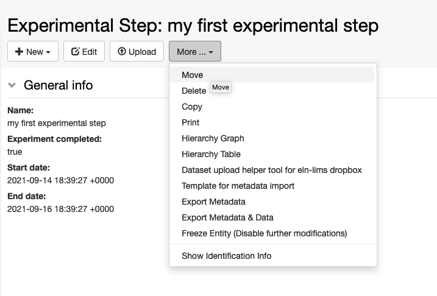
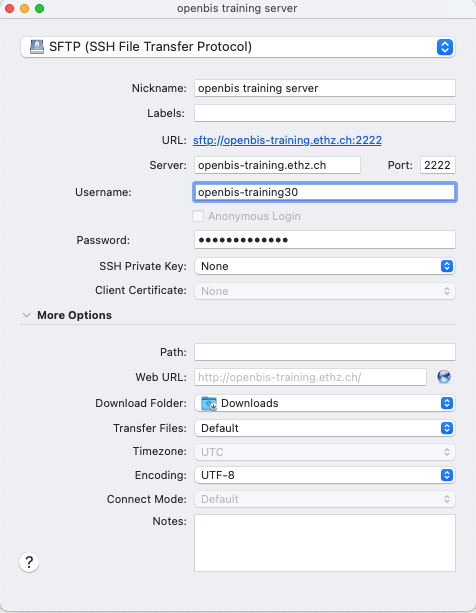

Lab Notebook
====
 
# Register Projects

<a href="#"
class="wedocs-print-article wedocs-hide-print wedocs-hide-mobile"
title="Print this article">

  
In a personal folder, users can register one or more *Projects* they
currently work on. *Projects* in openBIS only have a **Description**
field, no additional fields can be added.

 

1.  Navigate to the relevant *Space* in the *Lab Notebook* menu and

    class="alignnone size-full wp-image-3920"

    sizes="(max-width: 713px) 100vw, 713px" width="713" height="364" />
2.  Should you have an empty page, select **Show Identification Info**
    and **Show Description** from the **More…** dropdown
3.  *Projects* do not have a **Name** field, but only **Code**. Codes
    can only take alphanumeric characters and no spaces.Codes are
    prettified in the Main Menu.
4.  Enter a **Description** for the project.
5.  Click **Save** on top of the form.

class="alignnone size-full wp-image-3921"

sizes="(max-width: 829px) 100vw, 829px" width="829" height="378" />

In the **More…** dropdown you have additional options on what you can do
in the Project folder, as shown below.

 

class="alignnone size-full wp-image-3922"

sizes="(max-width: 478px) 100vw, 478px" width="478" height="390" />

Updated on April 25, 2023
 
# Register Experiments

<a href="#"
class="wedocs-print-article wedocs-hide-print wedocs-hide-mobile"
title="Print this article">

  
Inside one *Project*, a user can register several *Experiments*, which
can in turn be divided into single *Experimental Steps.*

 

To register one Experiment:

 

1.  Navigate to the relevant *Project* in the **Lab Notebook** menu
2.  Select **Default Experiment** from the **+New** dropdown, as shown
    below. *Please note that your openBIS instance might have different

    class="alignnone size-full wp-image-3924"

    sizes="(max-width: 748px) 100vw, 748px" width="748" height="407" />
3.  Fill in the relevant fields in the form.
4.  Select **Show in project overview = true** if the *Experiment* is
    important and should be shown in the *Project* form.
5.  Click **Save*** *on top of the form.

class="alignnone size-full wp-image-3927"

sizes="(max-width: 647px) 100vw, 647px" width="647" height="918" />  

 

Updated on April 25, 2023
 
# Register Experimental Steps

<a href="#"
class="wedocs-print-article wedocs-hide-print wedocs-hide-mobile"
title="Print this article">

  
As mentioned above, the various steps
executed when performing an Experiment in the lab can be registered in
openBIS as  *Experimental Steps or Entries.*

The default *Experimental Step* has pre-defined fields, as shown below:

class="alignnone size-full wp-image-1924"

sizes="(max-width: 2412px) 100vw, 2412px" width="2412" height="1546" />

 

An *Entry*, is a blank page, with no pre-defined fields:

 

class="alignnone size-full wp-image-1925"

sizes="(max-width: 2420px) 100vw, 2420px" width="2420" height="1562" />

  
To register a default *Experimental Step*
or *Entry*:  
  

1.  Navigate to the relevant **Experiment** in the *Lab Notebook* menu
    and click the **+ New** button, as shown below.
2.  Select **Experimental Step** or **Entry**
3.  Fill in the relevant information or select an available template
    from the list (see below).
4.  If **Show in project overview*** *is set to true, this *Experimental
    Step* or *Entry* will be displayed on the *Project* page.
5.  Click **Save** on top of the form. 

class="alignnone size-full wp-image-3929"

sizes="(max-width: 979px) 100vw, 979px" width="979" height="446" />

 

 

## **Comments Log**

  
Several comments can be added by different
users who have write-access to a given user Space:

1.  Click the button in the **Comments** section*.*
2.  Enter the **comment**.
3.  Click **Save***.*

##  

##  

Updated on April 25, 2023
 
# Add parents and children to Experimental Steps

<a href="#"
class="wedocs-print-article wedocs-hide-print wedocs-hide-mobile"
title="Print this article">

 

In the default *Experimental Step* and in
the *Entry*, there is a **Parents** section where it is possible to
specify links to materials and methods from the *Inventory* or to any
other *Object*, e.g. another *Experimental Step* or *Entry*. 

 

**Parents** are all samples/materials used in an experimental procedure,
standard protocols from the inventory followed in the experimental
procedure, the equipment used. It is also possible to set one
*Experimental Step/Entry* as parent of a second *Experimental
Step/Entry,* to keep the connection between the two.

 

The name of this section and which parents
should be shown in the form, is customisable by the *lab manager* or
*group admin* as described in [Customise Parents and Children Sections
in Object
Forms](https://openbis.ch/index.php/docs/admin-documentation-openbis-19-06-4/customise-parents-and-children-sections-in-object-forms/)

#  

# Adding a parent 

 

class="aligncenter wp-image-2628 size-full"

sizes="(max-width: 969px) 100vw, 969px" width="969" height="604" />

##  

## Adding a parent of a predefined type in the form

 

In the screenshot above, **General protocol** is predefined as parent
type in the form. We have two options to add a parent of this predefined
type:

 

### **1. Search**

 

1.  1.  Click on the **Search** button.
    2.  Enter the **name** or **code** of the entry you want to add as
        parent.
    3.  Select the entry you want to add from the list presented to you.

The parent will be added only when you **save** the entity.

class="alignnone size-large wp-image-3968"

sizes="(max-width: 1024px) 100vw, 1024px" width="1024" height="201" /> 

###  

class="alignnone size-large wp-image-3969"

sizes="(max-width: 1024px) 100vw, 1024px" width="1024" height="332" />

### **2. Paste**

 

1.  1.  You may copy the identifier of an entry you want to add as
        parent from a file, or from an advanced search or from another
        ELN page. You can paste the identifier(s) in the **Paste** text
        field.
    2.  click the **+Add** button

 

class="aligncenter wp-image-2633 size-large"

sizes="(max-width: 1024px) 100vw, 1024px" width="1024" height="186" />  
 

##  

##  

## Adding parent of any available type

 

If you want to add a parent that is not specified in the *Experimental
Step* form, you can use the **Search Any** or **Paste Any** options next
to **Parents.**

 

 

class="aligncenter wp-image-2637 size-full"

sizes="(max-width: 654px) 100vw, 654px" width="654" height="101" />

###  

###  

### 1. Search Any

 

1.  Click **Search Any**
2.  Select the *Object* type for which you want to add a parent
3.  Search by **code** or **name** as explained above
4.  Click the **+ Add** button

###  

### 2. Paste Any

 

There are cases where you may want to add several parents of the same
type or also of different types. In this case, we recommend to use the
**Advanced Search** to find the entries you want to add. You can select
the desired entries from the table and the **Copy Identifiers** button
will become visible. You can copy the identifiers and paste them in the
**Paste Any** field in the *Experimental Step* page, as shown below.

 

 

 

class="alignnone size-large wp-image-3232"

sizes="(max-width: 1024px) 100vw, 1024px" width="1024" height="572" />

 

##  

## Adding parent via barcodes

If you want to add a parent that is registered in openBIS and has a
barcode associated with it by scanning the barcode:

 

1.Click on the **barcode** icon in the Parents section

class="alignnone size-full wp-image-3682"

sizes="(max-width: 563px) 100vw, 563px" width="563" height="116" />

2\. A **Barcode Reader** window opens

class="alignnone size-full wp-image-3683"

sizes="(max-width: 407px) 100vw, 407px" width="407" height="149" />

3\. Scan the barcode of the entry you want to add as parent

4\. Click on the **Add Objects** button

5\. **Close** 

 

 

# Removing a parent 

 

To remove a parent, choose **Remove*** *from the **Operations*** *drop
down in the parent table, as shown below.

 

class="alignnone size-large wp-image-3230"

sizes="(max-width: 1024px) 100vw, 1024px" width="1024" height="313" />

#  

# **Adding and Removing Children**

 

Children of *Experimental Steps* are
usually derivative *Experimental Steps,* or products of the
*Experimental Step.* As for the **Parents** section, this section can
also be customised by a *group admin* or *lab manager* in the **ELN
Settings** ([Customise Parents and Children Sections in Object
Forms)](https://openbis.ch/index.php/docs/admin-documentation-openbis-19-06-4/customise-parents-and-children-sections-in-object-forms/).

 

The procedure for adding and removing
children is the same as explained for parents.

##  

## Children Generator

The **Children Generator** creates a
matrix of all the parents entered in the* Experimental Step*, as shown
below. Combinations of parents needed to generate children can then be
selected by the user. The *Object* type to assign to the children and
the number of replicas need to be specified. The children will then be
automatically generated by openBIS upon registration of the
*Experimental Step*.

class="wp-image-202"

sizes="(max-width: 1024px) 100vw, 1024px" />

# Parent-child relationships between entries in lab notebook

In the Lab Notebook section, if you create a new *Object* from an
existing *Object*, independently of the type, this will be automatically
set as parent of the new Object. For example, if you create a new
Experimental Step (measurement 4) from an existing Experimental Step
(measurement 3), this will be automatically set as child of measurement
3, as shown below.

 

class="alignnone size-full wp-image-3936"

sizes="(max-width: 720px) 100vw, 720px" width="720" height="405" />

##  

If you do not wish to have this relationship established, you need to
create the new Object starting from the Experiment level, as shown
below.

 

class="alignnone size-full wp-image-3937"

sizes="(max-width: 720px) 100vw, 720px" width="720" height="405" /> 

Updated on April 25, 2023
 
# How to use protocols in Experimental Steps

<a href="#"
class="wedocs-print-article wedocs-hide-print wedocs-hide-mobile"
title="Print this article">

 

 

When adding protocols to an *Experimental Step*, two options are
available:

1.  Link to a **Protocol** stored in the *Inventory*. This can be used
    if the protocol was followed exactly in all steps as described.
2.  Create a **local copy of the Protocol** from the *Inventory* in the
    current *Experiment*. This should be done if some steps of the main
    protocol were modified. These modifications can be edited in the
    local copy of the protocol, while the template is left untouched.

 

To create a local copy under the current
Experiment of a template protocol stored in the *Inventory*:

1.  Add a protocol as parent.
2.  From the **Operations** dropdown in the parents table
    select*** *Copy to Experiment.**
3.  Provide the **Object code** for the new protocol.
4.  A copy of the protocol is created under the current *Experiment*,
    where the user can modify it. This copy has the original protocol
    set as parent, so that connection between the two is clear.

 

class="alignnone size-large wp-image-3228"

sizes="(max-width: 1024px) 100vw, 1024px" width="1024" height="233" />

##  

Updated on April 26, 2023
 
# Move Experimental Steps

<a href="#"
class="wedocs-print-article wedocs-hide-print wedocs-hide-mobile"
title="Print this article">

 

To move an *Experimental Step* to a
different *Experiment*, choose **Move** from the **More..** drop down,
as shown in the picture above.  

 

class="wp-image-2618 size-full alignnone"

sizes="(max-width: 717px) 100vw, 717px" width="717" height="486" />

 

It is possible to move *Experimental Steps* from the *Object* table
which is presented on an *Experiment* or *Collection* page. 

Select the entries to move and use the **Move** button on the table. You
can move to an existing *Experiment*/*Collection* or create a new one.

 

class="alignnone size-large wp-image-3933"

sizes="(max-width: 1024px) 100vw, 1024px" width="1024" height="527" />

Updated on April 25, 2023
 
# Copy Experimental Steps

<a href="#"
class="wedocs-print-article wedocs-hide-print wedocs-hide-mobile"
title="Print this article">

 

To copy an *Experimental Step*, select
**Copy** from the **More…** drop down menu, as shown below.

class="alignnone size-full wp-image-3939"

sizes="(max-width: 649px) 100vw, 649px" width="649" height="537" />

 

## 

When an *Experimental Step* is copied, the
user has the option to **link parents, copy children to the current
Experiment** and **copy the comments log.** The *Experimental
Step* is copied inside the same *Experiment*.

class="alignnone size-large wp-image-3941"

sizes="(max-width: 1024px) 100vw, 1024px" width="1024" height="191" />

Updated on April 25, 2023
 
# Use templates for Experimental Steps

<a href="#"
class="wedocs-print-article wedocs-hide-print wedocs-hide-mobile"
title="Print this article">

 

Templates need to be defined by the lab manager in the <a
href="https://openbis.ch/index.php/docs/admin-documentation/create-templates-for-objects/"
target="_blank" rel="noopener noreferrer">ELN
Settings. If templates have been created for a given
*Experimental Step*, you can choose from the list of available templates
by clicking the **Template** button on the *Object* form, as shown
below.  

 

A template of an *Experimental Step* is an *Experimental Step* with
pre-filled values. Templates are useful when you need to repeat an
*Experimental Step* with the same parameters several times and you wold
like to have default values for those parameters.  

 

class="aligncenter wp-image-2623 size-large"

sizes="(max-width: 1024px) 100vw, 1024px" width="1024" height="598" />

##  

Updated on December 8, 2022
 
# Data Access

<a href="#"
class="wedocs-print-article wedocs-hide-print wedocs-hide-mobile"
title="Print this article">

  
*Datasets* are displayed on the left
hand-side of the *Experiment/Object* form, as shown below.

class="alignnone size-full wp-image-3943"

sizes="(max-width: 861px) 100vw, 861px" width="861" height="524" />  

To navigate and open data registered in
openBIS via Finder or Explorer, open the Dataset folder and click on the drive icon next to the
Dataset type name (see above). If SFTP has been configured by a system admin,
you will be provided with a link to copy/paste in an application such
as <a href="https://cyberduck.io/"
style="color: #0000ff;" target="_blank"
rel="noopener noreferrer">Cyberduck or other.

Please check our documentation for SFTP
server configuration: <a
href="https://unlimited.ethz.ch/display/openBISDoc2010/Installation+and+Administrators+Guide+of+the+openBIS+Data+Store+Server#InstallationandAdministratorsGuideoftheopenBISDataStoreServer-ExampleSFTPclientconfiguration"
style="color: #0000ff;">Installation and Administrators Guide of the
openBIS Data Store Server

 

For native access through Windows Explorer
or Mac Finder we recommend the following:

 

-   Windows
    10: <a href="https://www.nsoftware.com/sftp/netdrive/" class="external-link"
    style="color: #0000ff;" target="_blank"
    rel="nofollow noopener noreferrer">https://www.nsoftware.com/sftp/netdrive/
-   Mac OS X Yosemite and
    higher: <a href="https://mountainduck.io/" class="external-link"
    style="color: #0000ff;" target="_blank"
    rel="nofollow noopener noreferrer">https://mountainduck.io
-   Kubuntu: Default Dolphin File Manager
    with SFTP support

##  

##  Example of SFTP Net Drive connection:

1. open SFTP Net Drive and click on New:

 

class="alignnone size-full wp-image-3298"

sizes="(max-width: 735px) 100vw, 735px" width="735" height="470" />

2\. Edit the drive with the following info, as shown below:

     a. **Drive name**: choose any name you want. Can be the same as
your openBIS server, but does not have to be.

     b. **Remote Host**: the name of your openBIS. For example, if the
url of your openBIS is https://openbis-
demo.ethz.ch/openbis/webapp/eln-lims, then openbis-demo.ethz.ch is the
name you want to enter.

    c. **Remote por**t: enter 2222.

    d. **Authentication type**: Password (this is selected by default).

    e. **Username**: the username you use to login to openBIS.

    f. **Password**: the password you use to login to openBIS.

    g. **Root folder on server**: you can leave the default, User’s home
folder.

    h. Press **OK** after filling in all the information above. 

 

class="alignnone size-full wp-image-3304"

sizes="(max-width: 562px) 100vw, 562px" width="562" height="528" />

 

3\. After saving the drive, select it in the drivers’ window and click
**Connect**.

class="alignnone size-full wp-image-3305"

sizes="(max-width: 743px) 100vw, 743px" width="743" height="458" />

 

3\. openBIS will now appear as a drive in your Explorer window. Click on
the **ELN-LIMS** folder and navigate to the folder containing the data
you want to access.

 

class="alignnone size-full wp-image-3301"

sizes="(max-width: 783px) 100vw, 783px" width="783" height="496" />

 

Note: if you encounter the error
message “*SSH connection failed: Could not find a part of the path*.”
you can fix this by disabling the cache (Drives -&gt; Advanced -&gt;
Enable Caching), and disabling log files. The error is caused by an
attempt to create files in a folder not available to Windows.

 

 

## Example of Cyber Duck configuration

 

Create a new connection in cyberduck:

1.  select **SFTP (SSH File Transfer Protocol)**
2.  **Nickname**: the name you want to use for the server
3.  **Server**: the name of the server you want to connect to. In the
    example below openbis-training.ethz.ch. Replace this with the name
    of your own openBIS server.
4.  **Port**: 2222 
5.  **Username**: this is the username with which you connect to your
    openBIS
6.  **Password**: this is the password you use to connect to your
    openBIS
7.  **SSH** private Key: none

class="alignnone size-full wp-image-3726"

sizes="(max-width: 476px) 100vw, 476px" width="476" height="613" />

 

Save the specifications and connect to the server.

You will see the folders of your own openBIS in the Cyberduck window and
you can navigate to your data from there.

 

class="alignnone size-full wp-image-3727"

sizes="(max-width: 737px) 100vw, 737px" width="737" height="382" />

## Example of  Dolphin File Manager configuration

class="wp-image-581"

sizes="(max-width: 860px) 100vw, 860px" />

To access the Dataset form and edit the
Dataset metadata, click on the Dataset code or Name (if
provided).

 

## SFTP access via session token

To access via session token (for example when using SSO authentication)
you need to provide the following credentials:

 

**Username: ?**

**Password: session token**.

 

The session token can be copied from the **User Profile** under
**Utilities** in the main menu, as shown below.

 

 

class="alignnone size-large wp-image-4158"

sizes="(max-width: 1024px) 100vw, 1024px" width="1024" height="329" />

Updated on May 5, 2023
 
# Move Datasets

<a href="#"
class="wedocs-print-article wedocs-hide-print wedocs-hide-mobile"
title="Print this article">

 

It is possible to move a *Dataset* from one *Experiment/Object* to
another *Experiment/Object*.

1.  Click on the *Dataset* in the main menu
2.  In the *Dataset* page select **Move** from the **More..** dropdown
3.  Enter the name or code of the *Experiment* or *Object* where you
    want to move the *Dataset* to. If you start typing, openBIS will
    show you a list of possible entries that match what you entered.
4.  Press the **Accept** button.

 

class="alignnone size-full wp-image-3945"

sizes="(max-width: 893px) 100vw, 893px" width="893" height="430" />

 

 

class="alignnone size-large wp-image-3946"

sizes="(max-width: 1024px) 100vw, 1024px" width="1024" height="241" />

 

 

 

Updated on April 25, 2023
 
# Move one Experiment to a different Project

<a href="#"
class="wedocs-print-article wedocs-hide-print wedocs-hide-mobile"
title="Print this article">

 

It is possible to move one Experiment and all contained Objects and
Datasets from one Project to another.

If Objects contain parent/child relationships these are preserved.

 

To move one Experiment from one Project to another:

 

1.  Select the Experiment you want to move from the main menu
2.  Select **Move** from the **More…** dropdown

 

class="alignnone size-large wp-image-3949"

sizes="(max-width: 1024px) 100vw, 1024px" width="1024" height="373" />

 

3\. Enter the code of the Project where you want to move your
Experiment. If you start typing the code, openBIS will prompt you with a
list of available options and you can select the appropriate one from
there.

class="alignnone size-large wp-image-3950"

sizes="(max-width: 1024px) 100vw, 1024px" width="1024" height="168" />

 

4\. Click **Accept**

class="alignnone size-large wp-image-3951"

sizes="(max-width: 1024px) 100vw, 1024px" width="1024" height="120" />

Updated on April 25, 2023
 
# Project Overview

<a href="#"
class="wedocs-print-article wedocs-hide-print wedocs-hide-mobile"
title="Print this article">

  
All *Experiments* and *Experimental Ste*ps
have a **Show in project overview** checkbox. When selected, these
*Experiments* and/or *Experimental Steps* will be shown in the *Project*
form, as shown below.

 

This allows users to have a better
overview of a *Project* and highlight the most important
findings.

 

class="alignnone size-large wp-image-3953"

sizes="(max-width: 1024px) 100vw, 1024px" width="1024" height="516" />

 

If the *Experiments* and *Object* tables are not shown in the project
page, you need to select **Show Experiments** and **Show Objects** from
the More.. drop down.

 

class="alignnone size-full wp-image-3188"

sizes="(max-width: 560px) 100vw, 560px" width="560" height="418" /> dropdown
menu.

 

Updated on April 25, 2023
 
# Edit and Delete Projects, Experiments, Experimental Steps

<a href="#"
class="wedocs-print-article wedocs-hide-print wedocs-hide-mobile"
title="Print this article">

 

 

*Projects*, *Experiments* and
*Experimental Steps* can be edited at any time, by selecting the
**Edit** icon from the toolbar of the relevant page.

*Projects*, *Experiments* and
*Experimental Steps* can be deleted using the **Delete** option under
**More** tab in the toolbar.

 

class="alignnone size-full wp-image-3956"

sizes="(max-width: 625px) 100vw, 625px" width="625" height="394" />

 

*Experiments* and *Experimental Steps* are
moved to the **trashcan**, from where they need to be removed in order
to be permanently deleted from the database. *Projects* are directly
deleted, they are not moved to the trashcan first. *Projects* can be
deleted only after deleting all the *Experiments* they contain.

Please be aware that, by default, only
users with *Space Admin and Instance Admin*  role have permission to
delete. Default permissions can be modified only by a *system admin*
(see <a
href="https://unlimited.ethz.ch/display/openBISDoc2010/Installation+and+Administrator+Guide+of+the+openBIS+Server#InstallationandAdministratorGuideoftheopenBISServer-ChangingtheCapability-Rolemap"
style="color: #0000ff;" target="_blank"
rel="noopener noreferrer">Changing the openBIS capability role map)

Updated on April 25, 2023
 
# Share Lab Notebooks and Projects

<a href="#"
class="wedocs-print-article wedocs-hide-print wedocs-hide-mobile"
title="Print this article">

  
It is possible to share either a complete
lab notebook or single *Projects*, using the **Manage Access** option
in the **More..** dropdown of a *Space* or *Project* page, as
shown below.

 

class="alignnone size-full wp-image-3961"

sizes="(max-width: 555px) 100vw, 555px" width="555" height="325" />

 

Available roles are:

1.  **Observer**: read-only access to
    Space or Project
2.  **User**: can create and modify
    entities in Space or Project
3.  **Admin**: can create, modify and
    delete entities in Space or Project

 

The roles can be granted to:

1.  **User**: the user needs to be already registered in openBIS. The
    username of the user needs to be entered.
2.  **Group**: the name of a user group existing in openBIS needs to be
    entered.

 

 

class="size-full wp-image-3959 aligncenter"

sizes="(max-width: 815px) 100vw, 815px" width="815" height="435" />

 

class="size-full wp-image-3960 aligncenter"

sizes="(max-width: 812px) 100vw, 812px" width="812" height="409" />

 

 

 

 

Updated on April 25, 2023
