class="mobile" itemprop="image" alt="Logo" />

Search for:

All Docs Admin Documentation Admin Documentation (prior to openBIS
v19.06.4) Admin Documentation (prior to openBIS v20.10.3) User
Documentation User Documentation (prior to openBIS v19.06.4) User
Documentation (prior to openBIS v20.10.3)

-   <a href="https://openbis.ch"
    target="_blank">Home
-   <a href="https://openbis.ch" class="no_link" style="cursor: default;"
    onclick="JavaScript: return false;">Resources
    -   [Overview of openBIS and RDM
        services offered by
        SIS](https://openbis.ch/index.php/overview-of-openbis-and-rdm-services-offered-by-sis/)
    -   [User
        Documentation](https://openbis.ch/index.php/docs/user-documentation/)
    -   [Admin
        Documentation](https://openbis.ch/index.php/docs/admin-documentation/)
    -   [FAQ](https://openbis.ch/index.php/faq/)
    -   [Video
        tutorials](https://openbis.ch/index.php/screencasts/#video%20tutorials)
    -   [Demo](https://openbis.ch/index.php/demo/#demo)
    -   [Downloads](https://openbis.ch/index.php/downloads/#downloads)
    -   [References](https://openbis.ch/index.php/references/)
-   [Community
    forum](https://openbis.ch/index.php/community-forum/)
-   <a href="https://openbis.ch" class="no_link" style="cursor: default;"
    onclick="JavaScript: return false;">Services
    -   [openRDM.swiss](https://openbis.ch/index.php/openrdm-swiss/)
    -   [openRDM.eu](https://openbis.ch/index.php/openrdm-eu/)
-   <a href="https://openbis.ch" class="no_link" style="cursor: default;"
    onclick="JavaScript: return false;">Events
    -   [openBIS UGM
        2023](https://openbis.ch/index.php/openbis-ugm-2023/)
-   <a href="https://openbis.ch" class="no_link" style="cursor: default;"
    onclick="JavaScript: return false;">About
    -   [Our
        team](https://openbis.ch/index.php/our-team/)
    -   [Contact](https://openbis.ch/index.php/contact/)
-   [News](https://openbis.ch/index.php/news/)
-   [Imprint](https://openbis.ch/index.php/imprint/#imprint)

-   Home

-   ### Resources

    
    -   [Overview of openBIS and RDM
        services offered by
        SIS](https://openbis.ch/index.php/overview-of-openbis-and-rdm-services-offered-by-sis/)
    -   [User
        Documentation](https://openbis.ch/index.php/docs/user-documentation/)
    -   [Admin
        Documentation](https://openbis.ch/index.php/docs/admin-documentation/)
    -   [FAQ](https://openbis.ch/index.php/faq/)
    -   [Video
        tutorials](https://openbis.ch/index.php/screencasts/#video%20tutorials)
    -   [Demo](https://openbis.ch/index.php/demo/#demo)
    -   [Downloads](https://openbis.ch/index.php/downloads/#downloads)
    -   [References](https://openbis.ch/index.php/references/)

-   [Community
    forum](https://openbis.ch/index.php/community-forum/)

-   ### Services

    
    -   [openRDM.swiss](https://openbis.ch/index.php/openrdm-swiss/)
    -   [openRDM.eu](https://openbis.ch/index.php/openrdm-eu/)

-   ### Events

    
    -   [openBIS UGM
        2023](https://openbis.ch/index.php/openbis-ugm-2023/)

-   ### About

    
    -   [Our
        team](https://openbis.ch/index.php/our-team/)
    -   [Contact](https://openbis.ch/index.php/contact/)

-   [News](https://openbis.ch/index.php/news/)

-   [Imprint](https://openbis.ch/index.php/imprint/#imprint)

 

### User Documentation

-   [General
    Overview](https://openbis.ch/index.php/docs/user-documentation/general-overview/)
-   [Inventory of Materials and
    Methods](https://openbis.ch/index.php/docs/user-documentation/inventory-of-materials-and-methods/)
    -   [Customise Collection
        View](https://openbis.ch/index.php/docs/user-documentation/inventory-of-materials-and-methods/customise-collection-view/)
    -   [Register single entries in a
        Collection](https://openbis.ch/index.php/docs/user-documentation/inventory-of-materials-and-methods/register-single-entries-in-a-collection/)
    -   [Batch register entries in a
        Collection](https://openbis.ch/index.php/docs/user-documentation/inventory-of-materials-and-methods/batch-register-entries-in-a-collection/)
    -   [Batch register entries in several
        Collections](https://openbis.ch/index.php/docs/user-documentation/inventory-of-materials-and-methods/batch-register-entries-in-several-collections/)
    -   [Batch update entries in a
        Collection](https://openbis.ch/index.php/docs/user-documentation/inventory-of-materials-and-methods/batch-update-entries-in-a-collection/)
    -   [Batch update entries in several
        Collections](https://openbis.ch/index.php/docs/user-documentation/inventory-of-materials-and-methods/batch-update-entries-in-several-collections/)
    -   [Copy
        entries](https://openbis.ch/index.php/docs/user-documentation/inventory-of-materials-and-methods/copy-entries/)
    -   [Move entries to a different
        Collection](https://openbis.ch/index.php/docs/user-documentation/inventory-of-materials-and-methods/move-entries-to-a-different-collection/)
    -   [Register Protocols in the Methods
        Inventory](https://openbis.ch/index.php/docs/user-documentation/inventory-of-materials-and-methods/register-protocols-in-the-methods-inventory/)
-   [Managing storage of
    samples](https://openbis.ch/index.php/docs/user-documentation/managing-storage-of-samples/)
    -   [Allocate storage positions to
        samples](https://openbis.ch/index.php/docs/user-documentation/managing-storage-of-samples/allocate-storage-to-samples/)
    -   [Batch update storage
        positions](https://openbis.ch/index.php/docs/user-documentation/managing-storage-of-samples/batch-update-storage-positions/)
    -   [Delete storage
        positions](https://openbis.ch/index.php/docs/user-documentation/managing-storage-of-samples/delete-storage-positions/)
    -   [Overview of lab
        storages](https://openbis.ch/index.php/docs/user-documentation/managing-storage-of-samples/overview-of-lab-storages/)
-   [Barcodes](https://openbis.ch/index.php/docs/user-documentation/barcodes/)
    -   [Barcodes](https://openbis.ch/index.php/docs/user-documentation/barcodes/barcodes/)
    -   [Printer and Barcode Scanner
        Requirements](https://openbis.ch/index.php/docs/user-documentation/barcodes/printer-and-barcode-scanner-requirements/)
-   [Lab
    notebook](https://openbis.ch/index.php/docs/user-documentation/lab-notebook/)
    -   [Register
        Projects](https://openbis.ch/index.php/docs/user-documentation/lab-notebook/register-projects/)
    -   [Register
        Experiments](https://openbis.ch/index.php/docs/user-documentation/lab-notebook/register-experiments/)
    -   [Register Experimental
        Steps](https://openbis.ch/index.php/docs/user-documentation/lab-notebook/register-experimental-steps/)
    -   [Add parents and children to Experimental
        Steps](https://openbis.ch/index.php/docs/user-documentation/lab-notebook/add-parents-and-children-to-experimental-steps/)
    -   [How to use protocols in Experimental
        Steps](https://openbis.ch/index.php/docs/user-documentation/lab-notebook/how-to-use-protocols-in-experimental-steps/)
    -   [Move Experimental
        Steps](https://openbis.ch/index.php/docs/user-documentation/lab-notebook/move-experimental-steps/)
    -   [Copy Experimental
        Steps](https://openbis.ch/index.php/docs/user-documentation/lab-notebook/copy-experimental-steps/)
    -   [Use templates for Experimental
        Steps](https://openbis.ch/index.php/docs/user-documentation/lab-notebook/use-templates-for-experimental-steps/)
    -   [Data
        Access](https://openbis.ch/index.php/docs/user-documentation/lab-notebook/data-access/)
    -   [Move
        Datasets](https://openbis.ch/index.php/docs/user-documentation/lab-notebook/move-datasets/)
    -   [Move one Experiment to a different
        Project](https://openbis.ch/index.php/docs/user-documentation/lab-notebook/move-one-experiment-to-a-different-project/)
    -   [Project
        Overview](https://openbis.ch/index.php/docs/user-documentation/lab-notebook/project-overview/)
    -   [Edit and Delete Projects, Experiments, Experimental
        Steps](https://openbis.ch/index.php/docs/user-documentation/lab-notebook/edit-and-delete-projects-experiments-experimental-steps/)
    -   [Share Lab Notebooks and
        Projects](https://openbis.ch/index.php/docs/user-documentation/lab-notebook/share-lab-notebooks-and-projects/)
    -   [Rich Text
        Editor](https://openbis.ch/index.php/docs/user-documentation/lab-notebook/rich-text-editor/)
-   [Data
    upload](https://openbis.ch/index.php/docs/user-documentation/data-upload/)
    -   [Data upload via web
        UI](https://openbis.ch/index.php/docs/user-documentation/data-upload/data-upload-via-web-ui/)
    -   [Data upload via
        dropbox](https://openbis.ch/index.php/docs/user-documentation/data-upload/data-upload-via-dropbox/)
-   [Data
    export](https://openbis.ch/index.php/docs/user-documentation/data-export/)
    -   [Export to
        File](https://openbis.ch/index.php/docs/user-documentation/data-export/export-to-file/)
    -   [Export to
        Zenodo](https://openbis.ch/index.php/docs/user-documentation/data-export/export-to-zenodo/)
    -   [Export to ETH Research
        Collection](https://openbis.ch/index.php/docs/user-documentation/data-export/export-to-eth-research-collection/)
-   [Data
    archiving](https://openbis.ch/index.php/docs/user-documentation/data-archiving/)
-   [Search](https://openbis.ch/index.php/docs/user-documentation/search/)
    -   [Advanced
        search](https://openbis.ch/index.php/docs/user-documentation/search/advanced-search/)
    -   [Search](https://openbis.ch/index.php/docs/user-documentation/search/search/)
    -   [Save and reuse
        searches](https://openbis.ch/index.php/docs/user-documentation/search/save-and-reuse-searches/)
-   [Additional
    functionalities](https://openbis.ch/index.php/docs/user-documentation/additional-functionalities/)
    -   [Visualise
        Relationships](https://openbis.ch/index.php/docs/user-documentation/additional-functionalities/visualise-relationships/)
    -   [Tables](https://openbis.ch/index.php/docs/user-documentation/additional-functionalities/tables/)
    -   [Browse Entries by
        Type](https://openbis.ch/index.php/docs/user-documentation/additional-functionalities/browse-entries-by-type/)
    -   [Trashcan](https://openbis.ch/index.php/docs/user-documentation/additional-functionalities/trashcan/)
    -   [Vocabulary
        Browser](https://openbis.ch/index.php/docs/user-documentation/additional-functionalities/vocabulary-browser/)
    -   [Freeze
        Entities](https://openbis.ch/index.php/docs/user-documentation/additional-functionalities/freeze-entities/)
    -   [Navigation
        menu](https://openbis.ch/index.php/docs/user-documentation/additional-functionalities/navigation-menu/)
    -   [Custom
        Imports](https://openbis.ch/index.php/docs/user-documentation/additional-functionalities/custom-imports/)
    -   [Entity
        history](https://openbis.ch/index.php/docs/user-documentation/additional-functionalities/entity-history/)
    -   [Spreadsheet](https://openbis.ch/index.php/docs/user-documentation/additional-functionalities/spreadsheet/)
-   <a
    href="https://openbis.ch/index.php/docs/user-documentation/managing-lab-stocks-and-orders-2/"
    aria-current="page">Managing Lab Stocks and Orders
-   [Tools for Analysis of Data Stored in
    openBIS](https://openbis.ch/index.php/docs/user-documentation/tools-for-analysis-of-data-stored-in-openbis/)
    -   [Jupyter
        Notebooks](https://openbis.ch/index.php/docs/user-documentation/tools-for-analysis-of-data-stored-in-openbis/jupyter-notebooks/)
    -   [MATLAB
        toolbox](https://openbis.ch/index.php/docs/user-documentation/tools-for-analysis-of-data-stored-in-openbis/matlab-toolbox/)

1.  
2.  Home
3.  
4.  Docs
5.  
6.  <a href="https://openbis.ch/index.php/docs/user-documentation/"
    itemprop="item">User Documentation
7.  
8.  Managing Lab Stocks and Orders

# Managing Lab Stocks and Orders

<a href="#"
class="wedocs-print-article wedocs-hide-print wedocs-hide-mobile"
title="Print this article">

  
It is possible to use openBIS to manage
stocks of products and create orders of products to buy for the
lab. 

Every lab member can register products and place requests of products to
buy. The requests can be converted into orders by the lab manager or the
person responsible for purchases in the lab. The orders created with
openBIS contain the information that can be sent to the suppliers.

  

class="alignnone size-full wp-image-4018"
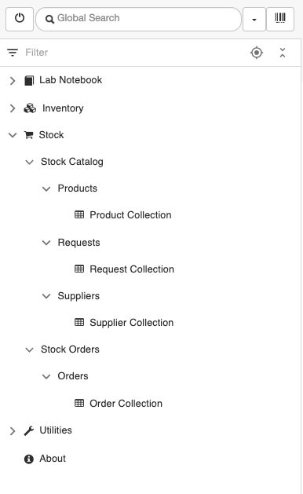
sizes="(max-width: 386px) 100vw, 386px" width="386" height="629" />

 

In the **Stock Catalog** folder, a lab can create one collection of all
products purchased in the lab and one collection of all suppliers used
for purchasing. Each product must be linked to 1 supplier. 

Every lab member by default has *Space User* access rights to the
**Stock Catalog** folder and is able to register products, suppliers and
place requests for products to buy.

The **Stock Orders** folder is visible to all lab members, who have by
default *Space Observer* rights to it.  The lab manager, or person
responsible for purchases, has *Space Admin* rights to this Space.
Orders can be created based on the requests placed in the **Stock
Catalog**. 

##  

# STOCK CATALOG

 

## Building the catalog of products and suppliers

##  

### Catalog of suppliers

 

To build the catalog of all suppliers used for purchasing products by
the lab:

> 1.  Go to the **Supplier Collection**
>     folder under **Stock** *-&gt;* **Stock Catalog***-&gt;*
>     **Suppliers** in the main menu.
> 2.  Click on the **+ New Supplier**
>     button in the *Collection* page.
> 3.  Follow the steps explained in
>     the <a
>     href="https://openbis.ch/index.php/docs/user-documentation-20-10-3/inventory-of-materials-and-methods/register-single-entries-in-a-collection/"
>     style="color: #3366ff;" target="_blank"
>     rel="noopener noreferrer">Register Entries
>     documentation page.
>
>  

class="alignnone size-full wp-image-4019"
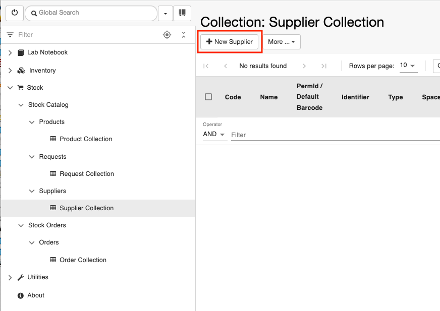
sizes="(max-width: 872px) 100vw, 872px" width="872" height="617" />

To register several suppliers at once, follow the steps described in <a
href="https://openbis.ch/index.php/docs/user-documentation-20-10-3/inventory-of-materials-and-methods/batch-register-entries-in-a-collection/"
target="_blank" rel="noopener noreferrer">Batch register entries in a
Collection.

###  Catalog of products

 

To build the catalog of all products purchased in the lab:

> 1.  Go to the **Product Collection**
>     folder under **Stock** *-&gt;* **Stock Catalog***-&gt;*
>     **Products** in the main menu.
> 2.  Click the **+ New Product** button
>     in the *Collection* page.

##  

class="alignnone size-full wp-image-4020"
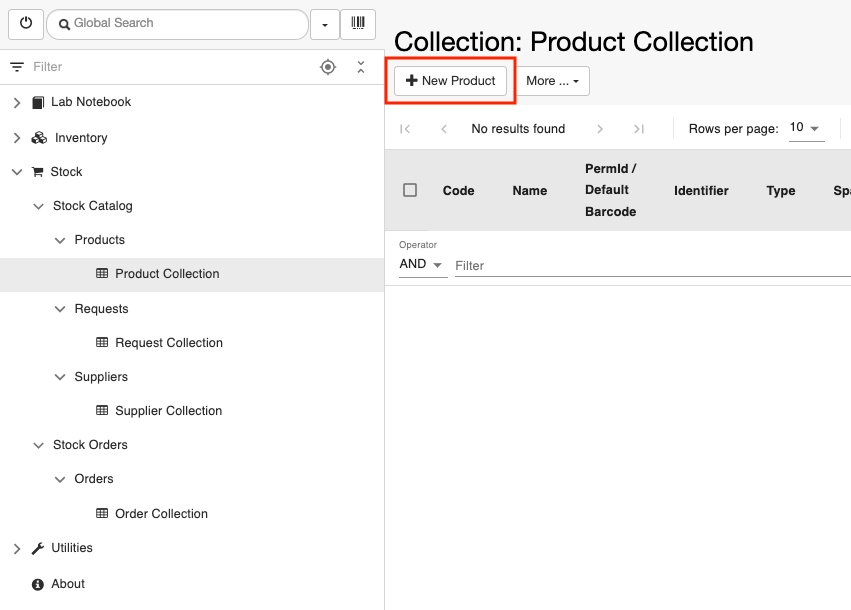
sizes="(max-width: 851px) 100vw, 851px" width="851" height="610" />

>  
>
> 3. For each product it is necessary to
> register one supplier as parent. Select the correct supplier from the
> list of suppliers registered in the **Supplier Collection.** The
> process for adding parents is the same as described for Experimental
> Steps: <a
> href="https://openbis.ch/index.php/docs/user-documentation-20-10-3/lab-notebook/add-parents-and-children-to-experimental-steps/"
> target="_blank" rel="noopener noreferrer">Add parents.
>
>  

## 

class="size-full wp-image-3357 aligncenter"
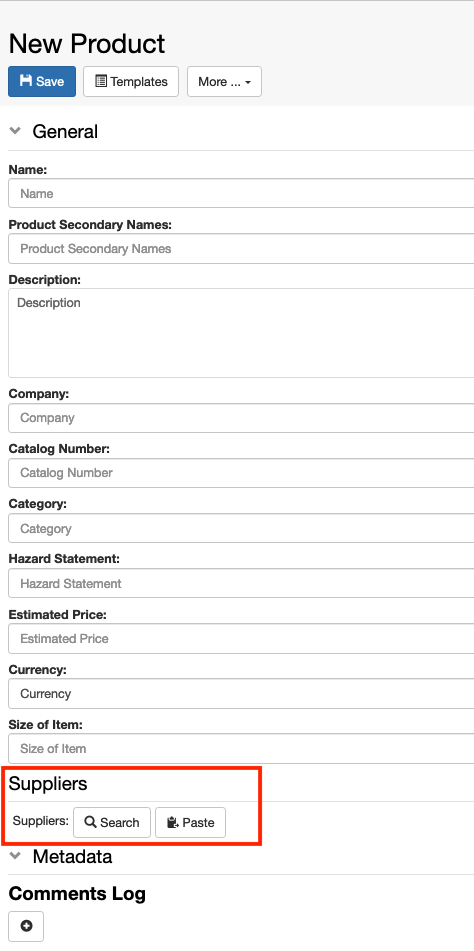
sizes="(max-width: 474px) 100vw, 474px" width="474" height="951" />

 

To register several suppliers at once, follow the steps described in <a
href="https://openbis.ch/index.php/docs/user-documentation-20-10-3/inventory-of-materials-and-methods/batch-register-entries-in-a-collection/"
target="_blank" rel="noopener noreferrer">Batch register entries in a
Collection.

###  

## Creating requests for products to order

 

Every lab member can create requests for products that need to be
ordered:

> 1.  Go to the **Request Collection**
>     folder under **Stock** *-&gt;* **Stock Catalog***-&gt;*
>     **Requests** in the main menu.
> 2.  Click the **+ New Request** button
>     in the *Collection* page.

 

class="alignnone size-full wp-image-4021"
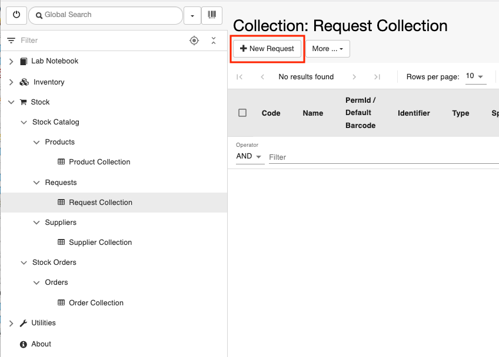
sizes="(max-width: 848px) 100vw, 848px" width="848" height="608" />

>        3. When you fill in the form the
> following information needs to be provided:
>
>  
>
> 1.  -    **Order Status**. Options  are
>         **Delivered**, **Paid**, **Ordered**, **Not yet ordered**.
>         When you create a request set this field to **Not yet
>         ordered.** Only requests with this **Order Status** can be
>         processed to orders.
>
> 2.   
>     -   Add the product you for which
>         you want to place a request for order. This can be done in two
>         ways**:**
>
> 1\. add a product that is already present in the catalog. This process
> is the same as described for adding parents in
> Experimental Steps: <a
> href="https://openbis.ch/index.php/docs/user-documentation-20-10-3/lab-notebook/add-parents-and-children-to-experimental-steps/"
> target="_blank" rel="noopener noreferrer">Add parents. The
> quantity, i.e. how many units of the product are requested, needs to
> be specified.
>
> 2\. add a product that is not yet registered in the Catalog. In this
> case the information shown in the picture below needs to be provided.
> After creating the request, the product entered here is automatically
> registered in the Product Catalog.
>
>  

Please note that only 1 product can be added to 1 request.

 

class="alignnone size-full wp-image-3362"
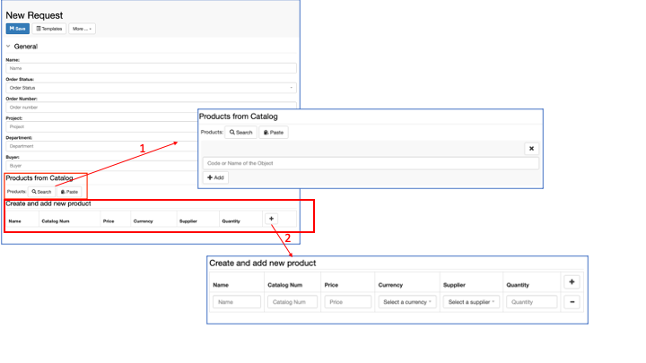
sizes="(max-width: 720px) 100vw, 720px" width="720" height="405" />

> 4.
> Click **Save** on top of the
> form.

#  

# STOCK ORDERS

 

This section is accessible by default by every lab member. However, by
default, only the person in charge of lab purchases can process orders
based on the requests created in the Stock Catalog by every lab member.

##  Processing product orders from requests

 

To create orders of products from requests created in the Stock Catalog:

> 1.  Go to the **Order Collection**
>     folder under **Stock** *-&gt;* **Stock Orders***-&gt;* **Orders**
>     in the main menu.
> 2.  Click the **+ New Order** button in
>     the *Collection* page.

class="alignnone size-full wp-image-4022"
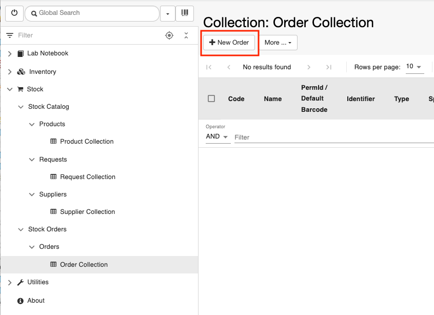
sizes="(max-width: 846px) 100vw, 846px" width="846" height="614" />

>  
>
>  
>
> 3\. If you do not see the **Code** in the form, select **Show
> Identification Info** from the **More..** dropdown

 

class="alignnone size-full wp-image-4023"
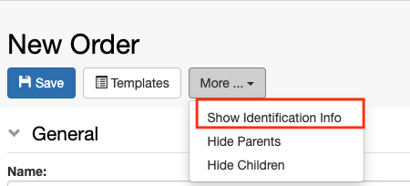
sizes="(max-width: 450px) 100vw, 450px" width="450" height="204" />

 

4\. Enter a **Code** for the order

 

class="alignnone size-full wp-image-4024"
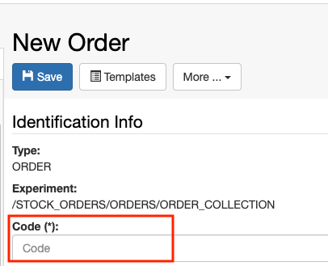
sizes="(max-width: 406px) 100vw, 406px" width="406" height="329" />

 

>  
>
>   3. If an **order** **template** form
> is available (see <a
> href="https://openbis.ch/index.php/docs/admin-documentation-20-10-3/create-templates-for-objects/"
> target="_blank" rel="noopener noreferrer">Create Templates for
> Objects), this template can be used and most fields will be
> automatically filled (see <a
> href="https://openbis.ch/index.php/docs/user-documentation-20-10-3/lab-notebook/use-templates-for-experimental-steps/"
> target="_blank" rel="noopener noreferrer">Use templates for Experimental
> Steps). If no template is available, the relevant fields in the
> form need to be filled in with the relevant information.

 

class="alignnone size-full wp-image-3365"
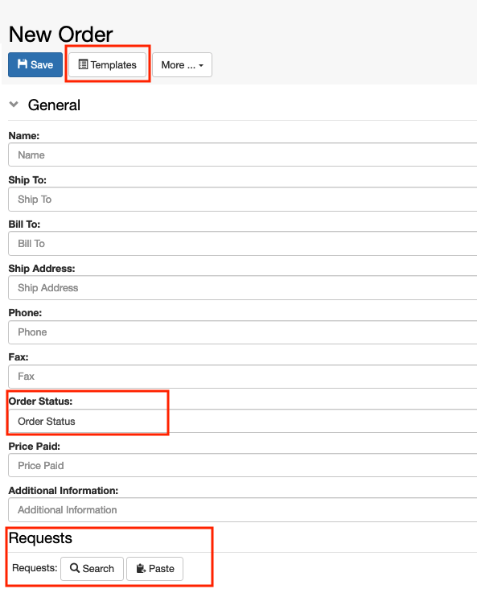
sizes="(max-width: 593px) 100vw, 593px" width="593" height="732" />

> 4\. Enter the **Order Status.** This field is mandatory. Available
> options are **Delivered**, **Paid**,
> **Ordered**, **Not yet ordered**. When you first create the order, you
> should set the status to **Not yet ordered**.
>
> 5. Add one or more requests to the
> Order. Only requests with Order Status set to **Not yet ordered** will
> be displayed and can be selected.
>
> 6. Click **Save** on top of the
> form.

 

class="alignnone size-large wp-image-3372"
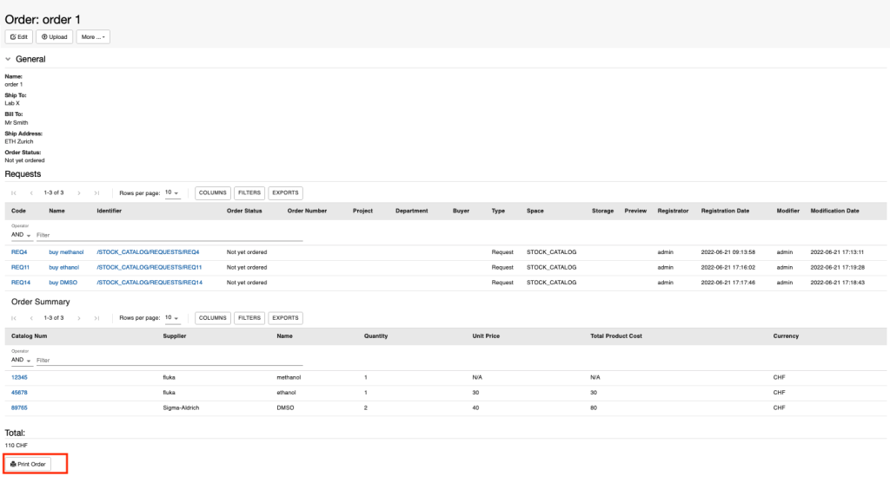
sizes="(max-width: 1024px) 100vw, 1024px" width="1024" height="556" />

If the price information is available in the products, the total cost of
the order is calculated by openBIS and displayed in the order form, as
shown above.

By using the **Print Order** button in the order form, the order can be
printed as text file that can be sent to the suppliers for purchasing
the products.

To simplify the process of ordering multiple products from the same
supplier, all information related to the same supplier is grouped in one
single text file. 

In the example presented in the picture above, there are 2 products to
buy from fluka and 1 product to buy from Sigma-Aldrich. In this case the
two attached files have been printed from the Order form in openBIS,
using the **Print Order** button:
[order\_ORD1\_p0; ](https://openbis.ch/wp-content/uploads/2022/02/order_ORD1_p0.txt)
[order\_ORD1\_p1](https://openbis.ch/wp-content/uploads/2022/02/order_ORD1_p1.txt)

 

Once the order is processed, you should
change the **Order Status** to
**Ordered**. This will
automatically change the **Order
Status** in all connected requests.
Requests with this oder status cannot be added to additional
orders.

Updated on April 25, 2023
