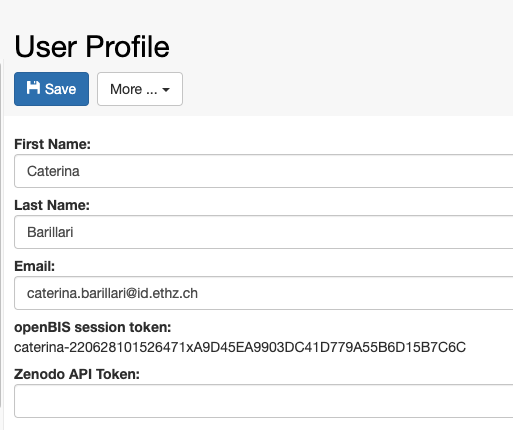
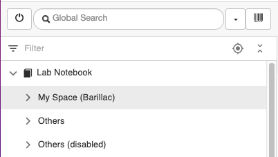

Managing Lab Stocks And Orders
====
 

class="mobile" itemprop="image" alt="Logo" />

Search for:

All Docs Admin Documentation Admin Documentation (prior to openBIS
v19.06.4) Admin Documentation (prior to openBIS v20.10.3) User
Documentation User Documentation (prior to openBIS v19.06.4) User
Documentation (prior to openBIS v20.10.3)

-   <a href="https://openbis.ch"
    target="_blank">Home
-   <a href="https://openbis.ch" class="no_link" style="cursor: default;"
    onclick="JavaScript: return false;">Resources
    -   [Overview of openBIS and RDM
        services offered by
        SIS](https://openbis.ch/index.php/overview-of-openbis-and-rdm-services-offered-by-sis/)
    -   [User
        Documentation](https://openbis.ch/index.php/docs/user-documentation/)
    -   [Admin
        Documentation](https://openbis.ch/index.php/docs/admin-documentation/)
    -   [FAQ](https://openbis.ch/index.php/faq/)
    -   [Video
        tutorials](https://openbis.ch/index.php/screencasts/#video%20tutorials)
    -   [Demo](https://openbis.ch/index.php/demo/#demo)
    -   [Downloads](https://openbis.ch/index.php/downloads/#downloads)
    -   [References](https://openbis.ch/index.php/references/)
-   [Community
    forum](https://openbis.ch/index.php/community-forum/)
-   <a href="https://openbis.ch" class="no_link" style="cursor: default;"
    onclick="JavaScript: return false;">Services
    -   [openRDM.swiss](https://openbis.ch/index.php/openrdm-swiss/)
    -   [openRDM.eu](https://openbis.ch/index.php/openrdm-eu/)
-   <a href="https://openbis.ch" class="no_link" style="cursor: default;"
    onclick="JavaScript: return false;">Events
    -   [openBIS UGM
        2023](https://openbis.ch/index.php/openbis-ugm-2023/)
-   <a href="https://openbis.ch" class="no_link" style="cursor: default;"
    onclick="JavaScript: return false;">About
    -   [Our
        team](https://openbis.ch/index.php/our-team/)
    -   [Contact](https://openbis.ch/index.php/contact/)
-   [News](https://openbis.ch/index.php/news/)
-   [Imprint](https://openbis.ch/index.php/imprint/#imprint)

-   Home

-   ### Resources

    
    -   [Overview of openBIS and RDM
        services offered by
        SIS](https://openbis.ch/index.php/overview-of-openbis-and-rdm-services-offered-by-sis/)
    -   [User
        Documentation](https://openbis.ch/index.php/docs/user-documentation/)
    -   [Admin
        Documentation](https://openbis.ch/index.php/docs/admin-documentation/)
    -   [FAQ](https://openbis.ch/index.php/faq/)
    -   [Video
        tutorials](https://openbis.ch/index.php/screencasts/#video%20tutorials)
    -   [Demo](https://openbis.ch/index.php/demo/#demo)
    -   [Downloads](https://openbis.ch/index.php/downloads/#downloads)
    -   [References](https://openbis.ch/index.php/references/)

-   [Community
    forum](https://openbis.ch/index.php/community-forum/)

-   ### Services

    
    -   [openRDM.swiss](https://openbis.ch/index.php/openrdm-swiss/)
    -   [openRDM.eu](https://openbis.ch/index.php/openrdm-eu/)

-   ### Events

    
    -   [openBIS UGM
        2023](https://openbis.ch/index.php/openbis-ugm-2023/)

-   ### About

    
    -   [Our
        team](https://openbis.ch/index.php/our-team/)
    -   [Contact](https://openbis.ch/index.php/contact/)

-   [News](https://openbis.ch/index.php/news/)

-   [Imprint](https://openbis.ch/index.php/imprint/#imprint)

 

### Admin Documentation

-   [Inventory
    overview](https://openbis.ch/index.php/docs/admin-documentation/inventory-overview/)
-   [Customise Inventory of Materials and
    Samples](https://openbis.ch/index.php/docs/admin-documentation/customise-inventory-of-materials-and-samples/)
    -   [Create Collections of
        Materials](https://openbis.ch/index.php/docs/admin-documentation/customise-inventory-of-materials-and-samples/create-collections-of-materials/)
    -   [Delete
        Collections](https://openbis.ch/index.php/docs/admin-documentation/customise-inventory-of-materials-and-samples/delete-collections/)
    -   [Enable Storage Widget on Sample
        Forms](https://openbis.ch/index.php/docs/admin-documentation/customise-inventory-of-materials-and-samples/enable-storage-widget-on-sample-forms/)
    -   [Configure Lab
        Storage](https://openbis.ch/index.php/docs/admin-documentation/customise-inventory-of-materials-and-samples/configure-lab-storage/)
    -   [Add metadata to Storage
        Positions](https://openbis.ch/index.php/docs/admin-documentation/customise-inventory-of-materials-and-samples/add-metadata-to-storage-positions/)
-   [Customise Inventory of
    Protocols](https://openbis.ch/index.php/docs/admin-documentation/customise-inventory-of-protocols/)
    -   [Create Collections of
        Protocols](https://openbis.ch/index.php/docs/admin-documentation/customise-inventory-of-protocols/create-collections-of-protocols/)
    -   [Enable Protocols in
        Settings](https://openbis.ch/index.php/docs/admin-documentation/customise-inventory-of-protocols/enable-protocols-in-settings/)
-   [Move Collections to a different
    Project](https://openbis.ch/index.php/docs/admin-documentation/move-collections-to-a-different-project/)
-   [Customise Parents and Children Sections in Object
    Forms](https://openbis.ch/index.php/docs/admin-documentation/customise-parents-and-children-sections-in-object-forms/)
-   [Customise the Main
    Menu](https://openbis.ch/index.php/docs/admin-documentation/customise-the-main-menu/)
-   [Associate File Types to Dataset
    Types](https://openbis.ch/index.php/docs/admin-documentation/associate-file-types-to-dataset-types/)
-   [User
    Registration](https://openbis.ch/index.php/docs/admin-documentation/user-registration/)
    -   <a
        href="https://openbis.ch/index.php/docs/admin-documentation/user-registration/openbis-roles/"
        aria-current="page">openBIS roles
    -   [User
        Profile](https://openbis.ch/index.php/docs/admin-documentation/user-registration/user-profile/)
    -   [Assign home space to a
        user](https://openbis.ch/index.php/docs/admin-documentation/user-registration/assign-home-space-to-a-user/)
-   [New Entity Type
    Registration](https://openbis.ch/index.php/docs/admin-documentation/new-entity-type-registration/)
    -   [Enable Rich Text Editor or Spreadsheet
        Widgets](https://openbis.ch/index.php/docs/admin-documentation/new-entity-type-registration/enable-rich-text-editor-or-spreadsheet-widgets/)
    -   [Enable Objects in
        dropdowns](https://openbis.ch/index.php/docs/admin-documentation/new-entity-type-registration/enable-objects-in-dropdowns/)
    -   [Register masterdata via
        Excel](https://openbis.ch/index.php/docs/admin-documentation/new-entity-type-registration/register-masterdata-via-excel/)
    -   [Properties
        overview](https://openbis.ch/index.php/docs/admin-documentation/new-entity-type-registration/properties-overview/)
    -   [Internal properties and
        vocabularies](https://openbis.ch/index.php/docs/admin-documentation/new-entity-type-registration/internal-properties-and-vocabularies/)
-   [Masterdata exports and
    imports](https://openbis.ch/index.php/docs/admin-documentation/masterdata-exports-and-imports/)
-   [Create Templates for
    Objects](https://openbis.ch/index.php/docs/admin-documentation/create-templates-for-objects/)
-   [Enable Transfer to Data
    Repositories](https://openbis.ch/index.php/docs/admin-documentation/enable-transfer-to-data-repositories/)
-   [Enable
    Barcodes](https://openbis.ch/index.php/docs/admin-documentation/enable-barcodes/)
-   [Enable archiving to Long Term
    Storage](https://openbis.ch/index.php/docs/admin-documentation/enable-archiving-to-long-term-storage/)
-   [History
    overview](https://openbis.ch/index.php/docs/admin-documentation/history-overview/)
    -   [History of
        deletions](https://openbis.ch/index.php/docs/admin-documentation/history-overview/history-of-deletions/)
    -   [History of
        freezing](https://openbis.ch/index.php/docs/admin-documentation/history-overview/history-of-freezing/)
-   [Space
    management](https://openbis.ch/index.php/docs/admin-documentation/space-management/)
    -   [Create new Inventory
        Spaces](https://openbis.ch/index.php/docs/admin-documentation/space-management/create-new-inventory-spaces/)
    -   [Create new ELN
        Spaces](https://openbis.ch/index.php/docs/admin-documentation/space-management/create-new-eln-spaces/)
    -   [Delete
        Spaces](https://openbis.ch/index.php/docs/admin-documentation/space-management/delete-spaces/)
    -   [Move Spaces between Lab Notebook and
        Inventory](https://openbis.ch/index.php/docs/admin-documentation/space-management/move-space-between-lab-notebook-and-inventory/)
-   [Multi-group set
    up](https://openbis.ch/index.php/docs/admin-documentation/multi-group-set-up/)
    -   [General ELN
        Settings](https://openbis.ch/index.php/docs/admin-documentation/multi-group-set-up/general-eln-settings/)
    -   [Group ELN
        Settings](https://openbis.ch/index.php/docs/admin-documentation/multi-group-set-up/group-eln-settings/)
-   [Database navigation in admin
    UI](https://openbis.ch/index.php/docs/admin-documentation/database-navigation-in-admin-ui/)

1.  
2.  Home
3.  
4.  Docs
5.  
6.  <a href="https://openbis.ch/index.php/docs/admin-documentation/"
    itemprop="item">Admin Documentation
7.  
8.  <a
    href="https://openbis.ch/index.php/docs/admin-documentation/user-registration/"
    itemprop="item">User Registration
9.  
10. openBIS roles

# openBIS roles

<a href="#"
class="wedocs-print-article wedocs-hide-print wedocs-hide-mobile"
title="Print this article">

# 

 

## Observer

This role can be assigned to the whole openBIS instance (*Instance
Observer*) or to specific *Spaces* or *Projects* (*Space* or *Project
Observer*). Users with this role have read-only access to the whole
openBIS (*Instance Observer*), or to a specified *Space* or *Project*
(*Space* or *Project Observer*).

An Observer can see and search everything in an openBIS instance or the
*Space/Project* which they have access to. They can also download
datasets. They cannot modify nor delete anything.

 

## Space/Project User

Extends Observer permissions with some creating and editing
functionality. Permissions are limited to specified *Space(s)* or
*Project(s)*.

Can do everything that Observer and additionally:

-   create
    -   objects
    -   collections
-   edit
    -   objects
    -   collections
    -   projects

 

## Space/Project Power User

Extends *Space/Projec*t User permissions with some deleting, editing and
processing functionality. Permissions are limited to specified
*Space(s)* or *Project(s)*.

Can do everything that *Space/Project* User and additionally:

-   create projects
-   delete
    -   projects
    -   data sets
    -   objects
    -   collections

Please note that this role cannot be assigned via the ELN UI, only via
admin UI.

## 

## Space/Project Admin

Extends Space/Project Power User permissions allowing to manage roles
and projects inside given *Space(s)* or *Project(s)*.

Can do everything that Space/Project Power User and additionally:

-   assign and remove Space/Project roles

 

## Instance Admin

Has the full access to given openBIS instance.

Can do everything that Space/Project Admin and additionally:

-   create
    -   space
    -   material
    -   person
    -   property type
    -   vocabulary
    -   material type
    -   object type
    -   collection type
    -   data set type
-   create/delete instance admin role
-   edit
    -   material
    -   property type
    -   property type assignment
    -   vocabulary
    -   material type
    -   object type
    -   collection type
    -   data set type
-   assign/unassign property type
-   delete
    -   space
    -   vocabulary terms
    -   material type
    -   sample type
    -   experiment type
    -   data set type

 

Please note that this role cannot be assigned via the ELN UI, only via
admin UI.

 

# 

Updated on April 26, 2023
 

class="mobile" itemprop="image" alt="Logo" />

Search for:

All Docs Admin Documentation Admin Documentation (prior to openBIS
v19.06.4) Admin Documentation (prior to openBIS v20.10.3) User
Documentation User Documentation (prior to openBIS v19.06.4) User
Documentation (prior to openBIS v20.10.3)

-   <a href="https://openbis.ch"
    target="_blank">Home
-   <a href="https://openbis.ch" class="no_link" style="cursor: default;"
    onclick="JavaScript: return false;">Resources
    -   [Overview of openBIS and RDM
        services offered by
        SIS](https://openbis.ch/index.php/overview-of-openbis-and-rdm-services-offered-by-sis/)
    -   [User
        Documentation](https://openbis.ch/index.php/docs/user-documentation/)
    -   [Admin
        Documentation](https://openbis.ch/index.php/docs/admin-documentation/)
    -   [FAQ](https://openbis.ch/index.php/faq/)
    -   [Video
        tutorials](https://openbis.ch/index.php/screencasts/#video%20tutorials)
    -   [Demo](https://openbis.ch/index.php/demo/#demo)
    -   [Downloads](https://openbis.ch/index.php/downloads/#downloads)
    -   [References](https://openbis.ch/index.php/references/)
-   [Community
    forum](https://openbis.ch/index.php/community-forum/)
-   <a href="https://openbis.ch" class="no_link" style="cursor: default;"
    onclick="JavaScript: return false;">Services
    -   [openRDM.swiss](https://openbis.ch/index.php/openrdm-swiss/)
    -   [openRDM.eu](https://openbis.ch/index.php/openrdm-eu/)
-   <a href="https://openbis.ch" class="no_link" style="cursor: default;"
    onclick="JavaScript: return false;">Events
    -   [openBIS UGM
        2023](https://openbis.ch/index.php/openbis-ugm-2023/)
-   <a href="https://openbis.ch" class="no_link" style="cursor: default;"
    onclick="JavaScript: return false;">About
    -   [Our
        team](https://openbis.ch/index.php/our-team/)
    -   [Contact](https://openbis.ch/index.php/contact/)
-   [News](https://openbis.ch/index.php/news/)
-   [Imprint](https://openbis.ch/index.php/imprint/#imprint)

-   Home

-   ### Resources

    
    -   [Overview of openBIS and RDM
        services offered by
        SIS](https://openbis.ch/index.php/overview-of-openbis-and-rdm-services-offered-by-sis/)
    -   [User
        Documentation](https://openbis.ch/index.php/docs/user-documentation/)
    -   [Admin
        Documentation](https://openbis.ch/index.php/docs/admin-documentation/)
    -   [FAQ](https://openbis.ch/index.php/faq/)
    -   [Video
        tutorials](https://openbis.ch/index.php/screencasts/#video%20tutorials)
    -   [Demo](https://openbis.ch/index.php/demo/#demo)
    -   [Downloads](https://openbis.ch/index.php/downloads/#downloads)
    -   [References](https://openbis.ch/index.php/references/)

-   [Community
    forum](https://openbis.ch/index.php/community-forum/)

-   ### Services

    
    -   [openRDM.swiss](https://openbis.ch/index.php/openrdm-swiss/)
    -   [openRDM.eu](https://openbis.ch/index.php/openrdm-eu/)

-   ### Events

    
    -   [openBIS UGM
        2023](https://openbis.ch/index.php/openbis-ugm-2023/)

-   ### About

    
    -   [Our
        team](https://openbis.ch/index.php/our-team/)
    -   [Contact](https://openbis.ch/index.php/contact/)

-   [News](https://openbis.ch/index.php/news/)

-   [Imprint](https://openbis.ch/index.php/imprint/#imprint)

 

### Admin Documentation

-   [Inventory
    overview](https://openbis.ch/index.php/docs/admin-documentation/inventory-overview/)
-   [Customise Inventory of Materials and
    Samples](https://openbis.ch/index.php/docs/admin-documentation/customise-inventory-of-materials-and-samples/)
    -   [Create Collections of
        Materials](https://openbis.ch/index.php/docs/admin-documentation/customise-inventory-of-materials-and-samples/create-collections-of-materials/)
    -   [Delete
        Collections](https://openbis.ch/index.php/docs/admin-documentation/customise-inventory-of-materials-and-samples/delete-collections/)
    -   [Enable Storage Widget on Sample
        Forms](https://openbis.ch/index.php/docs/admin-documentation/customise-inventory-of-materials-and-samples/enable-storage-widget-on-sample-forms/)
    -   [Configure Lab
        Storage](https://openbis.ch/index.php/docs/admin-documentation/customise-inventory-of-materials-and-samples/configure-lab-storage/)
    -   [Add metadata to Storage
        Positions](https://openbis.ch/index.php/docs/admin-documentation/customise-inventory-of-materials-and-samples/add-metadata-to-storage-positions/)
-   [Customise Inventory of
    Protocols](https://openbis.ch/index.php/docs/admin-documentation/customise-inventory-of-protocols/)
    -   [Create Collections of
        Protocols](https://openbis.ch/index.php/docs/admin-documentation/customise-inventory-of-protocols/create-collections-of-protocols/)
    -   [Enable Protocols in
        Settings](https://openbis.ch/index.php/docs/admin-documentation/customise-inventory-of-protocols/enable-protocols-in-settings/)
-   [Move Collections to a different
    Project](https://openbis.ch/index.php/docs/admin-documentation/move-collections-to-a-different-project/)
-   [Customise Parents and Children Sections in Object
    Forms](https://openbis.ch/index.php/docs/admin-documentation/customise-parents-and-children-sections-in-object-forms/)
-   [Customise the Main
    Menu](https://openbis.ch/index.php/docs/admin-documentation/customise-the-main-menu/)
-   [Associate File Types to Dataset
    Types](https://openbis.ch/index.php/docs/admin-documentation/associate-file-types-to-dataset-types/)
-   [User
    Registration](https://openbis.ch/index.php/docs/admin-documentation/user-registration/)
    -   [openBIS
        roles](https://openbis.ch/index.php/docs/admin-documentation/user-registration/openbis-roles/)
    -   <a
        href="https://openbis.ch/index.php/docs/admin-documentation/user-registration/user-profile/"
        aria-current="page">User Profile
    -   [Assign home space to a
        user](https://openbis.ch/index.php/docs/admin-documentation/user-registration/assign-home-space-to-a-user/)
-   [New Entity Type
    Registration](https://openbis.ch/index.php/docs/admin-documentation/new-entity-type-registration/)
    -   [Enable Rich Text Editor or Spreadsheet
        Widgets](https://openbis.ch/index.php/docs/admin-documentation/new-entity-type-registration/enable-rich-text-editor-or-spreadsheet-widgets/)
    -   [Enable Objects in
        dropdowns](https://openbis.ch/index.php/docs/admin-documentation/new-entity-type-registration/enable-objects-in-dropdowns/)
    -   [Register masterdata via
        Excel](https://openbis.ch/index.php/docs/admin-documentation/new-entity-type-registration/register-masterdata-via-excel/)
    -   [Properties
        overview](https://openbis.ch/index.php/docs/admin-documentation/new-entity-type-registration/properties-overview/)
    -   [Internal properties and
        vocabularies](https://openbis.ch/index.php/docs/admin-documentation/new-entity-type-registration/internal-properties-and-vocabularies/)
-   [Masterdata exports and
    imports](https://openbis.ch/index.php/docs/admin-documentation/masterdata-exports-and-imports/)
-   [Create Templates for
    Objects](https://openbis.ch/index.php/docs/admin-documentation/create-templates-for-objects/)
-   [Enable Transfer to Data
    Repositories](https://openbis.ch/index.php/docs/admin-documentation/enable-transfer-to-data-repositories/)
-   [Enable
    Barcodes](https://openbis.ch/index.php/docs/admin-documentation/enable-barcodes/)
-   [Enable archiving to Long Term
    Storage](https://openbis.ch/index.php/docs/admin-documentation/enable-archiving-to-long-term-storage/)
-   [History
    overview](https://openbis.ch/index.php/docs/admin-documentation/history-overview/)
    -   [History of
        deletions](https://openbis.ch/index.php/docs/admin-documentation/history-overview/history-of-deletions/)
    -   [History of
        freezing](https://openbis.ch/index.php/docs/admin-documentation/history-overview/history-of-freezing/)
-   [Space
    management](https://openbis.ch/index.php/docs/admin-documentation/space-management/)
    -   [Create new Inventory
        Spaces](https://openbis.ch/index.php/docs/admin-documentation/space-management/create-new-inventory-spaces/)
    -   [Create new ELN
        Spaces](https://openbis.ch/index.php/docs/admin-documentation/space-management/create-new-eln-spaces/)
    -   [Delete
        Spaces](https://openbis.ch/index.php/docs/admin-documentation/space-management/delete-spaces/)
    -   [Move Spaces between Lab Notebook and
        Inventory](https://openbis.ch/index.php/docs/admin-documentation/space-management/move-space-between-lab-notebook-and-inventory/)
-   [Multi-group set
    up](https://openbis.ch/index.php/docs/admin-documentation/multi-group-set-up/)
    -   [General ELN
        Settings](https://openbis.ch/index.php/docs/admin-documentation/multi-group-set-up/general-eln-settings/)
    -   [Group ELN
        Settings](https://openbis.ch/index.php/docs/admin-documentation/multi-group-set-up/group-eln-settings/)
-   [Database navigation in admin
    UI](https://openbis.ch/index.php/docs/admin-documentation/database-navigation-in-admin-ui/)

1.  
2.  Home
3.  
4.  Docs
5.  
6.  <a href="https://openbis.ch/index.php/docs/admin-documentation/"
    itemprop="item">Admin Documentation
7.  
8.  <a
    href="https://openbis.ch/index.php/docs/admin-documentation/user-registration/"
    itemprop="item">User Registration
9.  
10. User Profile

# User Profile

<a href="#"
class="wedocs-print-article wedocs-hide-print wedocs-hide-mobile"
title="Print this article">

In the User Profile, a user who is logged in into openBIS can find the
following information:

 

1.  **First Name**
2.  **Last Name**
3.  **Email**
4.  **openBIS session token**
5.  **Zenodo API Token** ([Export to
    Zenodo](https://openbis.ch/index.php/docs/user-documentation-20-10-3/data-export/export-to-zenodo/))

 

First name, last name and email are automatically filled in when LDAP or
SSO are used for authentication.

In case of file-based authentication, this information can be entered
here directly from the user.

 

class="alignnone size-full wp-image-3390"

sizes="(max-width: 513px) 100vw, 513px" width="513" height="430" />

 

For file-based authentication, users can also change their password
here, from the **Change Password** option under the **More..** dropdown.

 

class="alignnone size-full wp-image-3393" width="300" height="133" />

Updated on June 28, 2022
 

class="mobile" itemprop="image" alt="Logo" />

Search for:

All Docs Admin Documentation Admin Documentation (prior to openBIS
v19.06.4) Admin Documentation (prior to openBIS v20.10.3) User
Documentation User Documentation (prior to openBIS v19.06.4) User
Documentation (prior to openBIS v20.10.3)

-   <a href="https://openbis.ch"
    target="_blank">Home
-   <a href="https://openbis.ch" class="no_link" style="cursor: default;"
    onclick="JavaScript: return false;">Resources
    -   [Overview of openBIS and RDM
        services offered by
        SIS](https://openbis.ch/index.php/overview-of-openbis-and-rdm-services-offered-by-sis/)
    -   [User
        Documentation](https://openbis.ch/index.php/docs/user-documentation/)
    -   [Admin
        Documentation](https://openbis.ch/index.php/docs/admin-documentation/)
    -   [FAQ](https://openbis.ch/index.php/faq/)
    -   [Video
        tutorials](https://openbis.ch/index.php/screencasts/#video%20tutorials)
    -   [Demo](https://openbis.ch/index.php/demo/#demo)
    -   [Downloads](https://openbis.ch/index.php/downloads/#downloads)
    -   [References](https://openbis.ch/index.php/references/)
-   [Community
    forum](https://openbis.ch/index.php/community-forum/)
-   <a href="https://openbis.ch" class="no_link" style="cursor: default;"
    onclick="JavaScript: return false;">Services
    -   [openRDM.swiss](https://openbis.ch/index.php/openrdm-swiss/)
    -   [openRDM.eu](https://openbis.ch/index.php/openrdm-eu/)
-   <a href="https://openbis.ch" class="no_link" style="cursor: default;"
    onclick="JavaScript: return false;">Events
    -   [openBIS UGM
        2023](https://openbis.ch/index.php/openbis-ugm-2023/)
-   <a href="https://openbis.ch" class="no_link" style="cursor: default;"
    onclick="JavaScript: return false;">About
    -   [Our
        team](https://openbis.ch/index.php/our-team/)
    -   [Contact](https://openbis.ch/index.php/contact/)
-   [News](https://openbis.ch/index.php/news/)
-   [Imprint](https://openbis.ch/index.php/imprint/#imprint)

-   Home

-   ### Resources

    
    -   [Overview of openBIS and RDM
        services offered by
        SIS](https://openbis.ch/index.php/overview-of-openbis-and-rdm-services-offered-by-sis/)
    -   [User
        Documentation](https://openbis.ch/index.php/docs/user-documentation/)
    -   [Admin
        Documentation](https://openbis.ch/index.php/docs/admin-documentation/)
    -   [FAQ](https://openbis.ch/index.php/faq/)
    -   [Video
        tutorials](https://openbis.ch/index.php/screencasts/#video%20tutorials)
    -   [Demo](https://openbis.ch/index.php/demo/#demo)
    -   [Downloads](https://openbis.ch/index.php/downloads/#downloads)
    -   [References](https://openbis.ch/index.php/references/)

-   [Community
    forum](https://openbis.ch/index.php/community-forum/)

-   ### Services

    
    -   [openRDM.swiss](https://openbis.ch/index.php/openrdm-swiss/)
    -   [openRDM.eu](https://openbis.ch/index.php/openrdm-eu/)

-   ### Events

    
    -   [openBIS UGM
        2023](https://openbis.ch/index.php/openbis-ugm-2023/)

-   ### About

    
    -   [Our
        team](https://openbis.ch/index.php/our-team/)
    -   [Contact](https://openbis.ch/index.php/contact/)

-   [News](https://openbis.ch/index.php/news/)

-   [Imprint](https://openbis.ch/index.php/imprint/#imprint)

 

### Admin Documentation

-   [Inventory
    overview](https://openbis.ch/index.php/docs/admin-documentation/inventory-overview/)
-   [Customise Inventory of Materials and
    Samples](https://openbis.ch/index.php/docs/admin-documentation/customise-inventory-of-materials-and-samples/)
    -   [Create Collections of
        Materials](https://openbis.ch/index.php/docs/admin-documentation/customise-inventory-of-materials-and-samples/create-collections-of-materials/)
    -   [Delete
        Collections](https://openbis.ch/index.php/docs/admin-documentation/customise-inventory-of-materials-and-samples/delete-collections/)
    -   [Enable Storage Widget on Sample
        Forms](https://openbis.ch/index.php/docs/admin-documentation/customise-inventory-of-materials-and-samples/enable-storage-widget-on-sample-forms/)
    -   [Configure Lab
        Storage](https://openbis.ch/index.php/docs/admin-documentation/customise-inventory-of-materials-and-samples/configure-lab-storage/)
    -   [Add metadata to Storage
        Positions](https://openbis.ch/index.php/docs/admin-documentation/customise-inventory-of-materials-and-samples/add-metadata-to-storage-positions/)
-   [Customise Inventory of
    Protocols](https://openbis.ch/index.php/docs/admin-documentation/customise-inventory-of-protocols/)
    -   [Create Collections of
        Protocols](https://openbis.ch/index.php/docs/admin-documentation/customise-inventory-of-protocols/create-collections-of-protocols/)
    -   [Enable Protocols in
        Settings](https://openbis.ch/index.php/docs/admin-documentation/customise-inventory-of-protocols/enable-protocols-in-settings/)
-   [Move Collections to a different
    Project](https://openbis.ch/index.php/docs/admin-documentation/move-collections-to-a-different-project/)
-   [Customise Parents and Children Sections in Object
    Forms](https://openbis.ch/index.php/docs/admin-documentation/customise-parents-and-children-sections-in-object-forms/)
-   [Customise the Main
    Menu](https://openbis.ch/index.php/docs/admin-documentation/customise-the-main-menu/)
-   [Associate File Types to Dataset
    Types](https://openbis.ch/index.php/docs/admin-documentation/associate-file-types-to-dataset-types/)
-   [User
    Registration](https://openbis.ch/index.php/docs/admin-documentation/user-registration/)
    -   [openBIS
        roles](https://openbis.ch/index.php/docs/admin-documentation/user-registration/openbis-roles/)
    -   [User
        Profile](https://openbis.ch/index.php/docs/admin-documentation/user-registration/user-profile/)
    -   <a
        href="https://openbis.ch/index.php/docs/admin-documentation/user-registration/assign-home-space-to-a-user/"
        aria-current="page">Assign home space to a user
-   [New Entity Type
    Registration](https://openbis.ch/index.php/docs/admin-documentation/new-entity-type-registration/)
    -   [Enable Rich Text Editor or Spreadsheet
        Widgets](https://openbis.ch/index.php/docs/admin-documentation/new-entity-type-registration/enable-rich-text-editor-or-spreadsheet-widgets/)
    -   [Enable Objects in
        dropdowns](https://openbis.ch/index.php/docs/admin-documentation/new-entity-type-registration/enable-objects-in-dropdowns/)
    -   [Register masterdata via
        Excel](https://openbis.ch/index.php/docs/admin-documentation/new-entity-type-registration/register-masterdata-via-excel/)
    -   [Properties
        overview](https://openbis.ch/index.php/docs/admin-documentation/new-entity-type-registration/properties-overview/)
    -   [Internal properties and
        vocabularies](https://openbis.ch/index.php/docs/admin-documentation/new-entity-type-registration/internal-properties-and-vocabularies/)
-   [Masterdata exports and
    imports](https://openbis.ch/index.php/docs/admin-documentation/masterdata-exports-and-imports/)
-   [Create Templates for
    Objects](https://openbis.ch/index.php/docs/admin-documentation/create-templates-for-objects/)
-   [Enable Transfer to Data
    Repositories](https://openbis.ch/index.php/docs/admin-documentation/enable-transfer-to-data-repositories/)
-   [Enable
    Barcodes](https://openbis.ch/index.php/docs/admin-documentation/enable-barcodes/)
-   [Enable archiving to Long Term
    Storage](https://openbis.ch/index.php/docs/admin-documentation/enable-archiving-to-long-term-storage/)
-   [History
    overview](https://openbis.ch/index.php/docs/admin-documentation/history-overview/)
    -   [History of
        deletions](https://openbis.ch/index.php/docs/admin-documentation/history-overview/history-of-deletions/)
    -   [History of
        freezing](https://openbis.ch/index.php/docs/admin-documentation/history-overview/history-of-freezing/)
-   [Space
    management](https://openbis.ch/index.php/docs/admin-documentation/space-management/)
    -   [Create new Inventory
        Spaces](https://openbis.ch/index.php/docs/admin-documentation/space-management/create-new-inventory-spaces/)
    -   [Create new ELN
        Spaces](https://openbis.ch/index.php/docs/admin-documentation/space-management/create-new-eln-spaces/)
    -   [Delete
        Spaces](https://openbis.ch/index.php/docs/admin-documentation/space-management/delete-spaces/)
    -   [Move Spaces between Lab Notebook and
        Inventory](https://openbis.ch/index.php/docs/admin-documentation/space-management/move-space-between-lab-notebook-and-inventory/)
-   [Multi-group set
    up](https://openbis.ch/index.php/docs/admin-documentation/multi-group-set-up/)
    -   [General ELN
        Settings](https://openbis.ch/index.php/docs/admin-documentation/multi-group-set-up/general-eln-settings/)
    -   [Group ELN
        Settings](https://openbis.ch/index.php/docs/admin-documentation/multi-group-set-up/group-eln-settings/)
-   [Database navigation in admin
    UI](https://openbis.ch/index.php/docs/admin-documentation/database-navigation-in-admin-ui/)

1.  
2.  Home
3.  
4.  Docs
5.  
6.  <a href="https://openbis.ch/index.php/docs/admin-documentation/"
    itemprop="item">Admin Documentation
7.  
8.  <a
    href="https://openbis.ch/index.php/docs/admin-documentation/user-registration/"
    itemprop="item">User Registration
9.  
10. Assign home space to a user

# Assign home space to a user

<a href="#"
class="wedocs-print-article wedocs-hide-print wedocs-hide-mobile"
title="Print this article">

 

When a home space is assigned to a user, this becomes marked as **My
Space** for that user in the lab notebook, as shown below.

 

class="alignnone size-full wp-image-4103"

sizes="(max-width: 402px) 100vw, 402px" width="402" height="227" />

 

When users are registered via the ELN UI, a *Space* with their username
is created (see <a
href="https://openbis.ch/index.php/docs/admin-documentation/user-registration/"
target="_blank" rel="noopener noreferrer">User Registration) and
this is automatically set as home space for the user.

The same happens in multi-group instances where spaces are created for
each user in the lab notebook section.

An *instance admin* can change the home space of a user or assign one to
a user that does not have a home space assigned from the admin UI, as
shown below.

 

class="alignnone size-large wp-image-4105"

sizes="(max-width: 1024px) 100vw, 1024px" width="1024" height="359" />

 

Please note that when a user is inactivated, the home space assigned to
that user is moved in the ELN UI to the folder **Others (disabled).** If
this is not desired, the space should be removed as home space from the
inactivated user. This can be done by an *instance admin*.

 

 

 

Updated on April 26, 2023
