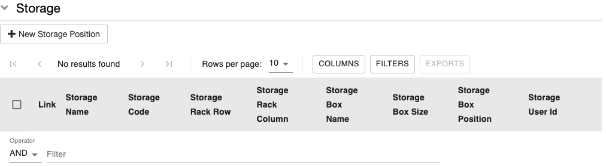
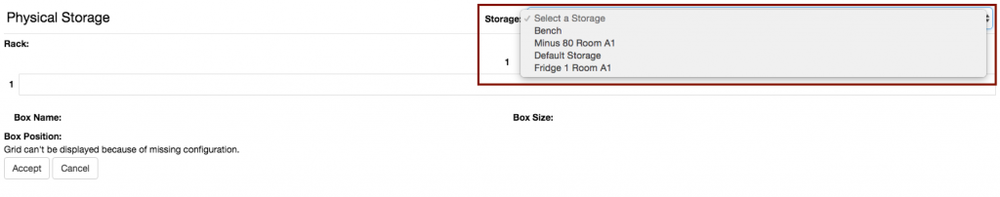
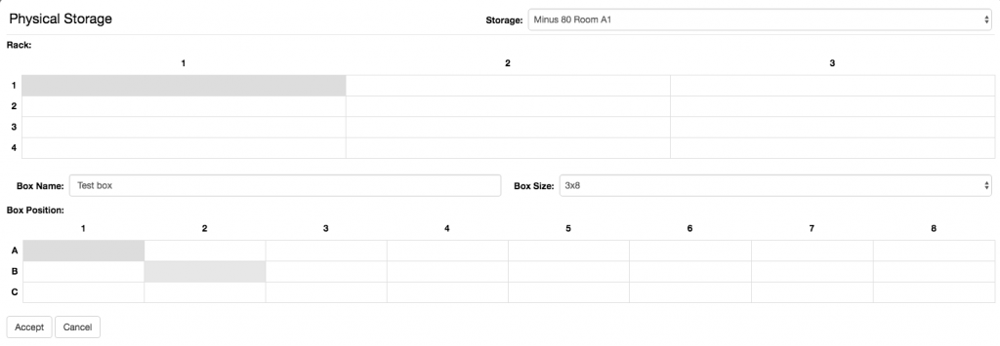
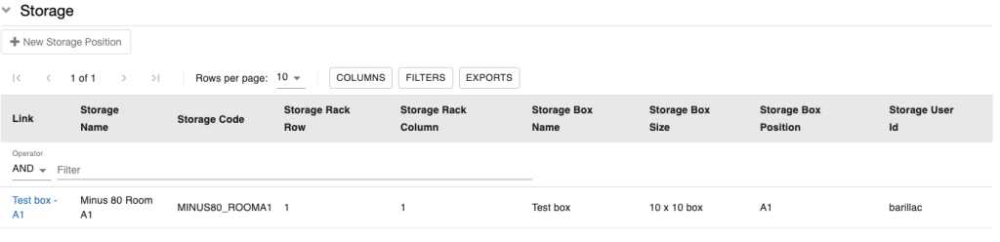
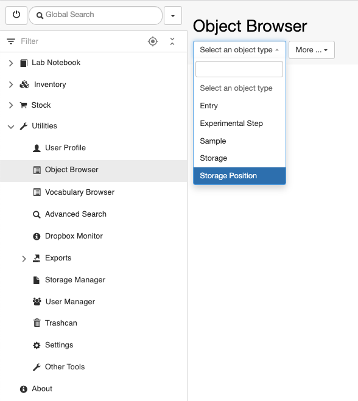
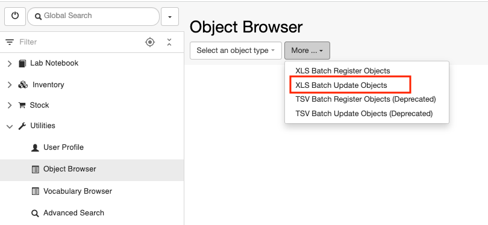
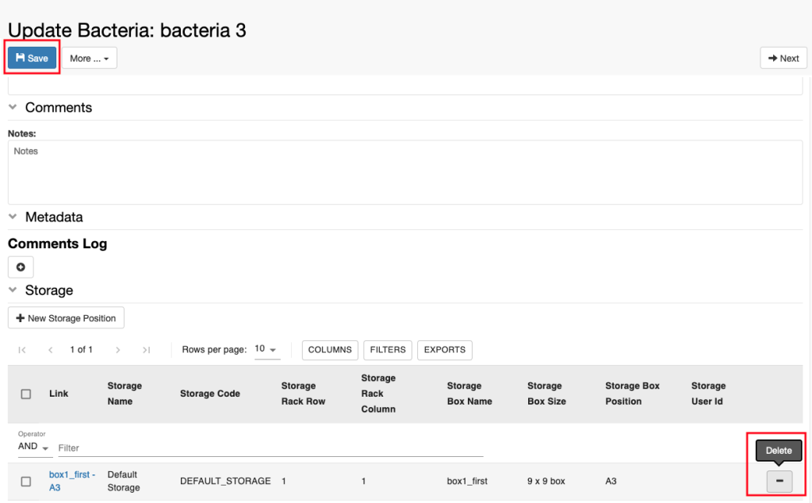
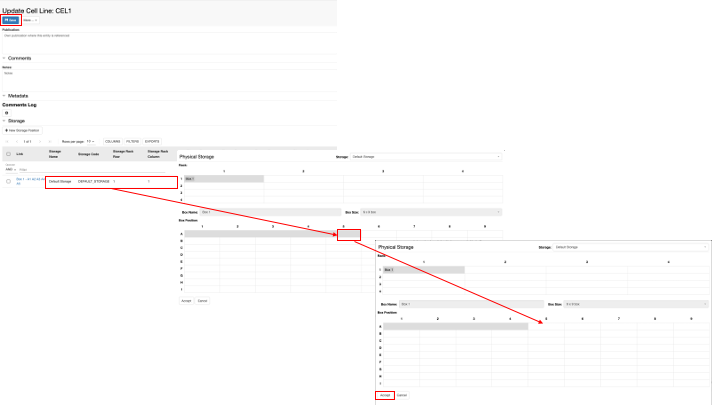
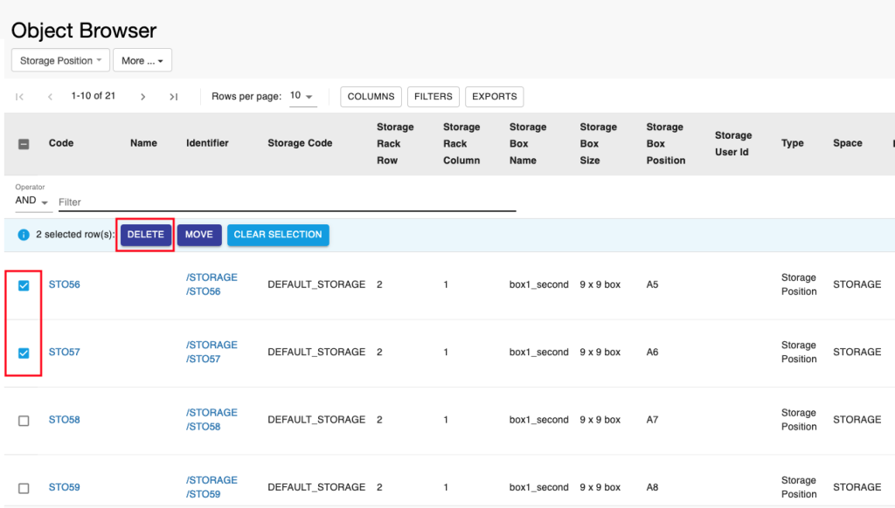

Managing Storage Of Samples
====
 
# Allocate storage positions to samples

  
If we want to track the storage position of samples, openBIS provides a
graphical overview of lab storages. 

Lab storages need to be configured by a *lab manager* or *group admin*,
as explained here: [Configure Lab
Storage](https://openbis.ch/index.php/docs/admin-documentation/customise-inventory-of-materials-and-samples/configure-lab-storage/)

  
This can be done in two ways:

1.  add storage information on the sample form during (or after) sample
    registration
2.  batch register storage positions for several samples  
      

##  Register storage position for a single sample

 

1\. Navigate to the **Storage** section, at the bottom of the sample
form. Click the **+ New Storage Positions** above the table, as shown
below:

  
2. In the widget that opens, select the appropriate **Storage** from the
dropdown menu. Storage must be configured by a lab manager or group
admin as explained in [Configure Lab
Storages](https://openbis.ch/index.php/docs/admin-documentation/customise-inventory-of-materials-and-samples/configure-lab-storage/)

3\. Select the **position** in the storage (shelf and rack).

4\. If the sample is in a box, provide a **Box Name.**

5\. Select the **Box Size** form the list of configured sizes (the list
can be configured by an *Instance Admin)*.

6\. Select the **Position** in the box.

7\. Click **Accept.**

###  

### Add additional metadata to storage positions

  
By default, the storage only keeps track of locations. If the **Storage
Position** has been configured by an *Instance admin* to have additional
metadata (e.g. freezing date), these can be added by clicking on the
link in the storage table, as shown below. The link becomes available
after saving the sample.

 

 

The additional information can be entered in the **Storage Position**
*Object* form.

##  Batch register storage positions

### XLS Batch Registration

With the new XLS batch registration, samples and their storage positions
can be registered in one transaction using the XLS template file, as
explained in [Batch register entries in a
Collection](https://openbis.ch/index.php/docs/user-documentation/inventory-of-materials-and-methods/batch-register-entries-in-a-collection/).

 

### Batch Registration with TSV file

  
Storage positions are modelled in openBIS as children of other entries.
To register the positions for several samples with the Batch
Registration using the .tsv template, first the parent samples need to
be registered in openBIS. In a second step, the positions are assigned.

To assign storage positions in batch mode follow the steps below:

> 1.  Select **Storage positions **from the **Batch Registration** drop
>     down menu.
> 2.  Download the **template file**.
> 3.  Remove the **identifier** column from the file (identifiers need
>     to be automatically generated by openBIS).
> 4.  Fill in the **parents** column. These are the identifiers of the
>     samples for which we want to register the storage
>     positions(/MATERIALS/PROJECT/OBJECT\_CODE).  
> 5.  Fill the remaining information about the storage positions.
> 6.  Save the file and upload with the **Batch Registration**.

An example file can be found
here: [SAMPLE-STORAGE\_POSITION-template.txt](https://wiki-bsse.ethz.ch/download/attachments/147412090/SAMPLE-STORAGE_POSITION-template.txt?version=1&modificationDate=1502441624183&api=v2)

Updated on April 26, 2023
 
# Batch update storage positions

 

To update several storage positions, we can use the batch update option
from the Object Browser:

 

1.  Go to the **Object Browser** under **Utilities** in the main menu
2.  Select the object type **Storage Position** from the dropdown menu
    (see picture)

3.  Use the table **Filter** to select the storage positions you want to
    update
    (see [Tables](https://openbis.ch/index.php/docs/user-documentation/additional-functionalities/tables/))
4.  Export the table (see
    [Tables](https://openbis.ch/index.php/docs/user-documentation/additional-functionalities/tables/))
5.  Edit the file to make the changes needed (e.g. change the name of a
    box, change the storage, change a box position, change box size etc)
6.  Select **XLS Batch Update Objects** from the **More..** dropdown.

7\. Import the file you modified before and update the storage
positions.

 

Updated on April 25, 2023
 
# Delete storage positions

# 

 

# Delete single storage positions

 

To delete a single storage position from a sample:

 

1.  Edit the sample for which you want to deleted the storage position
2.  Navigate to the **Storage** section at the end of the page
3.  Use the “**–**” button in the **Storage Position** table, as shown
    in the picture
4.  Save the sample

 

Please note that the storage position deleted in this way is moved to
the trashcan. To delete the position permanently, this has to be deleted
from the trashcan (see
[Trashcan](https://openbis.ch/index.php/docs/user-documentation-20-10-3/additional-functionalities/trashcan/)).

 

 

# Remove one of multiple positions in the same box

 

If one sample has been assigned to multiple positions in the same box
and you need to remove only one or some of them, you can follow these
steps:

 

1.  **Edit** the sample for which you need to remove the storage
    position in the box
2.  Navigate to the **Storage** section at the end of the page
3.  Click on the table row** **(see picture below)
4.  **Unselect** the position you want to remove (eg. A5 in the example
    below)
5.  Click **Accept**
6.  **Save** the sample

 

 

# Delete multiple storage positions

 

To delete multiple storage positions from multiple samples we can use
the **Object Browser**.

 

1.  Go to the **Object Browser** under **Utilities** in the main menu
2.  Select **Storage Position** from the **Object Type** dropdown

 

 

3\. **Filter** the table to find the storage positions you want to
delete
(see [Tables](https://openbis.ch/index.php/docs/user-documentation-20-10-3/additional-functionalities/tables/))

4\. Select the positions you want to delete from the table and click the
**Delete** button (see picture below)

5\. You will be asked to provide a reason for deletion

6\. The deleted storage positions will be moved to the trashcan and
should be removed from there to be permanently deleted (see
[Trashcan) ](https://openbis.ch/index.php/docs/user-documentation-20-10-3/additional-functionalities/trashcan/)

 

 

Updated on May 2, 2023
