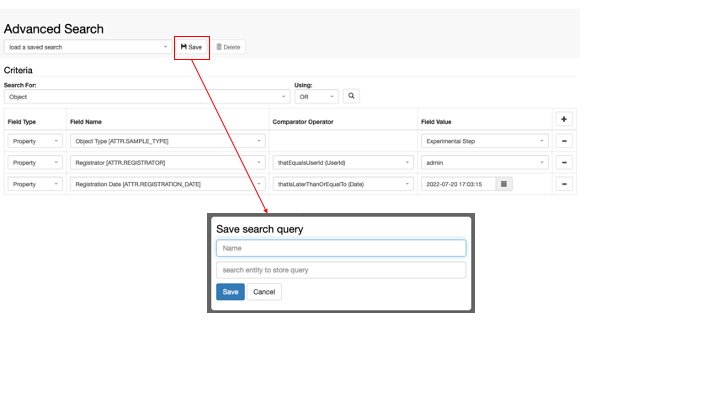
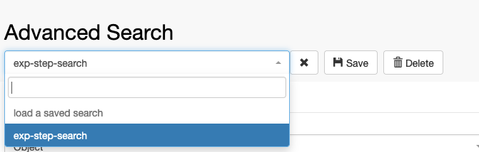

Search
====
 

<a href="#"
class="wedocs-print-article wedocs-hide-print wedocs-hide-mobile"
title="Print this article">

 

It is possible to save and re-use searches
created in the <a
href="https://openbis.ch/index.php/docs/user-documentation-20-10-3/search/advanced-search/"
target="_blank" rel="noopener noreferrer">Advanced search. *Space*
*admin* rights are required to save searches in a given Space. Searches
can be used by anyone with *User* or *Observer* rights to a given
Space.

 

In the Advanced Search page, build your
search criteria (see example below). To save the search, click the
**Save** button and enter:

 

1.  The **Name** of the search
2.  The **Experiment/Collection** where
    the search should be stored

 

Searches are stored in
*Experiments/Collections*. 

class="alignnone size-full wp-image-3465"

sizes="(max-width: 720px) 100vw, 720px" width="720" height="405" />  

Saved searches are available from the **load a saved search** drop down
menu, at the top of the **Advanced Search** page.  

class="alignnone size-full wp-image-3466"

sizes="(max-width: 671px) 100vw, 671px" width="671" height="214" />  

Updated on July 28, 2022
