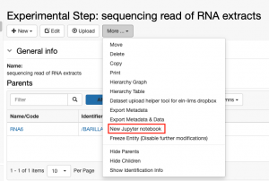
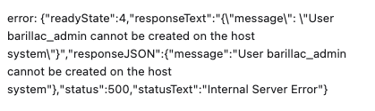
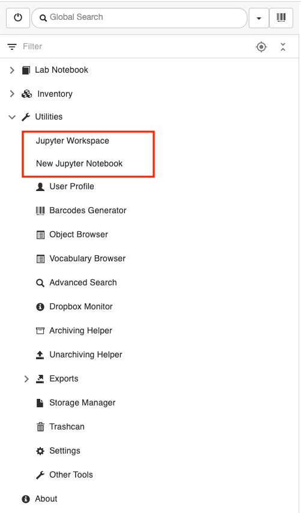
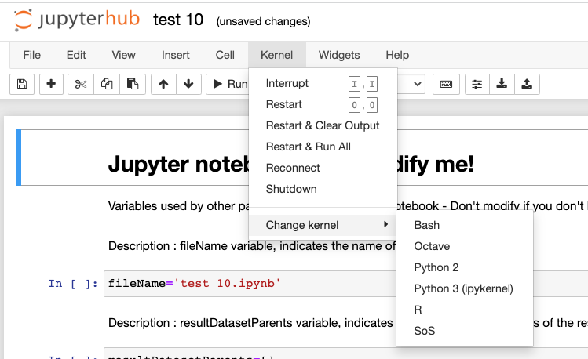
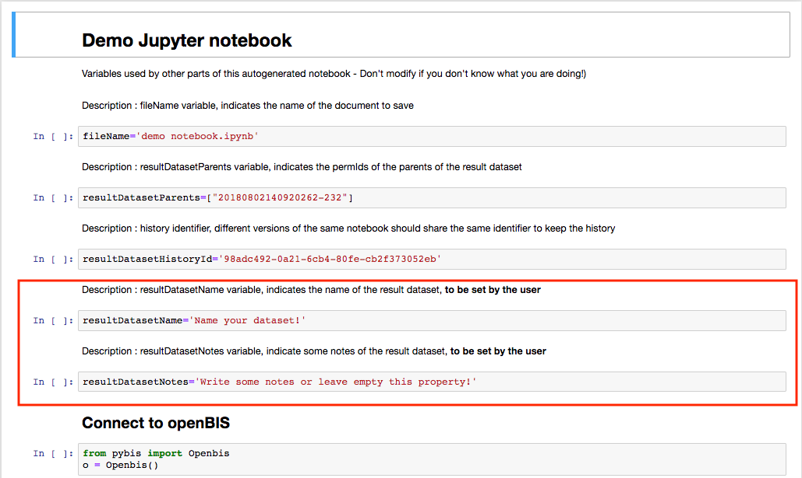
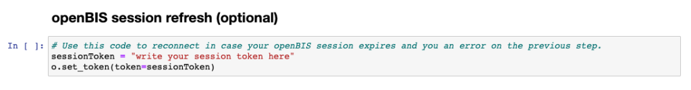
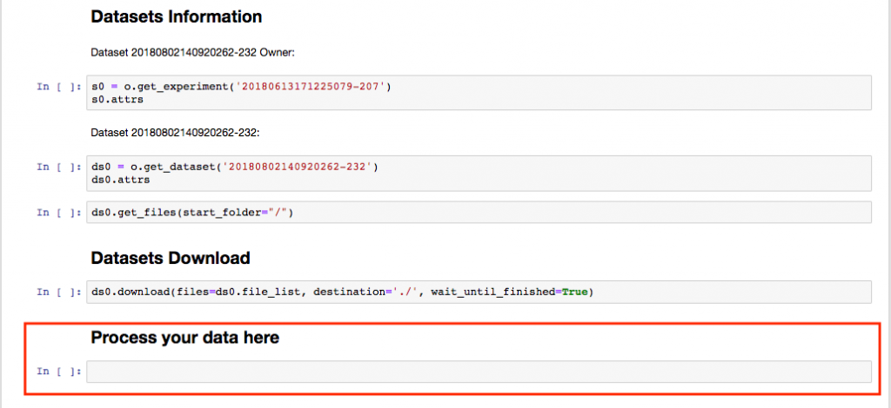
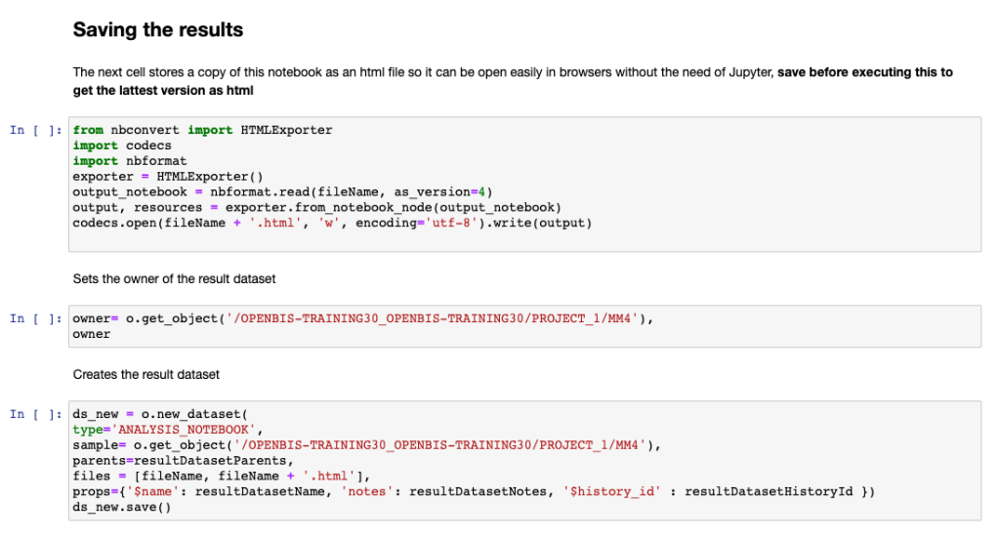
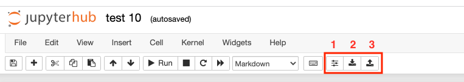

Tools For Analysis Of Data Stored In Openbis
====
 
# Jupyter Notebooks

<a href="#"
class="wedocs-print-article wedocs-hide-print wedocs-hide-mobile"
title="Print this article">

  
Jupyter notebooks are web applications
that combine text, code and output
(<a href="https://jupyter.org/" target="_blank"
rel="noopener noreferrer">https://jupyter.org/). Jupyter supports
over 40 programming languages.

Jupyter notebooks can be used to analyze
data stored in openBIS.  
  

It is possible to connect to a JupyterHub
server and launch Jupyter notebooks directly from the openBIS interface.
This feature is not available by default, but needs to be enabled and
configured by a *system admin*. JupyterHub docker containers are
available from our download page:
<a href="https://wiki-bsse.ethz.ch/display/bis/openBIS+Download+Page"
target="_blank" rel="noopener noreferrer">openBIS download.
Further documentation can be found here: <a
href="https://unlimited.ethz.ch/display/openBISDoc2010/JupyterHub+for+openBIS"
target="_blank" rel="noopener noreferrer">JupyterHub for openBIS  
  

##  

## How to use Jupyter notebooks from openBIS

 

Jupyter notebooks can be opened at every
level of the openBIS hierarchy (*Space, Project, Experiment/Collection,
Object, Dataset*) from the **More…** dropdown menu, as shown
below.

 

class="alignnone wp-image-2222 size-medium"

sizes="(max-width: 300px) 100vw, 300px" width="300" height="202" />

 

If you get a similar error as the one shown below when you try to launch
a notebook from an entity, you need to start the JupyterHub server by
going to the main menu **Utilities** -&gt; **Jupyter Workspace**. This
error appears when the JupyterHub server is restarted (e.g. after an
upgrade), because the user profile needs to be recreated.

 

class="alignnone size-full wp-image-3707"

sizes="(max-width: 419px) 100vw, 419px" width="419" height="125" />

If you go to the Jupyter workspace, the user profile is re-created on
the server. After this, you can open a notebook from any entity of the
openBIS hierarchy as explained above
(*Space, Project, Experiment/Collection,
Object, Dataset*).

 

 Jupyter notebooks can also be launched
from the main menu, under **Utilities**, as shown below.

class="alignnone size-full wp-image-4026"

sizes="(max-width: 501px) 100vw, 501px" width="501" height="854" />

 

**Note**: if you use SSO for authentication (eg. Switch aai), the first
time you want to work with a Jupyter notebook, you first need to open
the **Jupyter Workspace** and then launch a notebook from wherever you
want to open it.

 

When you launch a notebook from the **New
Jupyter Notebook** in the main menu under **Utilities**, it is necessary
to enter:  
  

1.  The **dataset(s)** needed for the
    analysis. 
2.  The **owner** of the Jupyter notebook.
    Jupyter notebooks are saved back to openBIS as datasets, and these
    belong either to an *Experiment/Collection* or to an *Object*. The
    owner is the *Experiment/Collection* or *Object* where the notebook
    should be stored.
3.  The **directory name**. This is the
    name of the folder that will be created on the JupyterHub
    server.
4.  **Notebook name**. This is the name of
    the Jupyter notebook.

class="wp-image-660"

sizes="(max-width: 1024px) 100vw, 1024px" />

Jupyter notebooks can also be opened from a *Project*, *Experiment*,
*Experimental Step* choosing the corresponding option in the **More**
drop down menu. When opening notebooks from an *Experiment* or
*Experimental Step*, all connected datasets are automatically selected.
If some are not needed, they can be deselected. 

##  

## Overview of Jupyter notebook opened from openBIS.

The Jupyter notebooks running on the JupyterHub server for openBIS
support the following kernels: *Bash, Octave, Python 2, Python 3, R,
SoS* (<a href="https://vatlab.github.io/sos-docs/" target="_blank"
rel="noopener noreferrer">Script of Scripts).

When you open a Jupyter notebook from openBIS, the default kernel used
is Python 3, but you can change to another language as shown below.

 

class="alignnone size-full wp-image-3717"

sizes="(max-width: 749px) 100vw, 749px" width="749" height="458" />

 

  
The Jupyter notebook opened from the
openBIS interface contains some pre-filled cells. All cells need to be
run. The information of two cells should be modified: **Name of the
dataset** where the notebook will be stored and **Notes** (in red
below).

class="wp-image-663 size-full alignnone"

sizes="(max-width: 1029px) 100vw, 1029px" width="1029" height="615" />

 

If you are running a JupyterHub version released after July 2021
(available at <a href="https://hub.docker.com/u/openbis" target="_blank"
rel="noopener noreferrer">https://hub.docker.com/u/openbis) you do
not need to enter username and password, as authentication uses the
openBIS session token.

 

### What to do in case of invalid session token

 

If your session token is not automatically renewed you will see a long
error message when you try to retrieve information of a dataset. At the
bottom of the  error message you can see:

 

src="https://openbis.ch/wp-content/uploads/2022/03/invalid-session-token-error-1024x58.jpg"
class="alignnone size-large wp-image-3699"
srcset="https://openbis.ch/wp-content/uploads/2022/03/invalid-session-token-error-1024x58.jpg 1024w, https://openbis.ch/wp-content/uploads/2022/03/invalid-session-token-error-300x17.jpg 300w, https://openbis.ch/wp-content/uploads/2022/03/invalid-session-token-error-768x43.jpg 768w, https://openbis.ch/wp-content/uploads/2022/03/invalid-session-token-error-1000x58.jpg 1000w, https://openbis.ch/wp-content/uploads/2022/03/invalid-session-token-error-700x39.jpg 700w, https://openbis.ch/wp-content/uploads/2022/03/invalid-session-token-error.jpg 1029w"
sizes="(max-width: 1024px) 100vw, 1024px" width="1024" height="58" />

 

In such case, the session token can be manually entered in the cell as
shown below:

 

class="alignnone size-large wp-image-3700"

sizes="(max-width: 1024px) 100vw, 1024px" width="1024" height="135" />

 

The session token can be copied from the **User Profile** under the
**Utilities** Main Menu in the ELN. 

Enter the session token, run the cell above and then move to the next
cell to get the dataset(s) information.

 

Alternatively you can go to the Jupyter Workspace under **Utilities**
and restart the server.

 

Your script should be written in the
section named *Process your data here*, that contains one empty cell
(see below). You can, of course, add additional cells.

 

class="alignnone wp-image-662 size-large"

sizes="(max-width: 1024px) 100vw, 1024px" width="1024" height="470" />

After the analysis is done, the notebook
can be saved back to openBIS, by running the last few cells which
contain the information about where the notebook will be stored (as
shown below).

 

class="alignnone size-large wp-image-3719"

sizes="(max-width: 1024px) 100vw, 1024px" width="1024" height="553" />

 

The last pre-filled cell in the notebook, contains the information on
where to upload the Jupyter notebook in openBIS. After you run this
cell, you can go back to the ELN interface, refresh the webpage and you
will see your Jupyter notebook uploaded to the Object or Experiment you
specified. By default the Jupyter notebook are save to datasets of type
ANALYSIS\_NOTEBOOK. If you prefer to use a different type, you can edit
the pre-filled cell shown above.

 

# Using a local Jupyter installation with openBIS

It is also possible to use a local Jupyter installation with openBIS. In
this case, it is possible to download an extension for JupyterLab that
adds 3 buttons to a default notebook: 

1.  connect to an openBIS instance;
2.  download datasets from the openBIS instance;
3.  upload the notebook to openBIS.

 

class="alignnone size-full wp-image-3720"

sizes="(max-width: 763px) 100vw, 763px" width="763" height="136" />

The JupyterLab openBIS extension is
available from:
<a href="https://www.npmjs.com/package/jupyterlab-openbis"
target="_blank" rel="noopener noreferrer">JupyterLab openBIS
extension

 

Updated on April 25, 2023
 
# MATLAB toolbox

<a href="#"
class="wedocs-print-article wedocs-hide-print wedocs-hide-mobile"
title="Print this article">

  
The MATLAB toolbox for openBIS allows to access data stored in openBIS
directly from MATALB. Full documentation can be found here: <a
href="https://sissource.ethz.ch/sispub/openbis/-/tree/master/api-openbis-matlab"
target="_blank" rel="noopener noreferrer">MATLAB API

Updated on April 17, 2023
